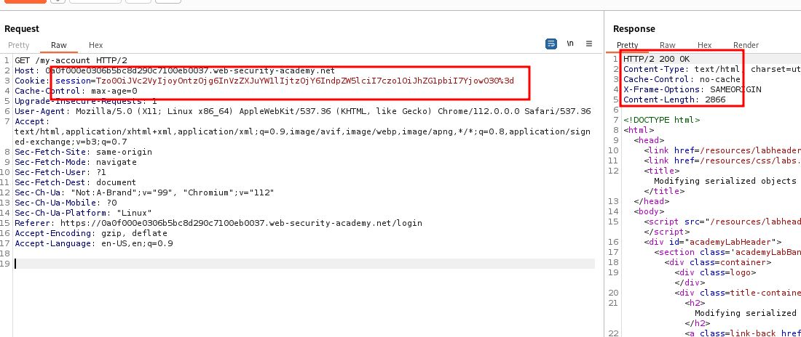
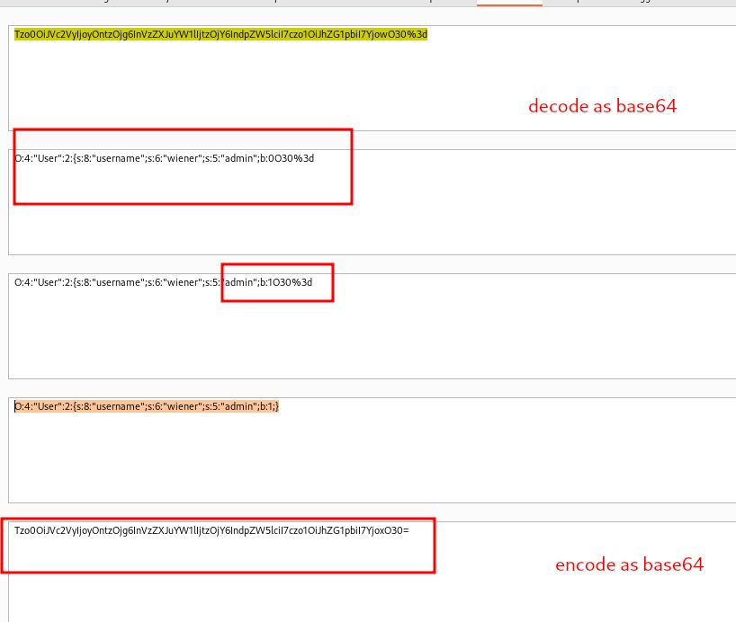
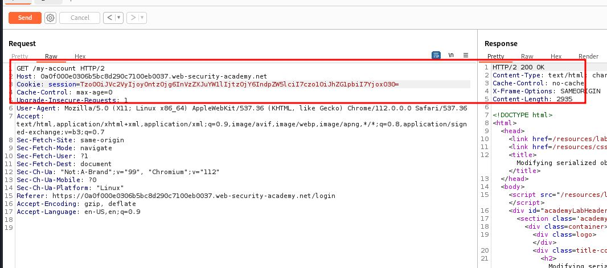
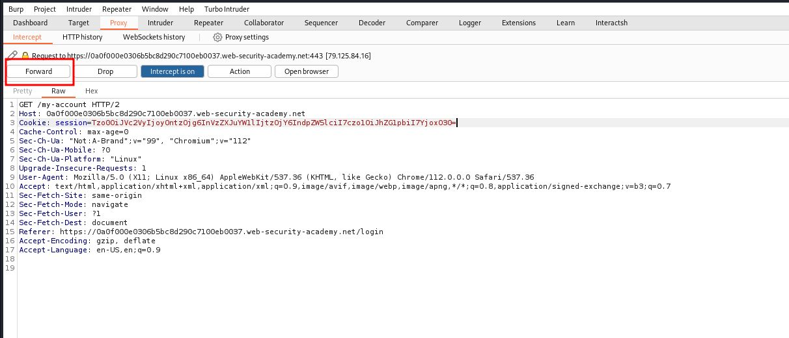

# Modifying serialized objects

## This lab uses a serialization-based session mechanism and is vulnerable to privilege escalation as a result. To solve the lab, edit the serialized object in the session cookie to exploit this vulnerability and gain administrative privileges. Then, delete Carlos's account

## You can log in to your own account using the following credentials: `wiener:peter`

---

### step 1

login using userid and password
and see /my-account page in burpsuite
you will see a seesion send to repeater



### step2

decode session

```json
O:4:"User":2:{s:8:"username";s:6:"wiener";s:5:"admin";b:0O30%3d
```

change `b:0 to b:1`

```json
O:4:"User":2:{s:8:"username";s:6:"wiener";s:5:"admin";b:1;}
```



step3
use the encoded sessionid



### step4

reload account page and intercept
change session id with modified session id




goto admin panel and delete carlos
