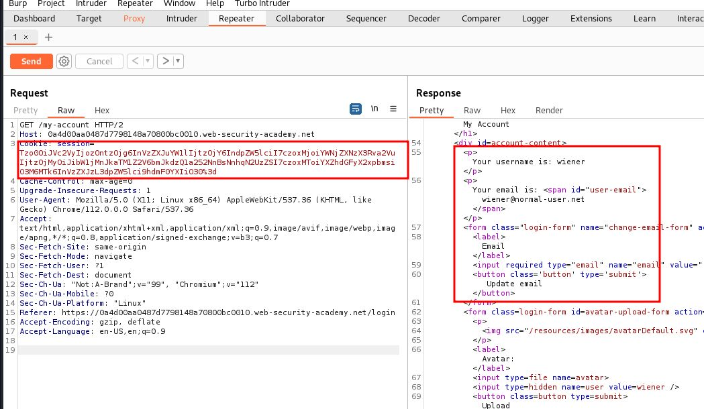
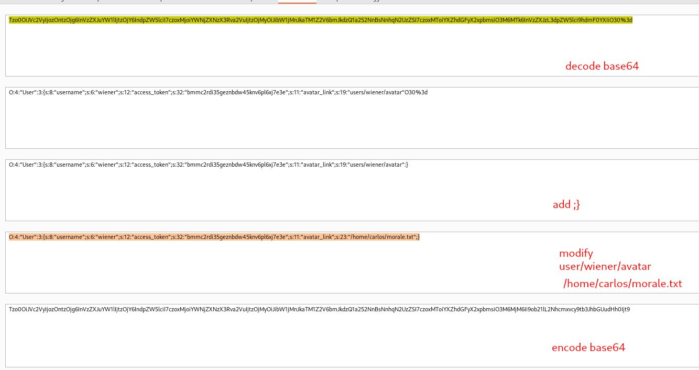
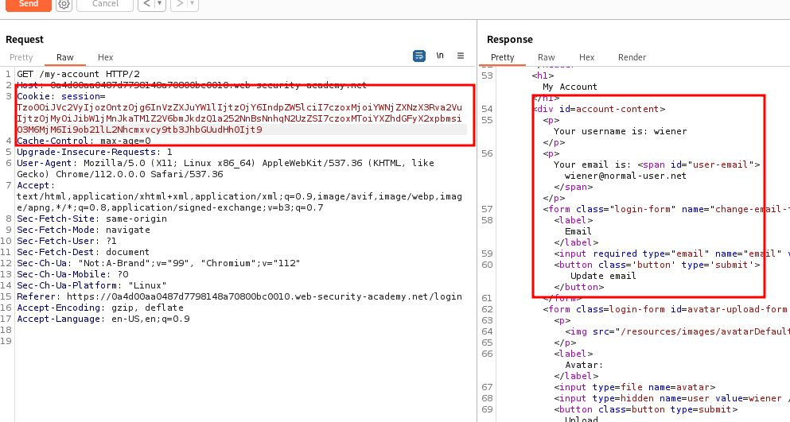

# Using application functionality to exploit insecure deserialization

## This lab uses a serialization-based session mechanism. A certain feature invokes a dangerous method on data provided in a serialized object. To solve the lab, edit the serialized object in the session cookie and use it to delete the `morale.txt` file from Carlos's home directory.

## You can log in to your own account using the following credentials: `wiener:peter`

## You also have access to a backup account: `gregg:rosebud`

---

### step 1 login and intercept **my-account** into Reapeter

### step2 **decode** session id

### step3 replace old session id with new session id

### step4

click on delete account
intercept into burpsuite and change session id with modified sesssion id
lab solved
