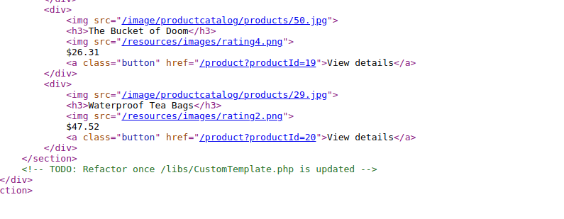
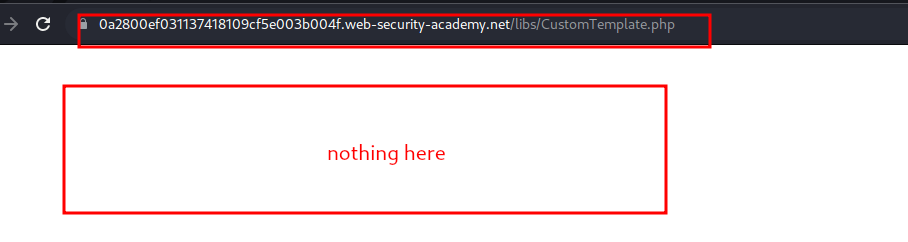
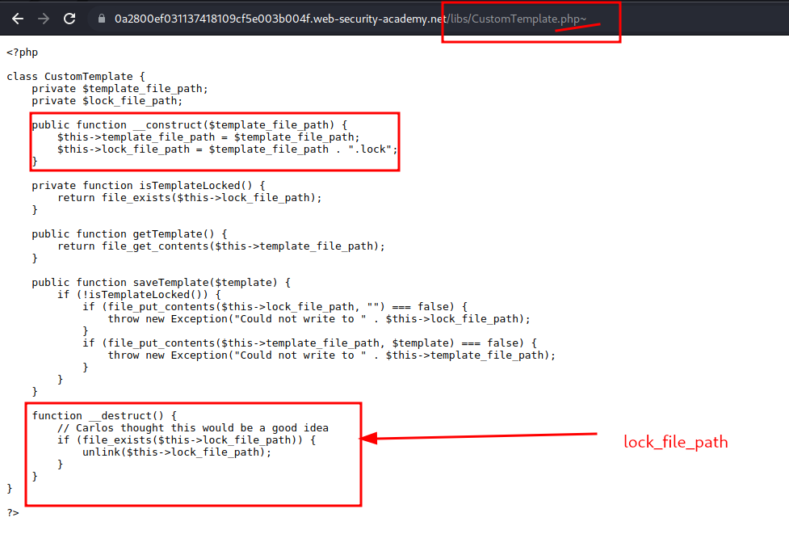
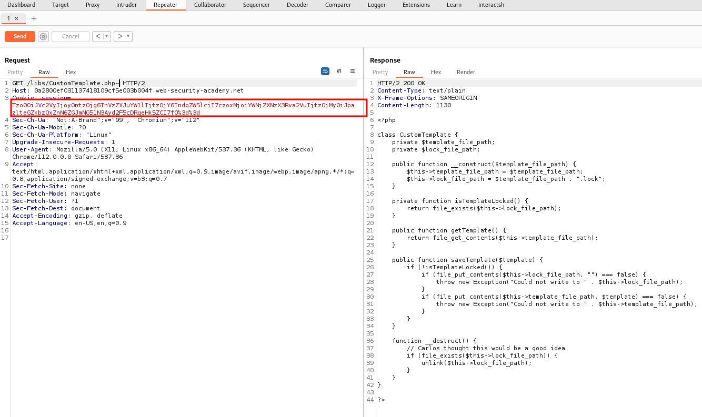
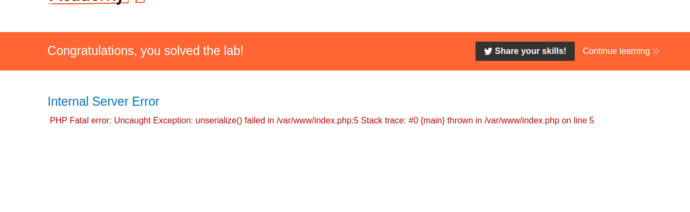

# Arbitrary object injection in PHP

## This lab uses a serialization-based session mechanism and is vulnerable to arbitrary object injection as a result. To solve the lab, create and inject a malicious serialized object to delete the `morale.txt` file from Carlos's home directory. You will need to obtain source code access to solve this lab.

## You can log in to your own account using the following credentials: `wiener:peter`

---

### step 1

login account

### step2

view source code of homepage

### step3 open link /libs/CustomTemplate.php

### step4 open link /libs/CustomTemplate.php~

### step5

send php to repeter

### step6 copy cookie id to decoder

### step7

coy encoded session id and reload home page
replace session id with this session id

