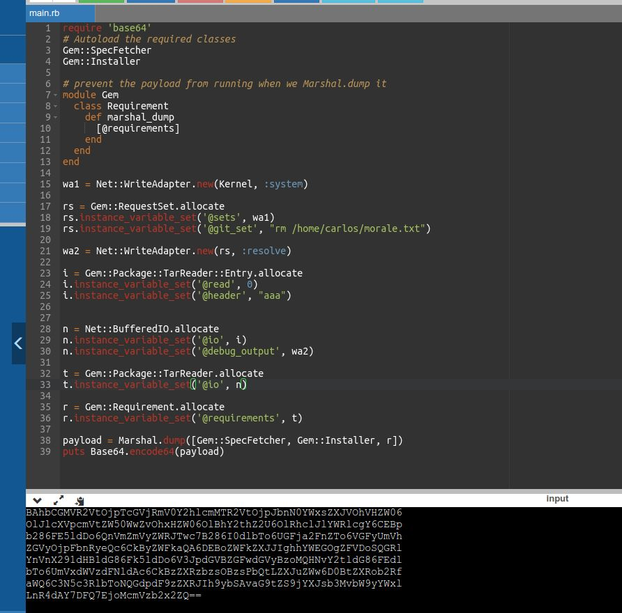

# Exploiting Ruby deserialization using a documented gadget chain

## This lab uses a serialization-based session mechanism and the Ruby on Rails framework. There are documented exploits that enable remote code execution via a gadget chain in this framework.

## To solve the lab, find a documented exploit and adapt it to create a malicious serialized object containing a remote code execution payload. Then, pass this object into the website to delete the `morale.txt` file from Carlos's home directory.

## You can log in to your own account using the following credentials: wiener:peter

---

### step 1 login

### step2

ruby Universal Deserialisation (ruby version 3.0 or 2.X version work)

### step3

copy session id to decoder encode to url
go to repeter replace session id with encoded url
send request lab solve
