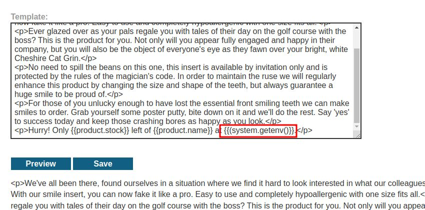
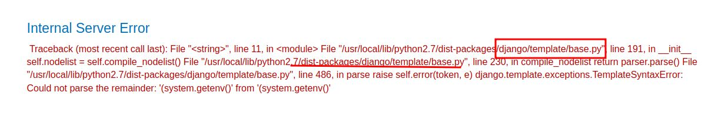
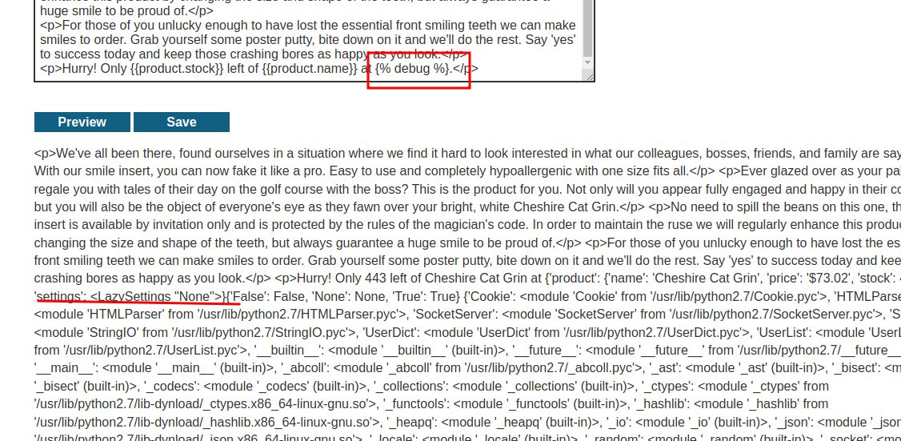
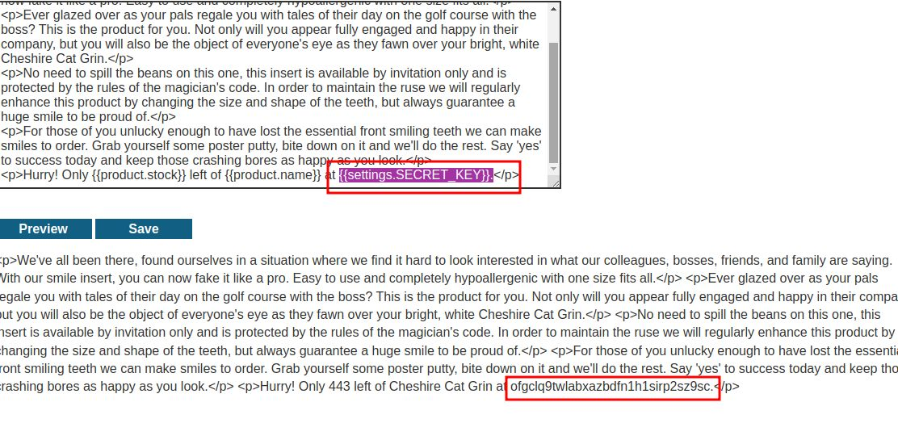

# Server-side template injection with information disclosure via user-supplied objects

## This lab is vulnerable to [server-side template injection](https://portswigger.net/web-security/server-side-template-injection) due to the way an object is being passed into the template. This vulnerability can be exploited to access sensitive data.

## To solve the lab, steal and submit the framework's secret key.

You can log in to your own account using the following credentials:

`content-manager:C0nt3ntM4n4g3r`

### Note: `${{<%[%'"}}%\` use for fuzzing

submit key lab solved
