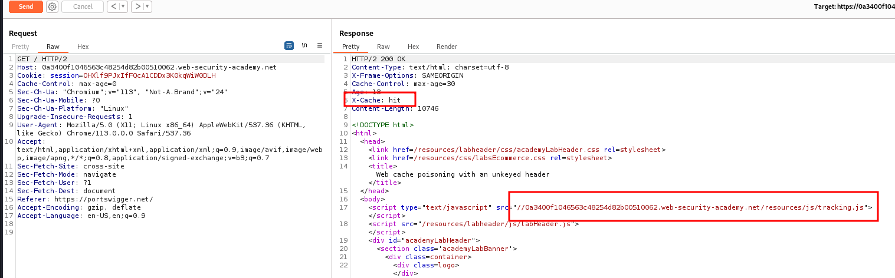
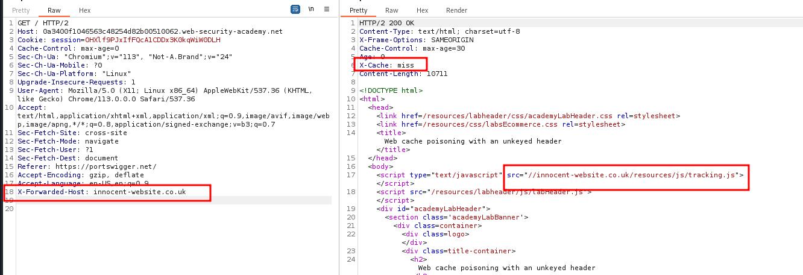
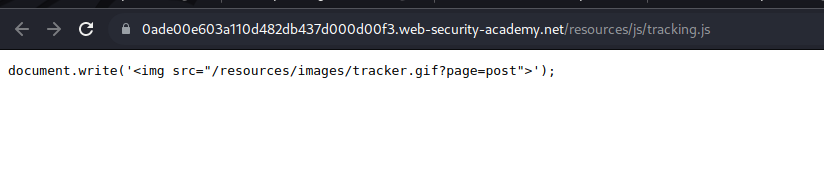
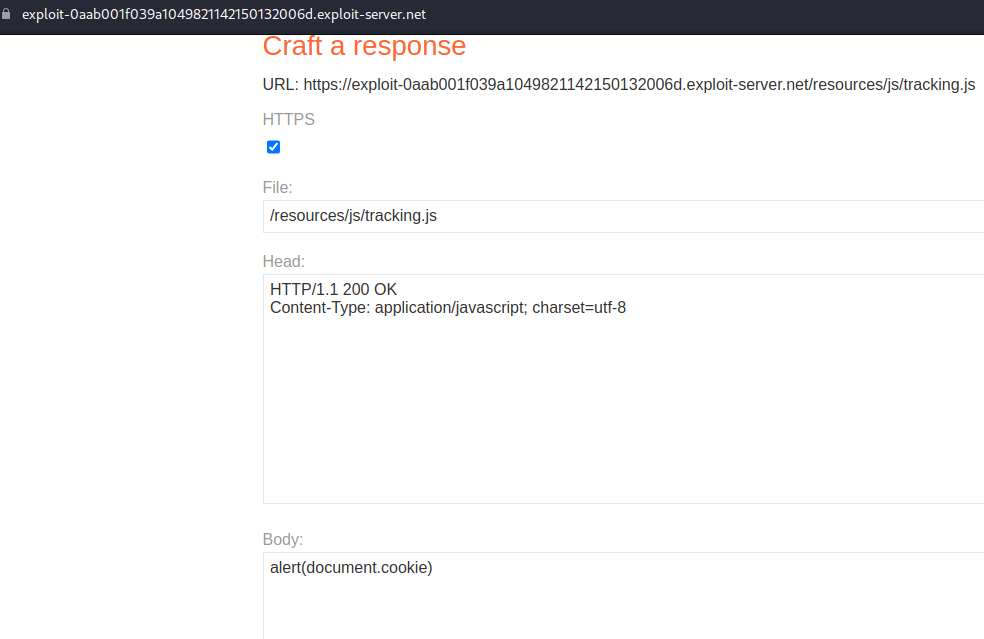
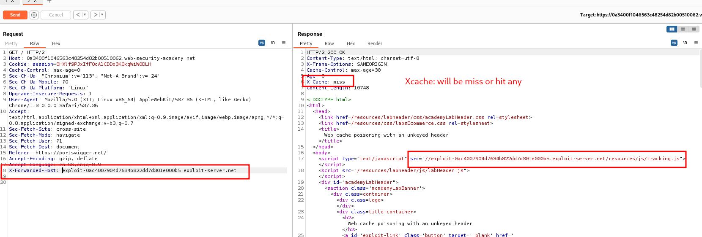

# Web cache poisoning with an unkeyed header

## This lab is vulnerable to [web cache poisoning](https://portswigger.net/web-security/web-cache-poisoning) because it handles input from an unkeyed header in an unsafe way. An unsuspecting user regularly visits the site's home page. To solve this lab, poison the cache with a response that executes `alert(document.cookie)` in the visitor's browser.

### step1

### step2

add _X-forword-Host : any url without https or http_

### step3

inspect resourcee file

### step4

add payload to the resource/js/tracking.js

### step5

### step6

reload page alert will pop up lab solve

