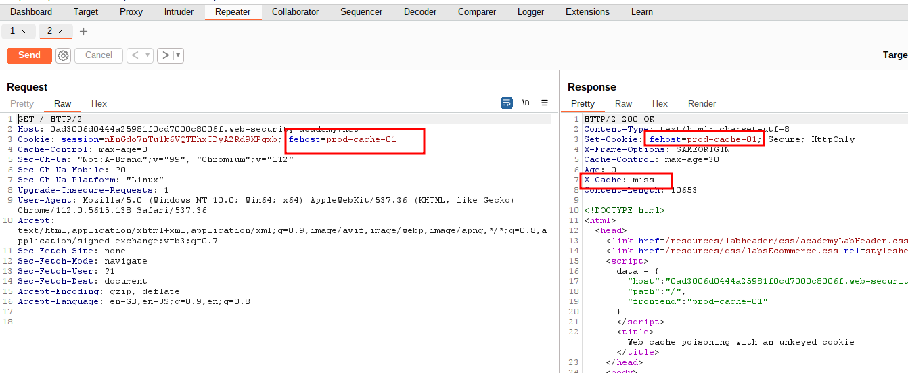
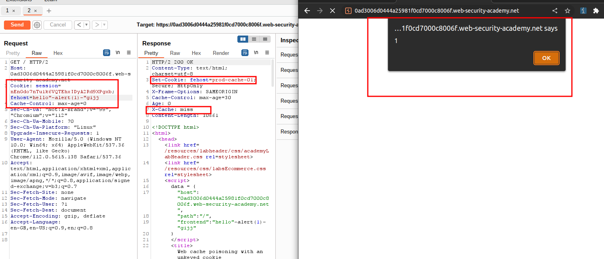

# Web cache poisoning with an unkeyed cookie

## This lab is vulnerable to [web cache poisoning](https://portswigger.net/web-security/web-cache-poisoning) because cookies aren't included in the cache key. An unsuspecting user regularly visits the site's home page. To solve this lab, poison the cache with a response that executes `alert(1)` in the visitor's browser.

### step1

relad page and find page with cookie and fehost

### step2

X-cache: HIT means that **your request was served by CDN (Content Delivery Network) and not the origin servers**.
If the X-Cache header is "Miss from cloudfront," then **the request was retrieved from the origin and wasn't served by the cache**
check x-cache: miss after send request it will be hit again send request it will be miss
add payload _fehost=anyrandomword"-alert(1)-"anyrandomword_
x-chache: miss
reload home page to see alert pop up

