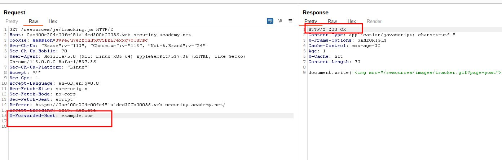
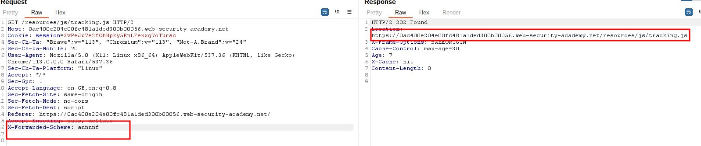
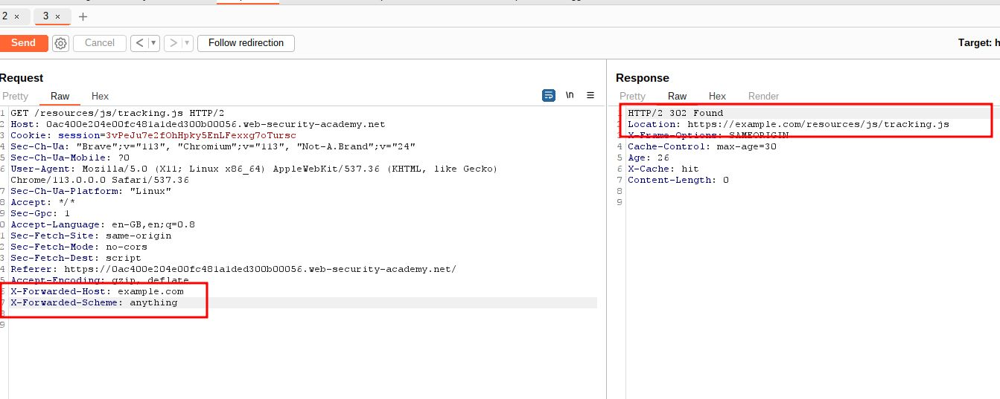
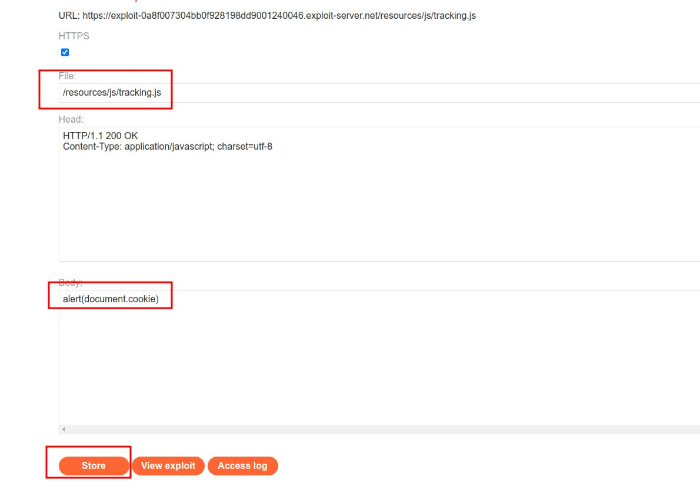
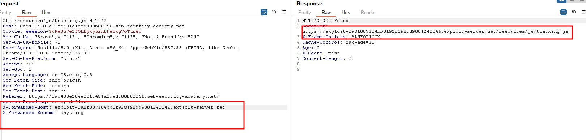

# Web cache poisoning with multiple headers

## This lab contains a [web cache poisoning](https://portswigger.net/web-security/web-cache-poisoning) vulnerability that is only exploitable when you use multiple headers to craft a malicious request. A user visits the home page roughly once a minute. To solve this lab, poison the cache with a response that executes `alert(document.cookie)` in the visitor's browser.

### HINT:

### This lab supports both the `X-Forwarded-Host` and `X-Forwarded-Scheme` headers.

## solution:

### **\_\_\_\_**

### step 1

## ### step2

### step3

### step4

### step5

lab solved
