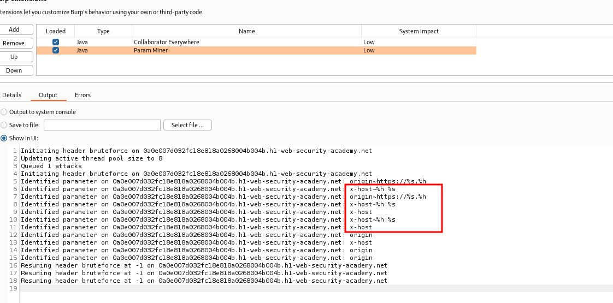
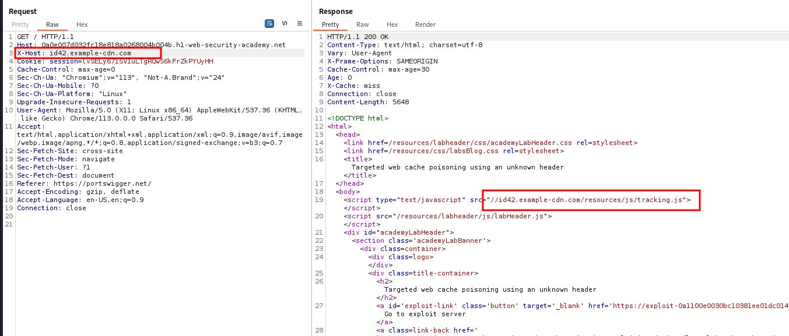
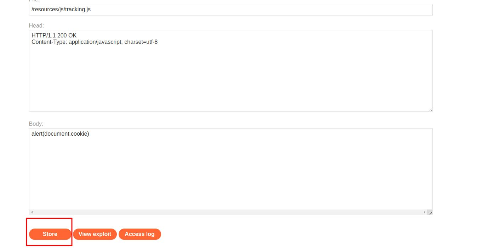
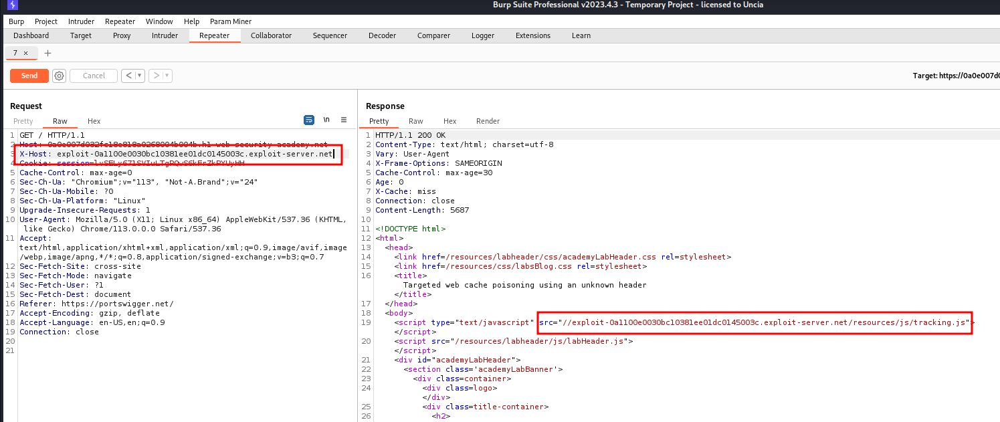
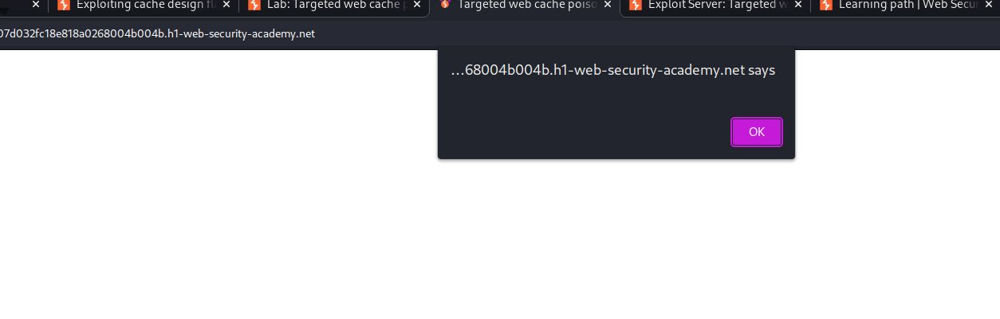
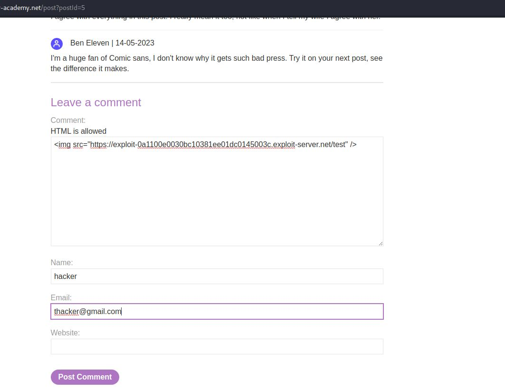
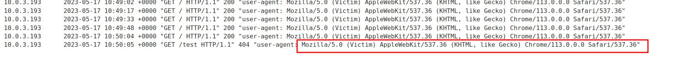
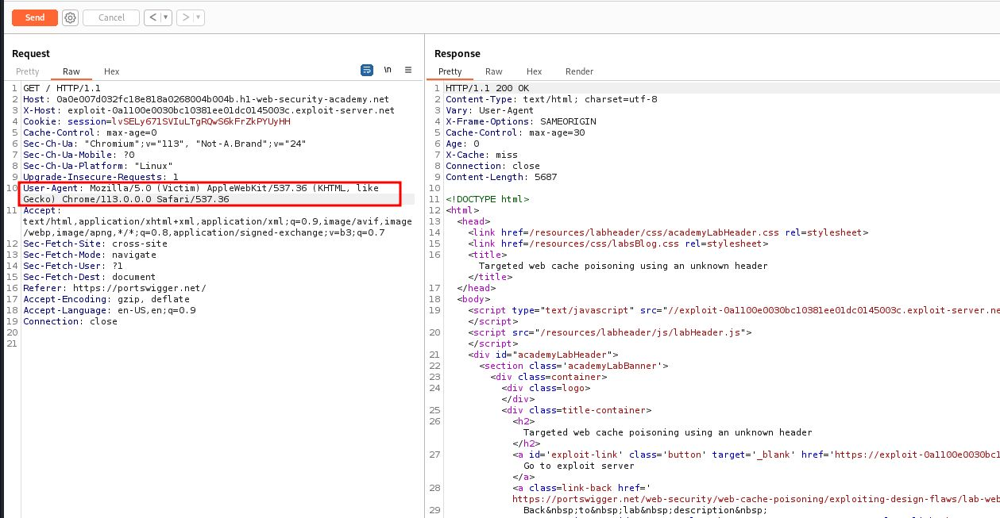

# Targeted web cache poisoning using an unknown header

## This lab is vulnerable to [web cache poisoning](https://portswigger.net/web-security/web-cache-poisoning). A victim user will view any comments that you post. To solve this lab, you need to poison the cache with a response that executes `alert(document.cookie)` in the visitor's browser. However, you also need to make sure that the response is served to the specific subset of users to which the intended victim belongs

### HINT: use extension param miner

---

### step 1

right click on / (home page of the lab) go to extension then param miner then guess param then guess header now go to extension

### step2

add X-Host: example.com

### step3

### step4

### step5

### step6

to solve the lab we need user agent
so in comment section
``

### step7

go to log section
copy user-agent

### step8

paste user-agent into repeter

reload home page lab solved
