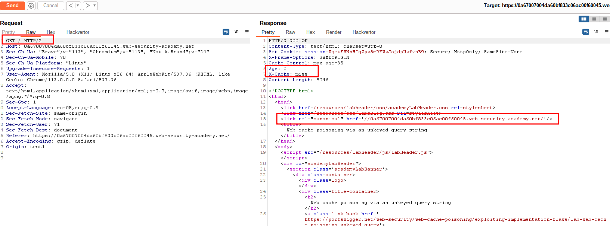
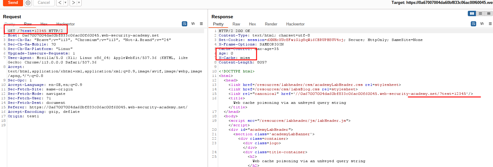
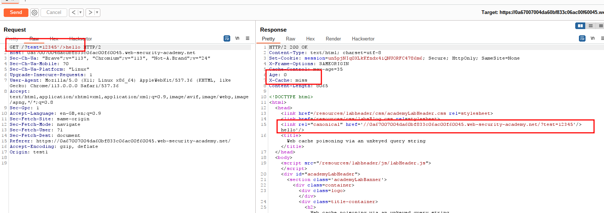
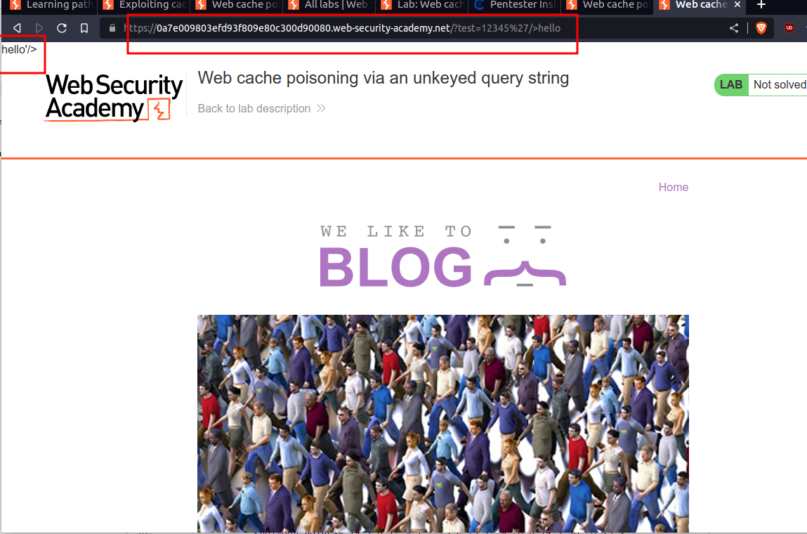
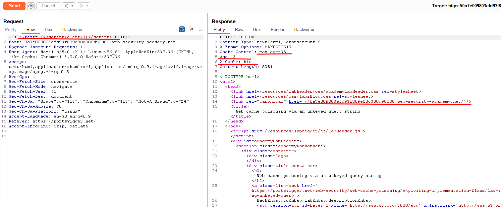
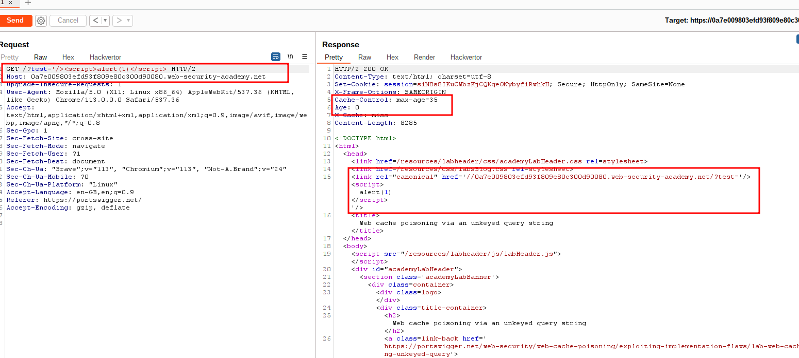
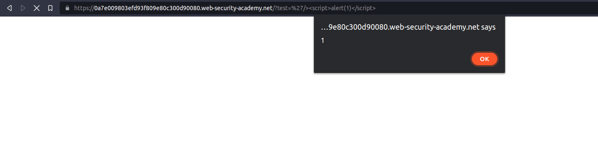

# Web cache poisoning via an unkeyed query string

## This lab is vulnerable to [web cache poisoning](https://portswigger.net/web-security/web-cache-poisoning) because the query string is unkeyed. A user regularly visits this site's home page using Chrome.

## To solve the lab, poison the home page with a response that executes `alert(1)` in the victim's browser.

---

### step 1

send home page into repeter and send request
the value of age will change at each request and x-cache: hit
once value of age = 0
x-cache: miss

### step2

add cache-buster query parameter eg /?cb=1222
so /?test=123

### step3

### step4

right click request on browser current session

### step5

note:
max-age = 35
age:31
x-cache: hit
it will not store payload untill age=0 and x-cache: miss

### step6

### step7

lab will solve after request
still right click over repeter
go to request in browser
go to current session copy url paste into browser
lab solved

