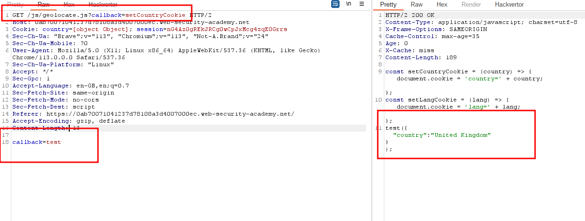
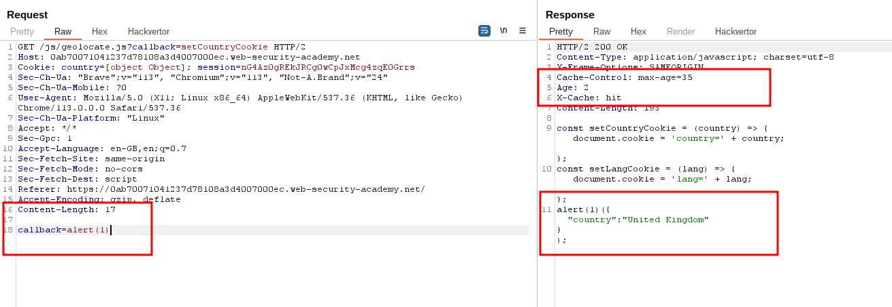

# Web cache poisoning via a fat GET request

## This lab is vulnerable to [web cache poisoning](https://portswigger.net/web-security/web-cache-poisoning). It accepts `GET` requests that have a body, but does not include the body in the cache key. A user regularly visits this site's home page using Chrome.

## To solve the lab, poison the cache with a response that executes `alert(1)` in the victim's browser.

### step1

send geolocate.js to repeter

step2
add callback = test
send request
test will show when age will be 0
so send request many times to make age=0

### step3

alert(1) will show when age will be 0
so send request many times to make age=0
and lab will be solved

