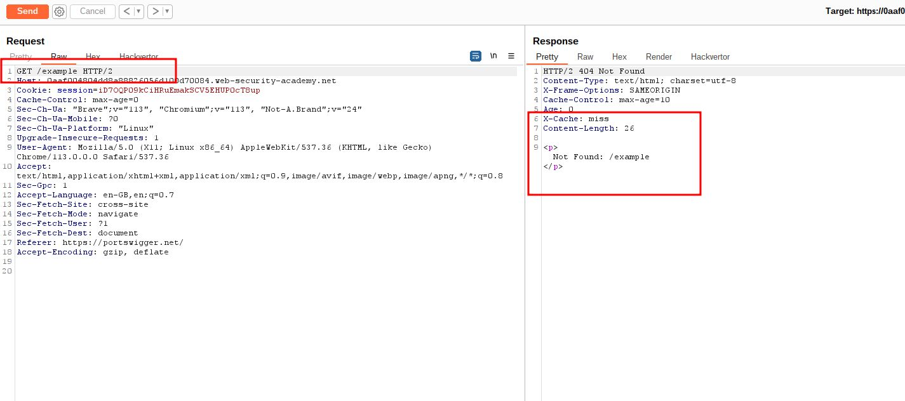
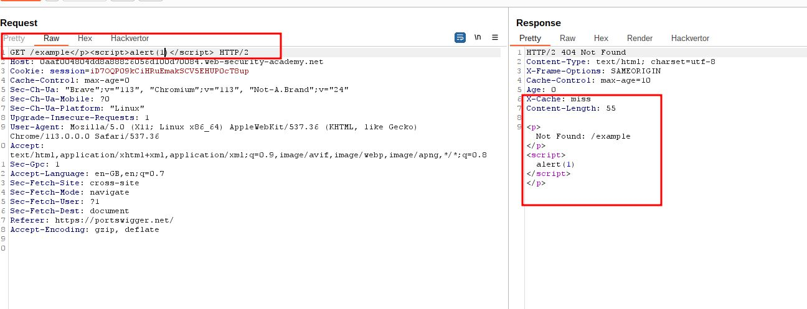
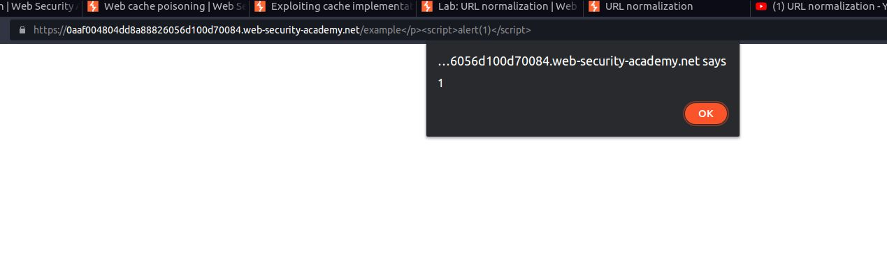

# URL normalization

## This lab contains an XSS vulnerability that is not directly exploitable due to browser URL-encoding.

## To solve the lab, take advantage of the cache's normalization process to exploit this vulnerability. Find the XSS vulnerability and inject a payload that will execute `alert(1)` in the victim's browser. Then, deliver the malicious URL to the victim

---

### step 1

send / to repeter
add /example or and random
and send request it will display a not found page

### step2

add `GET /example
`

### step3

request the current session into browser
if pop will not show
send ### step2 process (send request again)

### step4

copy url and deliver link to victim and click ok lab will solved
if lab not solved
then copy url and deliver link to victim another pop up menu will come then ### step2(send again) then click ok
