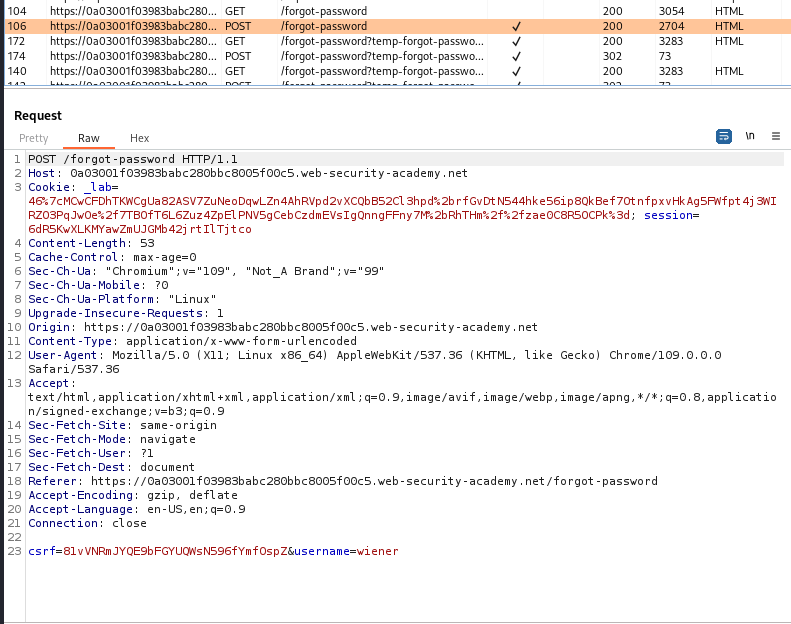
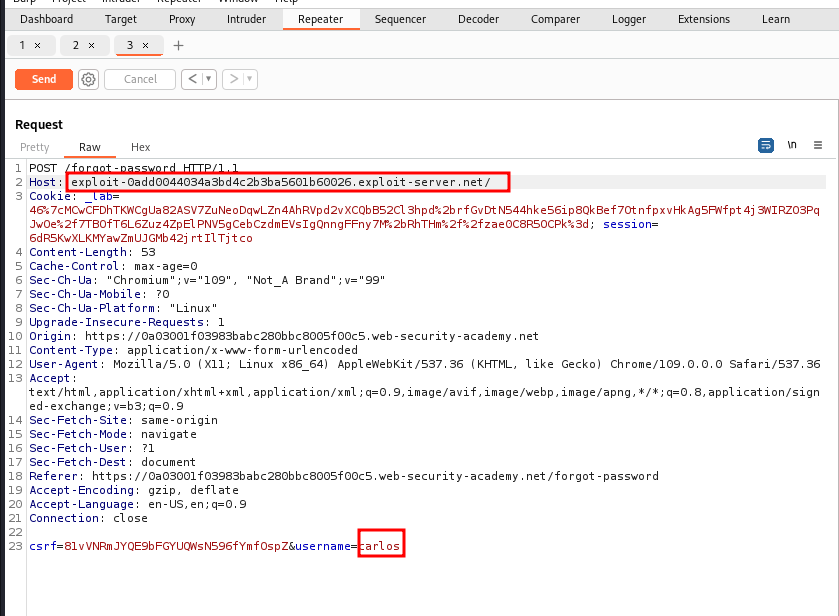

# Basic password reset poisoning

## This lab is vulnerable to password reset poisoning. The user `carlos` will carelessly click on any links in emails that he receives. To solve the lab, log in to Carlos's account.

## You can log in to your own account using the following credentials: `wiener:peter`. Any emails sent to this account can be read via the email client on the exploit server.

---

### step 1

click on forget button and enter _wiener_ as _username_
and enter password

### step2

go to burpsuite

### step3

send to repeter
change _host_ to exploite url and change _username_ and send

### step4

go to exploit url and go to access log
you will notice a different ip with forget password url with token given
copy token _OrTzPqtpxqU3I3S7rpwiecnPPekiNkTf_

and go to exploit email
forgot url link like this

> https://0a03001f03983babc280bbc8005f00c5.web-security-academy.net/forgot-password?temp-forgot-password-token=xwRQswZ9WBjVpb5lErzKTnF8wToK555w

change token with access log token _OrTzPqtpxqU3I3S7rpwiecnPPekiNkTf_

> https://0a03001f03983babc280bbc8005f00c5.web-security-academy.net/forgot-password?temp-forgot-password-token=OrTzPqtpxqU3I3S7rpwiecnPPekiNkTf

copy the modified url into browser and change password
now login with carlos with the current password
