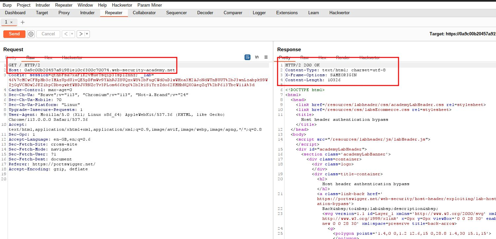
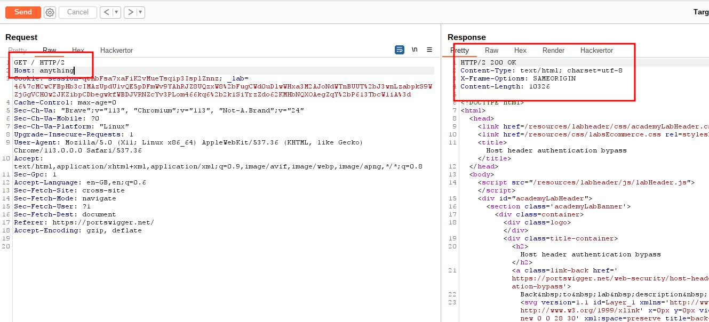
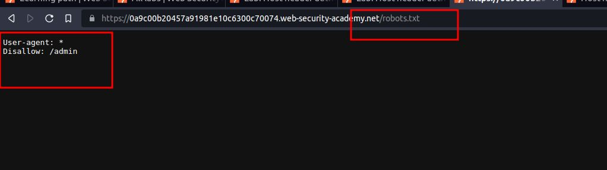
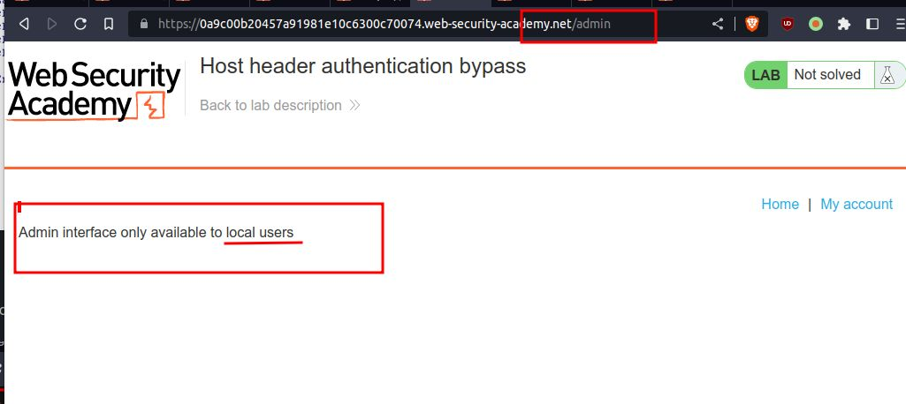
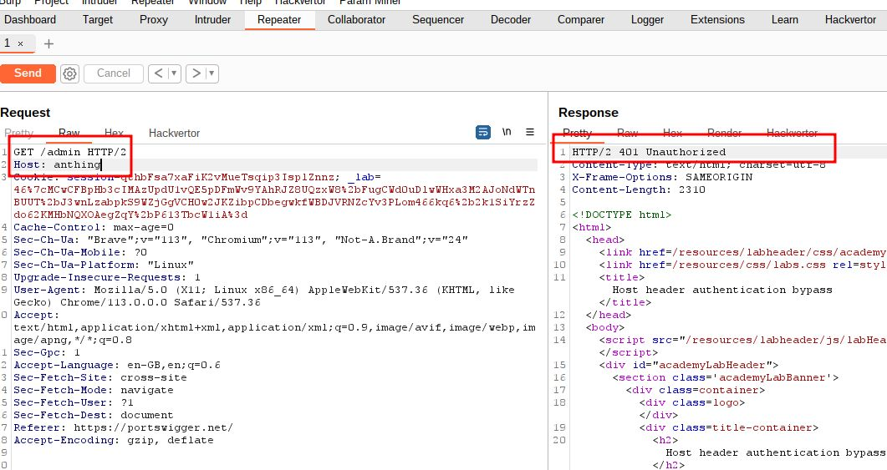
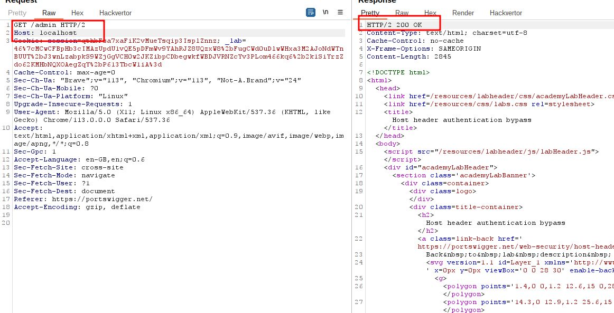
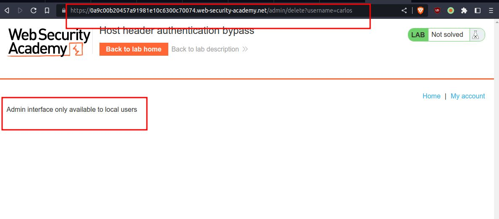
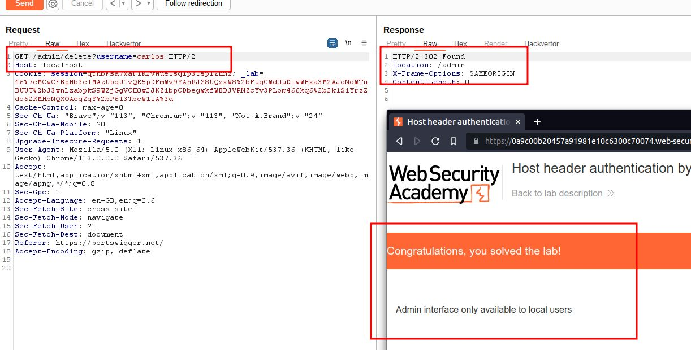

# Host header authentication bypass

## This lab makes an assumption about the privilege level of the user based on the HTTP Host header.

## To solve the lab, access the admin panel and delete Carlos's account

---

### step 1

send homepage into repeter

### step2

remove host url with any random name
and send request

### step3

look for robots.txt page

### step4

try to access admin page

### step5

try to access admin page into repeter

### step6

right click and request in browser

### step7

delete carlos account
but you cannot delete

### step8

add _/admin/delete?username=carlos_
into repeter
and send request
carlos account will be deleted

