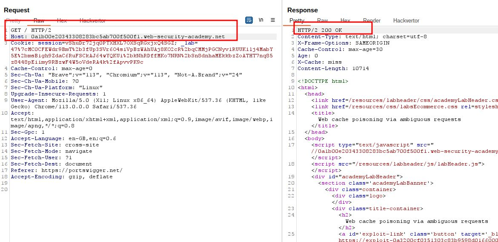
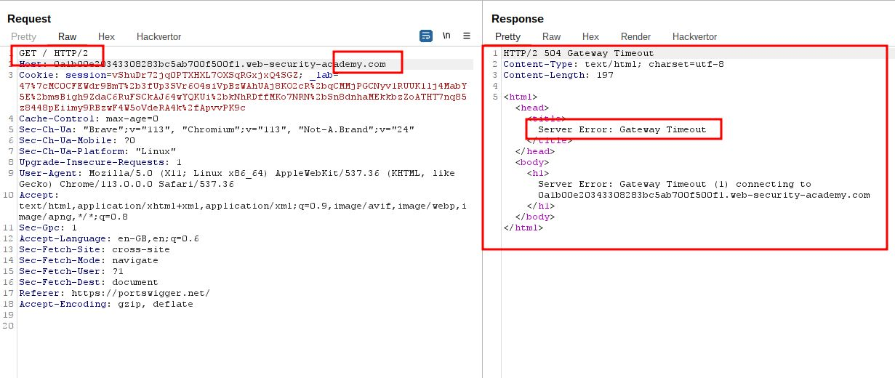
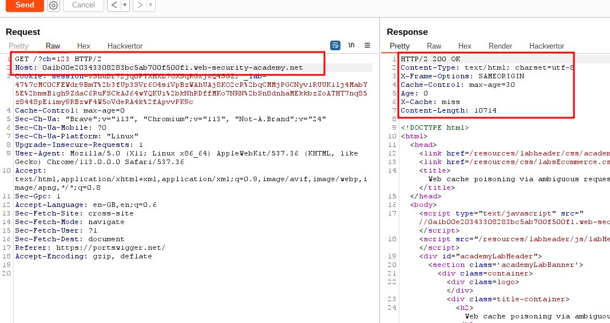
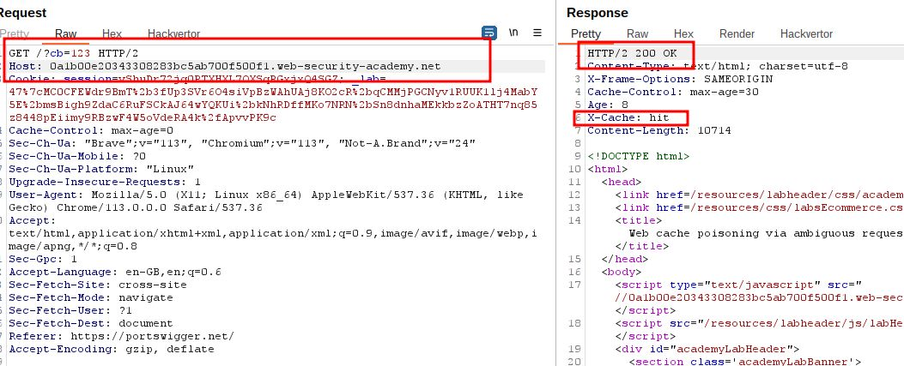
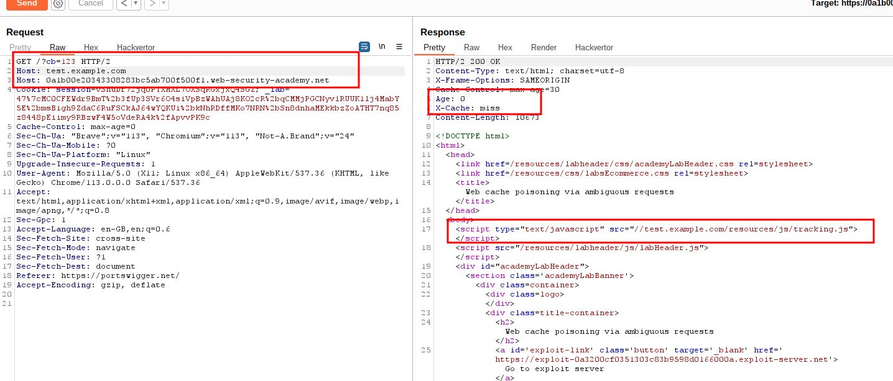
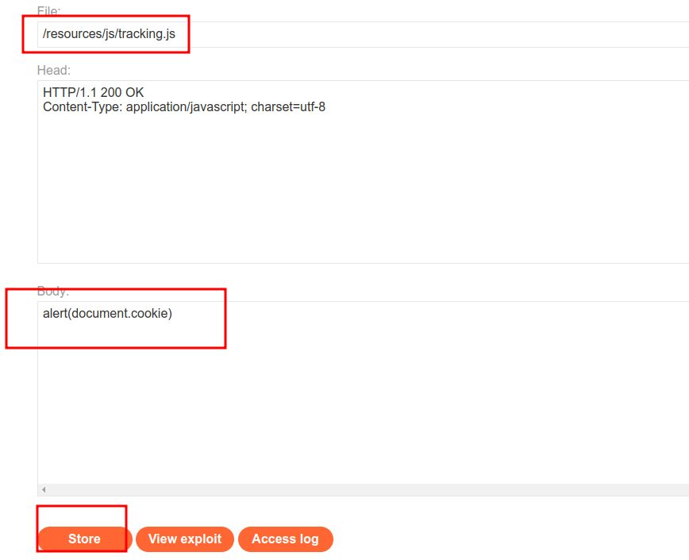
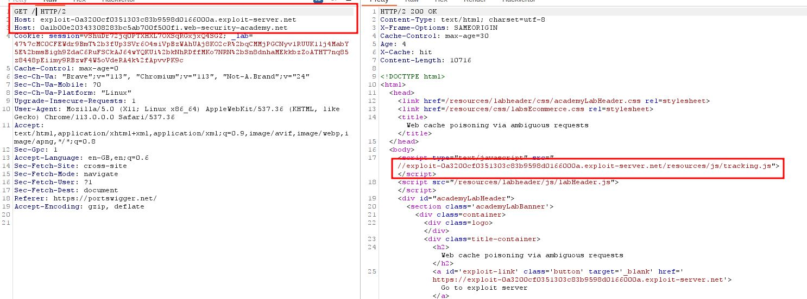
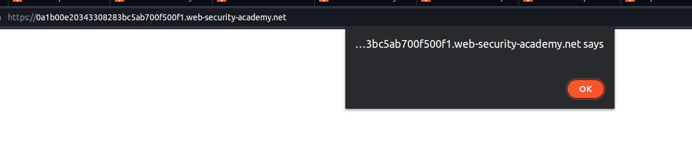

# Web cache poisoning via ambiguous requests

## This lab is vulnerable to [web cache poisoning](https://portswigger.net/web-security/web-cache-poisoning) due to discrepancies in how the cache and the back-end application handle ambiguous requests. An unsuspecting user regularly visits the site's home page.

## To solve the lab, poison the cache so the home page executes `alert(document.cookie)` in the victim's browser

---

### step 1

send homepage into repeter

### step2

change host name

### step3

add cache buster and use original host name

### step4

if you add another host
you will get sever error
when x-cache: hit
add another host (see ### step5)

### step5

add another Host: text.example.com

### step6

add payload `alert(document.cookie`

### step7

replace Host with expolite host

lab solved

Note:
if you want alert pop up
right click inside repeter and request in browser current session copy url paste into browser

