# Routing-based SSRF

## This lab is vulnerable to routing-based [SSRF](https://portswigger.net/web-security/ssrf) via the Host header. You can exploit this to access an insecure intranet admin panel located on an internal IP address.

## To solve the lab, access the internal admin panel located in the `192.168.0.0/24` range, then delete Carlos.

### Note: Burp collaborator used so Burpsuite Pro will used to solved the lab

---

### step 1

send Homepage(/) to the repeter

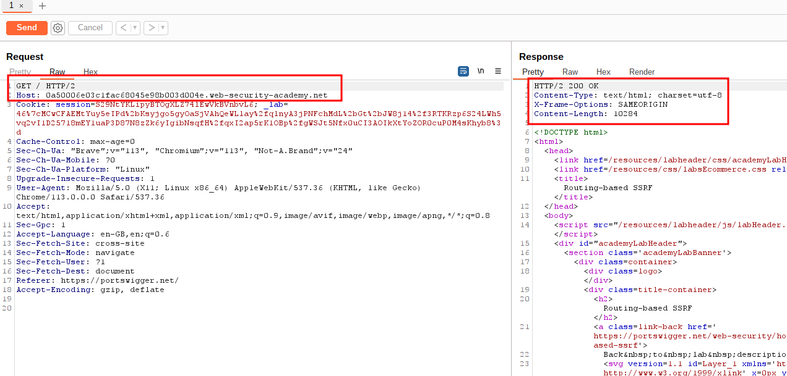

### step2

go to burp collaborator
copy to clipboad
replace with host url
`Host: mh7ba0stpilluj3j7qcr4o5b026tuji8.oastify.com`
send request into repeter and go collaborator click on poll now

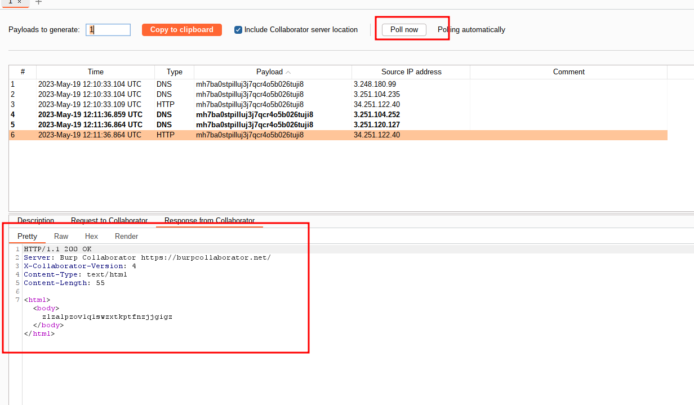

go to repeter after poll now from burp collaborator

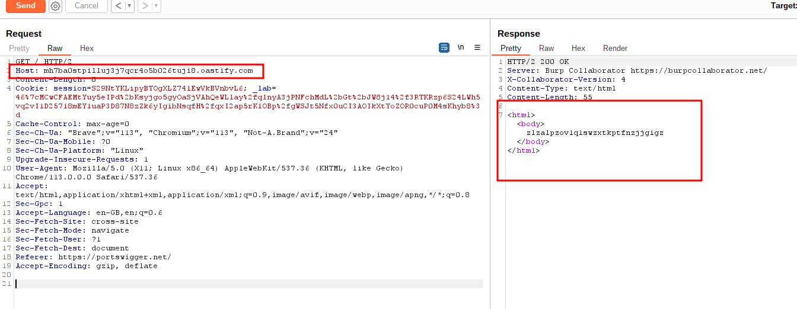

### step3

access the internal admin panel located in the `192.168.0.0/24`

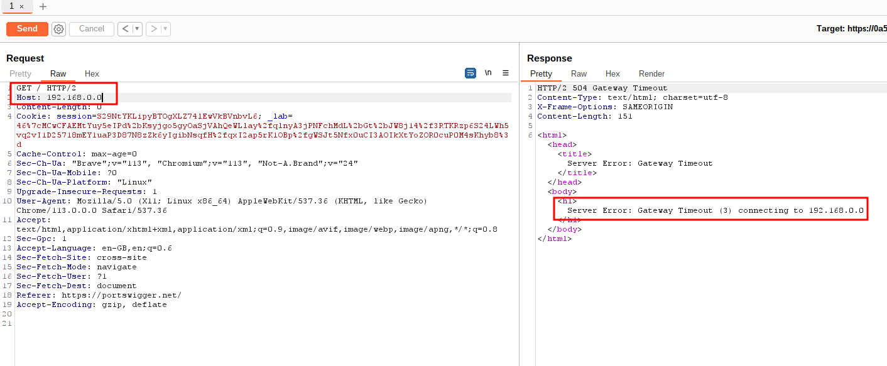

### step4

send ( ### step3) to intruder
and uncheck update host header
payload
values:
`From: 0 To: 255 Step: 1`

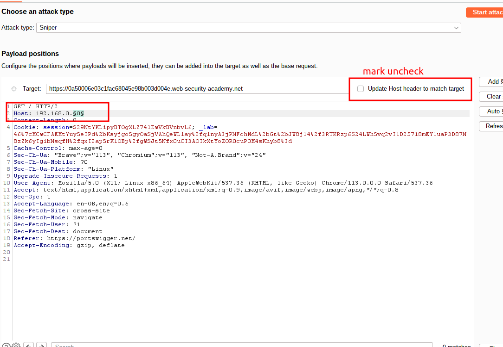

payload result

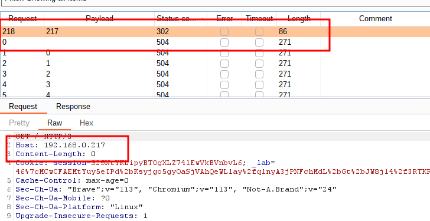

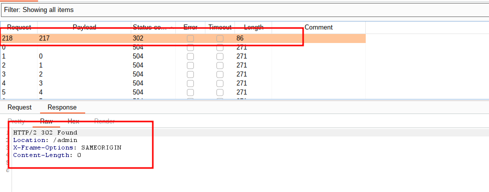

### step5

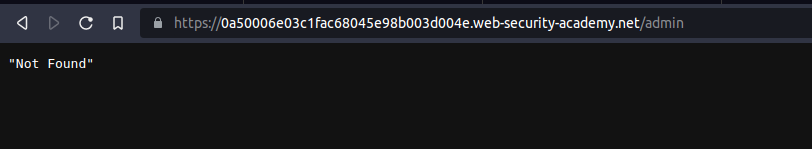

### step6

add host `Host: 192.168.0.217` from ### step5

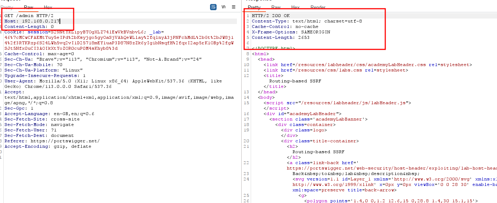

### step7

from ### step6 request in browser current session

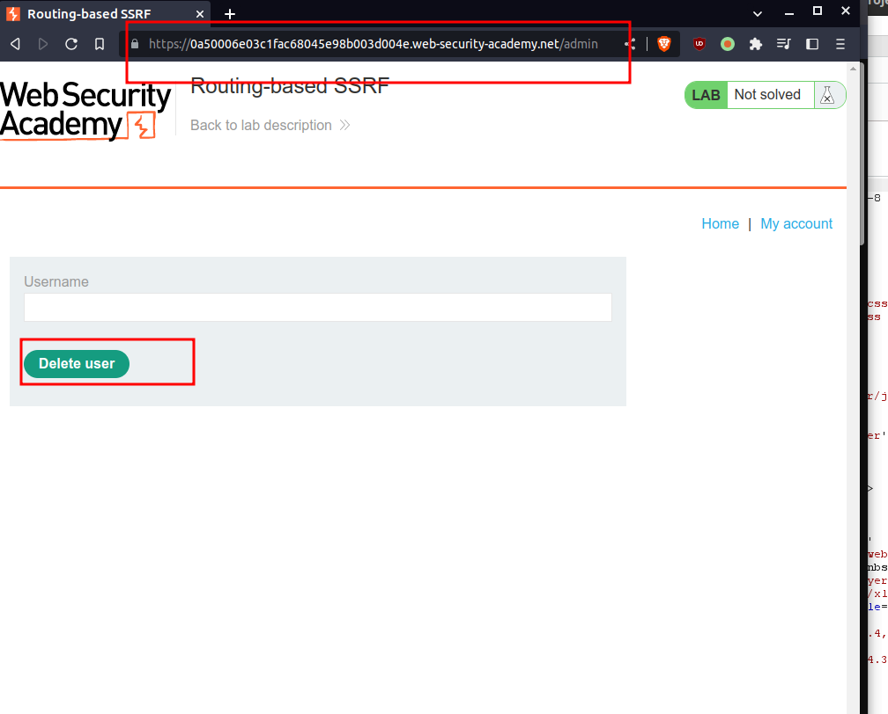

### step8

it will not work

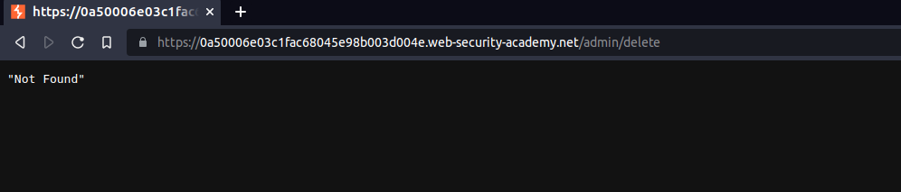

### step9

inspect ### step7

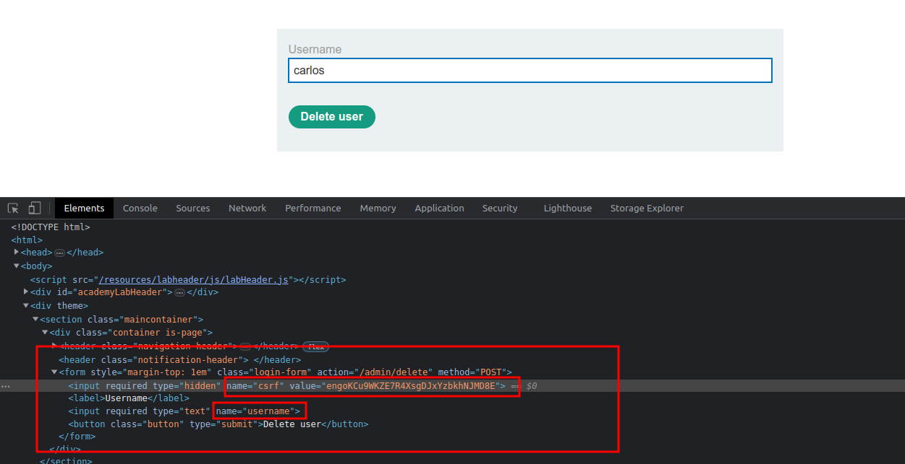

---

### step 10

add _GET /admin/delete?csrf=engoKCu9WKZE7R4XsgDJxYzbkhNJMD8E&username=carlos_

reload page lab solved

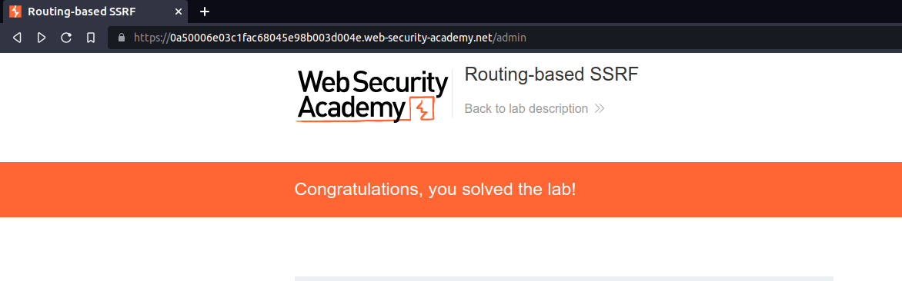
