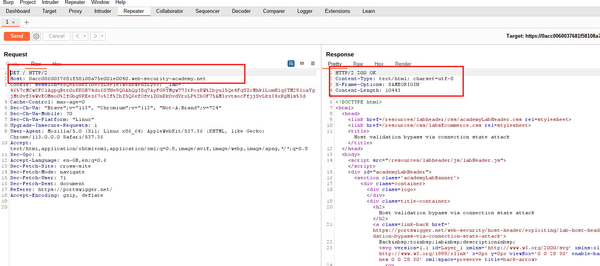
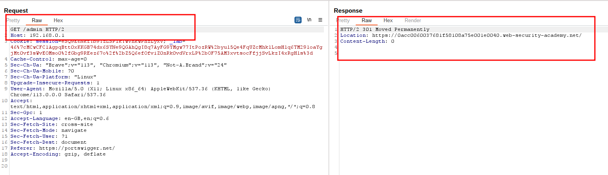
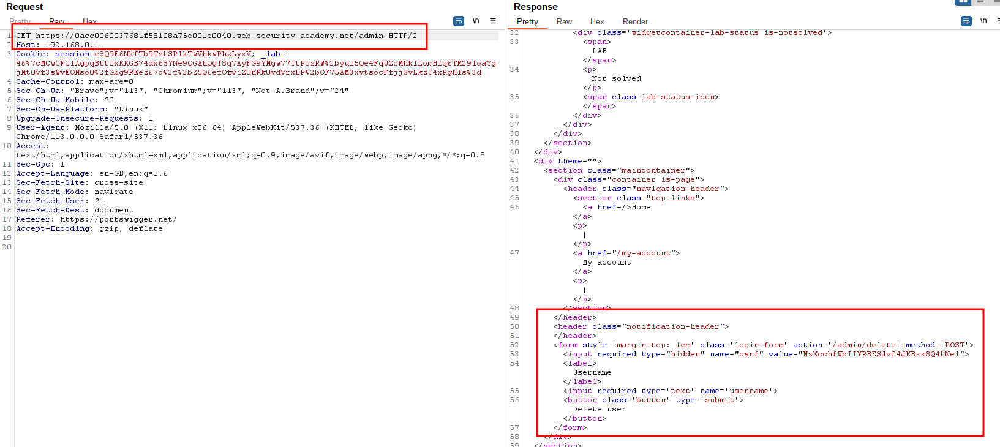
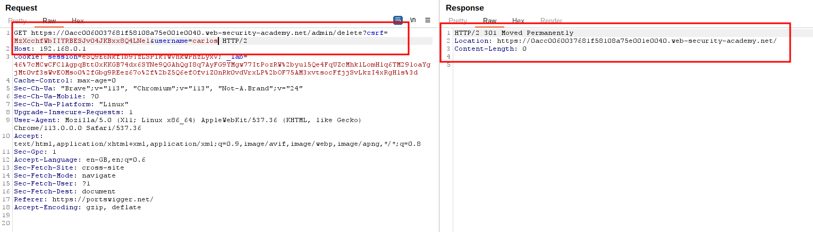
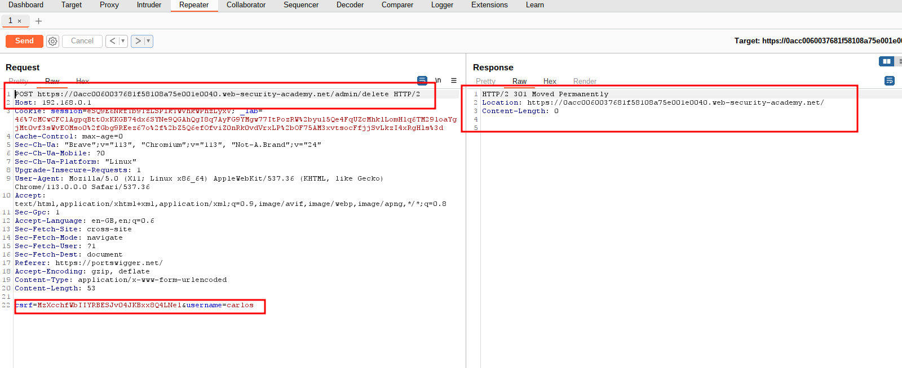
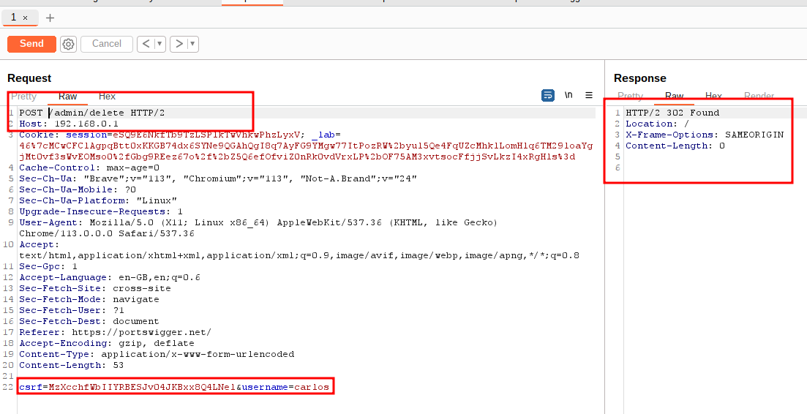

# Host validation bypass via connection state attack

## This lab is vulnerable to routing-based [SSRF](https://portswigger.net/web-security/ssrf) via the Host header. Although the front-end server may initially appear to perform robust validation of the Host header, it makes assumptions about all requests on a connection based on the first request it receives.

## To solve the lab, exploit this behavior to access an internal admin panel located at `192.168.0.1/admin`, then delete the user `carlos`.

---

### step 1

### step2

### step3

### step4

### step5

change request method from get to post

### step6

remove url
simply test /admin/delete with post request
lab will solve

