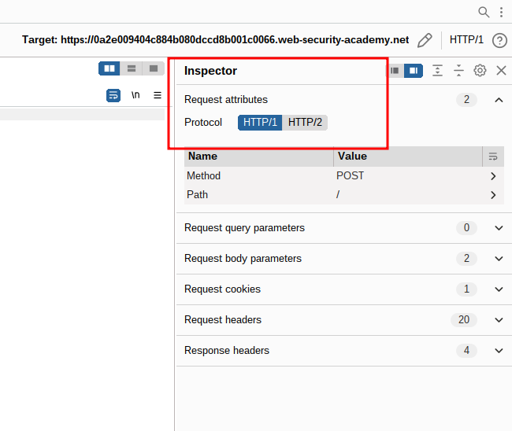
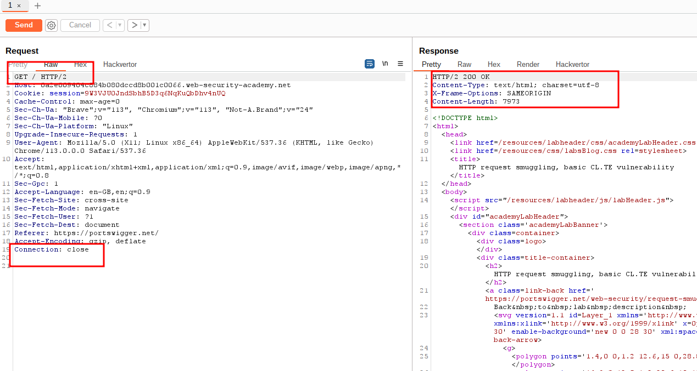
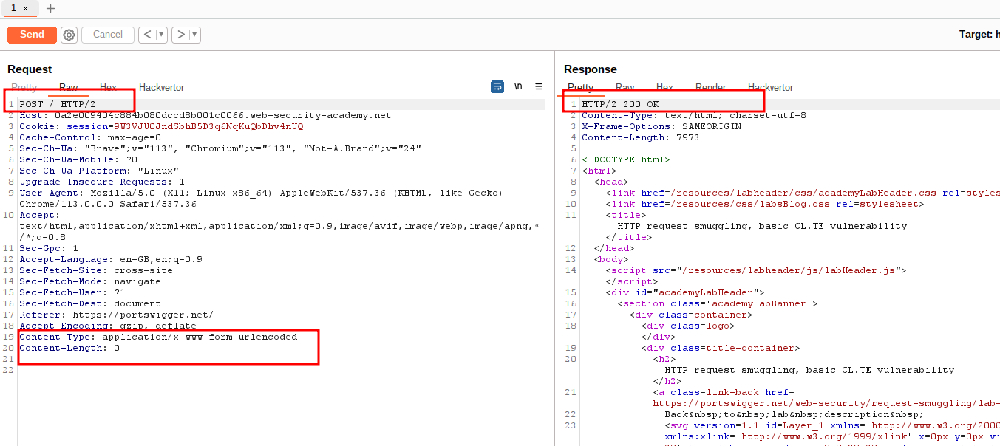
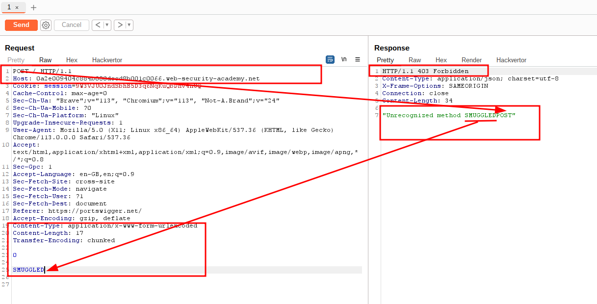
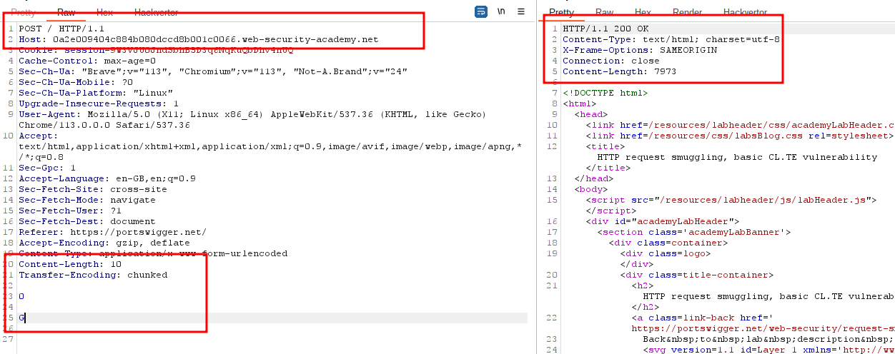
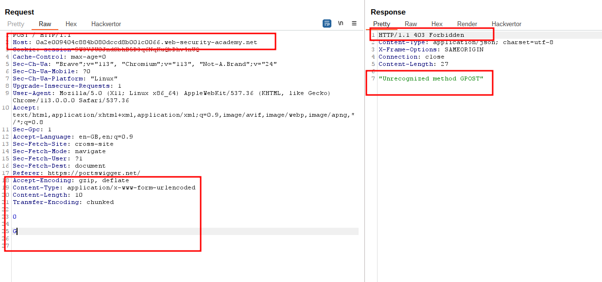
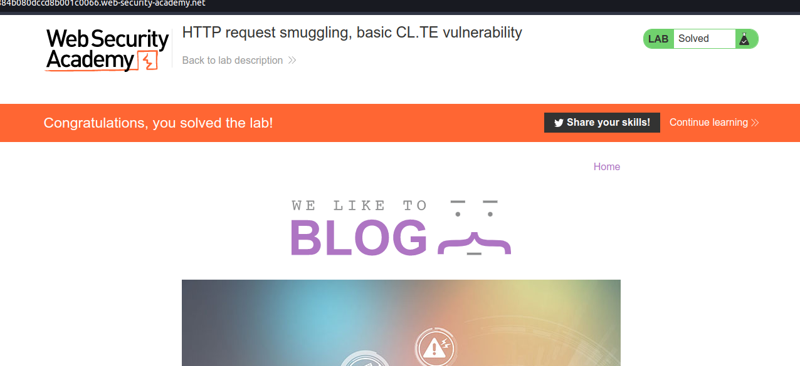

# HTTP request smuggling, basic CL.TE vulnerability

## This lab involves a front-end and back-end server, and the front-end server doesn't support chunked encoding. The front-end server rejects requests that aren't using the GET or POST method.

## To solve the lab, smuggle a request to the back-end server, so that the next request processed by the back-end server appears to use the method `GPOST`.

### Note:

### Although the lab supports HTTP/2, the intended solution requires techniques that are only possible in HTTP/1. You can manually switch protocols in Burp Repeater from the **Request attributes** section of the **Inspector** panel.

### CL.TE => the front-end server uses the `Content-Length` header and the back-end server uses the `Transfer-Encoding` header.

---

### step 1

send home page to the repeater

### step2

change request method from get to post

### step3

add Content-Length: 13
Transfer-Encoding: chunked
0
SMUGGLED

the intended solution requires techniques that are only possible in HTTP/1
change HTTP/2 to HTTP/1.1 using inspector

how content-Length is 17

### step4

send request again from ### step3
example: => when _Content-Length: 10 and Transfer-Encoding: chunked_ used
on backed Content-Length: 10 will ignore and Transfer-Encoding: chunked will valid
on front-end Content-Length will be valid

### step6

to solve this lab we need `use the method `GPOST`

### step7

send request again

### step8

lab solved

