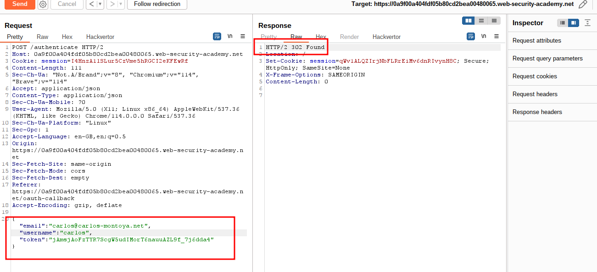
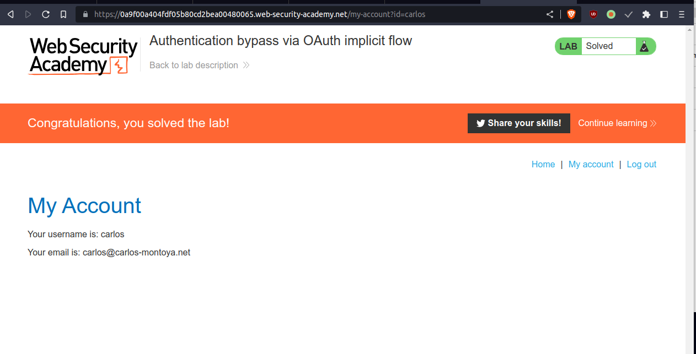

# Authentication bypass via OAuth implicit flow

## This lab uses an [OAuth](https://portswigger.net/web-security/oauth) service to allow users to log in with their social media account. Flawed validation by the client application makes it possible for an attacker to log in to other users' accounts without knowing their password.

## To solve the lab, log in to Carlos's account. His email address is `carlos@carlos-montoya.net`.

## You can log in with your own social media account using the following credentials: `wiener:peter`.

---

step 1

observe whole login process

step 2

send to authenticate to repeater
and change email with username

step 3
once 302 found click click request in browser current session paste into browser
lab solved

