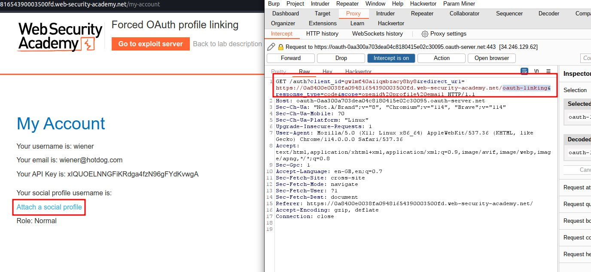
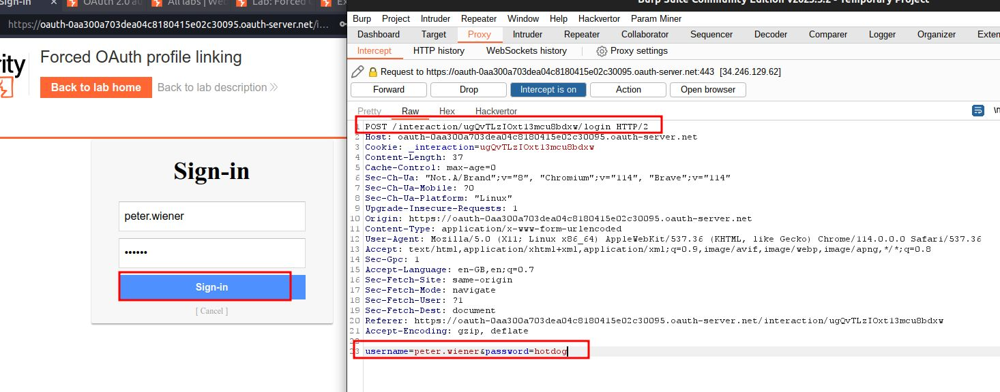
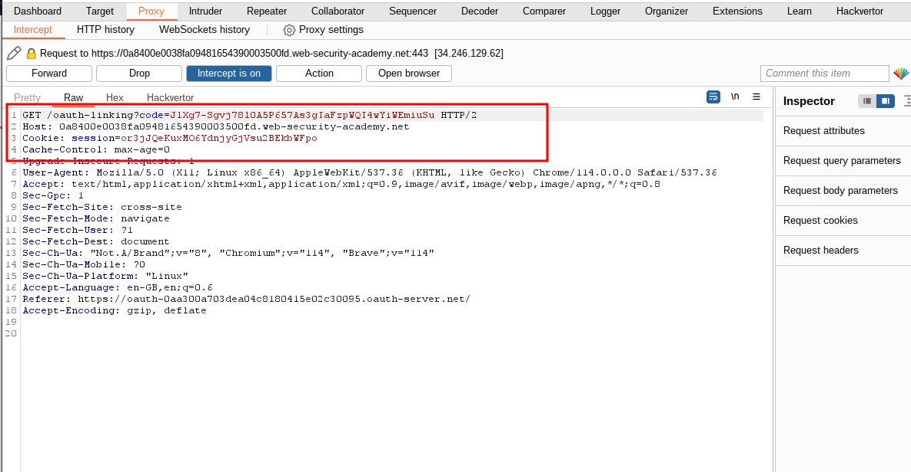
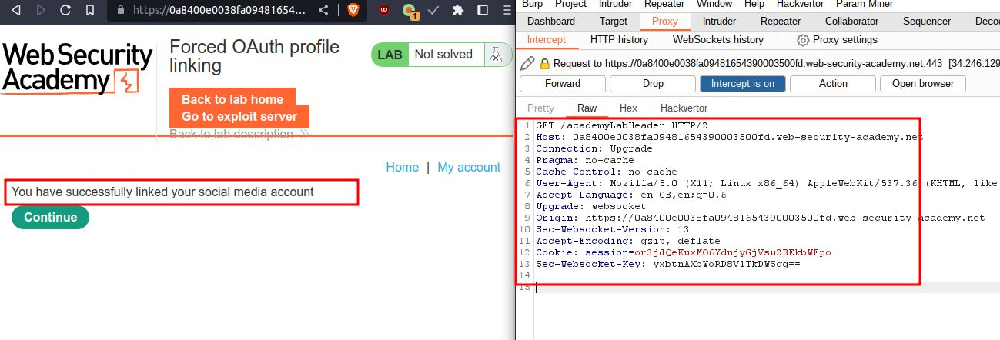
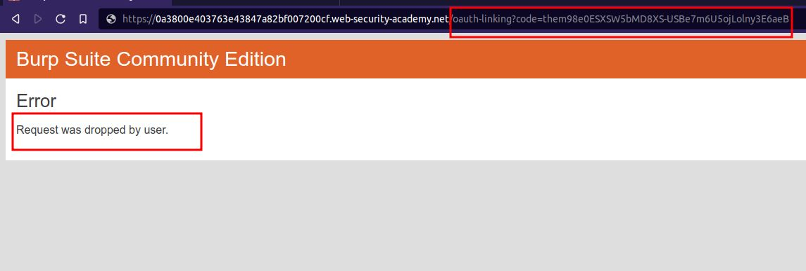
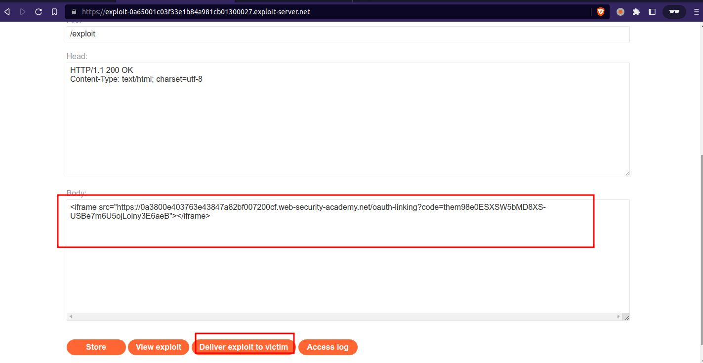
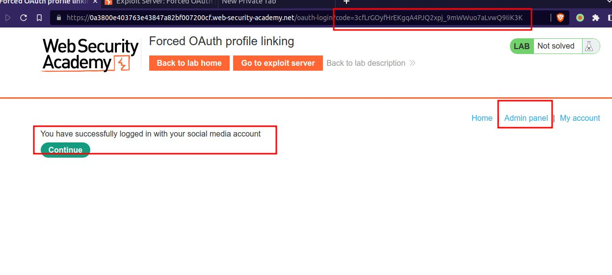
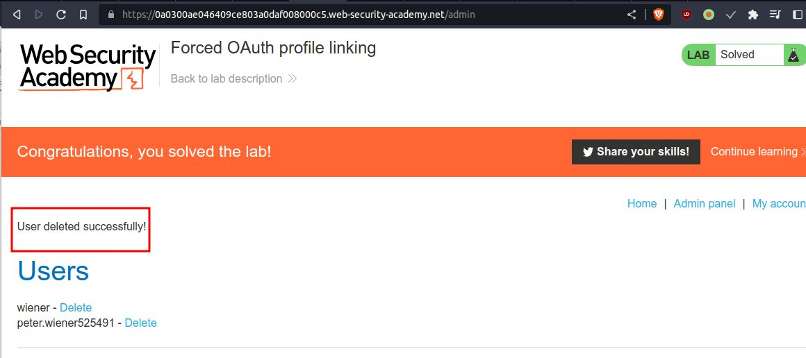

# Forced OAuth profile linking

## This lab gives you the option to attach a social media profile to your account so that you can log in via [OAuth](https://portswigger.net/web-security/oauth) instead of using the normal username and password. Due to the insecure implementation of the OAuth flow by the client application, an attacker can manipulate this functionality to obtain access to other users' accounts.

## To solve the lab, use a [CSRF attack](https://portswigger.net/web-security/csrf) to attach your own social media profile to the admin user's account on the blog website, then access the admin panel and delete Carlos.

## The admin user will open anything you send from the exploit server and they always have an active session on the blog website.

## You can log in to your own accounts using the following credentials:

- Blog website account: `wiener:peter`
- Social media profile: `peter.wiener:hotdog`

### HINT:

```javascript
<iframe src="https://YOUR-LAB-ID.web-security-academy.net/oauth-linking?code=STOLEN-CODE"></iframe>
```

---

step 1
open incognito mode in browser
login account without using social media account
then click on attach a social profile









step 2
now login again without using social media normal blog login
then you have to attach social profile then drop request
you will get code note down that code



after dropping click on back back to reach to account page then go to exploit

step 5
add payload

```javascript
<iframe src="https://0a3800e403763e43847a82bf007200cf.web-security-academy.net/oauth-linking?code=them98e0ESXSW5bMD8XS-USBe7m6U5ojLolny3E6aeB"></iframe>
```



step 5
reload home page and logout
then login with social media

you will directly get admin panel just delete carlos account to solve lab




